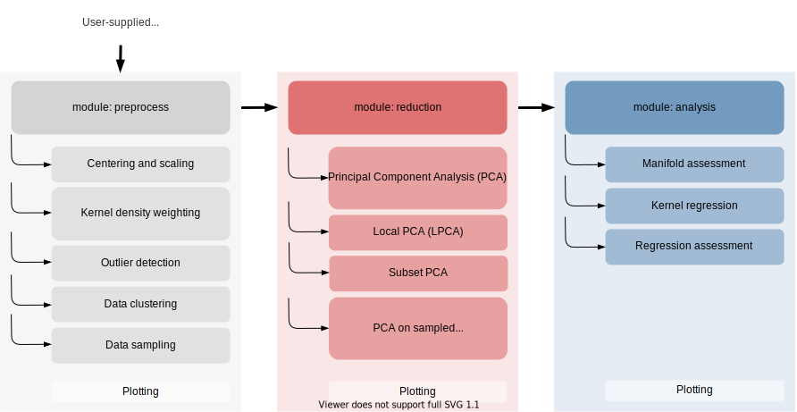

[](https://opensource.org/licenses/MIT)
[](https://pcafold.readthedocs.io/en/latest/?badge=latest)
[](https://gitlab.multiscale.utah.edu/common/PCAfold)

<p align="center">
  
</p>

**PCAfold** is an open-source Python library for generating, analyzing and improving low-dimensional manifolds obtained via Principal Component Analysis
(PCA). It incorporates a variety of data preprocessing tools (including data
clustering and sampling), uses PCA as a dimensionality reduction technique
and utilizes a novel approach to assess the quality of the obtained
low-dimensional manifolds.

## [PCAfold documentation](https://pcafold.readthedocs.io/en/latest/)

**PCAfold** documentation contains a thorough user guide including equations, references and example code snippets. Numerous illustrative tutorials and demos are presented as well. The corresponding Jupyter notebooks can be found in the `docs/tutorials` directory.

## Software architecture

A general overview for using **PCAfold** modules is presented in the diagram
below:



Each module's functionalities can also be used as a standalone tool for
performing a specific task and can easily combine with techniques outside of
this software, such as K-Means algorithm or Artificial Neural Networks.

## Installation

### Dependencies

**PCAfold** requires `python3.7` and the following packages:

- `Cython`
- `matplotlib`
- `numpy`
- `scipy`

### Build from source

Clone the `PCAfold` repository and move into the `PCAfold` directory created:

```
git clone http://gitlab.multiscale.utah.edu/common/PCAfold.git
cd PCAfold
```

Run the `setup.py` script as below to complete the installation:

```
python3.7 setup.py build_ext --inplace
python3.7 setup.py install

```

You are ready to `import PCAfold`!

### Testing

To run regression tests from the base repo directory run:

```
python3.7 -m unittest discover
```

To switch verbose on, use the `-v` flag.

All tests should be passing. If any of the tests is failing and you can’t sort
out why, please open an issue on [GitLab](https://gitlab.multiscale.utah.edu/common/PCAfold).

## Authors and contacts

- **Kamila Zdybał**, *Université Libre de Bruxelles*, `Kamila.Zdybal@ulb.ac.be`
- **Elizabeth Armstrong**, *The University of Utah*, `Elizabeth.Armstrong@chemeng.utah.edu`
- **Alessandro Parente**, *Université Libre de Bruxelles*, `Alessandro.Parente@ulb.ac.be`
- **James C. Sutherland**, *The University of Utah*, `James.Sutherland@utah.edu`
