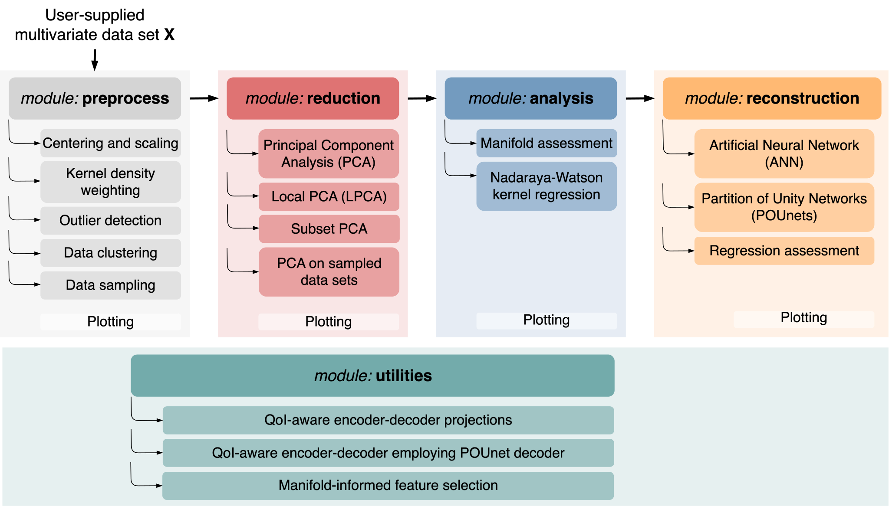

[](https://opensource.org/licenses/MIT)
[](https://pcafold.readthedocs.io/en/latest/?badge=latest)
[](https://gitlab.multiscale.utah.edu/common/PCAfold)
[](https://mybinder.org/v2/git/https%3A%2F%2Fgitlab.multiscale.utah.edu%2Fcommon%2FPCAfold/master?filepath=docs%2Ftutorials%2F)

<p align="center">
  
</p>

**PCAfold** is an open-source Python library for generating, analyzing and improving low-dimensional manifolds. It incorporates a variety of data preprocessing tools (including data clustering and sampling), implements several dimensionality reduction strategies and utilizes novel approaches to assess the quality of the obtained
low-dimensional manifolds. The latest software version introduces algorithms to optimize projection topologies based on quantities of interest (QoIs) and novel tools to reconstruct QoIs from the low-dimensional data representations using partition of unity networks (POUnets).

## Citing PCAfold

PCAfold is published in the [SoftwareX journal](https://www.sciencedirect.com/science/article/pii/S2352711020303435). If you use PCAfold in a scientific publication, you can cite the software as:

> Zdybał, K., Armstrong, E., Parente, A. and Sutherland, J.C., 2020. *PCAfold: Python software to generate, analyze and improve PCA-derived low-dimensional manifolds.* SoftwareX, 12, p.100630.

or using BibTeX:

```
@article{pcafold2020,
title = "PCAfold: Python software to generate, analyze and improve PCA-derived low-dimensional manifolds",
journal = "SoftwareX",
volume = "12",
pages = "100630",
year = "2020",
issn = "2352-7110",
doi = "https://doi.org/10.1016/j.softx.2020.100630",
url = "http://www.sciencedirect.com/science/article/pii/S2352711020303435",
author = "Kamila Zdybał and Elizabeth Armstrong and Alessandro Parente and James C. Sutherland"
}
```

## [PCAfold documentation](https://pcafold.readthedocs.io/en/latest/)

**PCAfold** documentation contains a thorough user guide including equations, references and example code snippets. Numerous illustrative tutorials and demos are presented as well. The corresponding Jupyter notebooks can be found in the `docs/tutorials` directory.

## Software architecture

A general overview for using **PCAfold** modules is presented in the diagram
below:



Each module's functionalities can also be used as a standalone tool for
performing a specific task and can easily combine with techniques outside of
this software.

## Installation

### Dependencies

**PCAfold** requires Python>=3.8 and the latest versions of the following packages:

```
pip install Cython
pip install matplotlib
pip install numpy
pip install scipy
pip install termcolor
pip install pandas
pip install scikit-learn
pip install tensorflow
pip install keras
pip install tqdm
```

### Build from source

Clone the `PCAfold` repository and move into the `PCAfold` directory created:

```
git clone http://gitlab.multiscale.utah.edu/common/PCAfold.git
cd PCAfold
```

Run installation from ``setup.py``:

```
python setup.py build_ext --inplace
python setup.py install
```

Note, that this will be deprecated in the future, but should still work.

Alternatively, run installation using ``pip``:

```
python -m pip install .
```

You are ready to import `PCAfold`! In Python, you can now import all modules:

```python
from PCAfold import preprocess
from PCAfold import reduction
from PCAfold import analysis
from PCAfold import reconstruction
from PCAfold import utilities
```

### Testing

To run regression tests from the base repo directory run:

```
python -m unittest discover
```

To switch verbose on, use the `-v` flag.

All tests should be passing. If any of the tests is failing and you can’t sort
out why, please open an issue on [GitLab](https://gitlab.multiscale.utah.edu/common/PCAfold).

## Authors and contacts

- **Kamila Zdybał**, *Université Libre de Bruxelles*, `Kamila.Zdybal@ulb.ac.be`
- **Elizabeth Armstrong**, *The University of Utah*, `Elizabeth.Armstrong@chemeng.utah.edu`
- **Alessandro Parente**, *Université Libre de Bruxelles*, `Alessandro.Parente@ulb.ac.be`
- **James C. Sutherland**, *The University of Utah*, `James.Sutherland@utah.edu`
