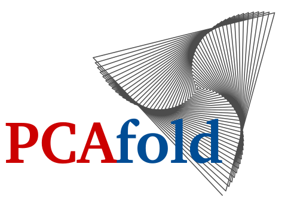

*Low-dimensional PCA-derived manifolds and everything in between!*

--------------------------------------------------------------------------------

.. image:: https://img.shields.io/badge/GitLab-PCAfold-blue.svg?style=flat
    :target: https://gitlab.multiscale.utah.edu/common/PCAfold
.. image:: http://img.shields.io/badge/license-MIT-blue.svg?style=flat
    :target: https://gitlab.multiscale.utah.edu/common/PCAfold/-/blob/master/LICENSE.txt
.. image:: https://readthedocs.org/projects/pcafold/badge/?version=latest
    :target: https://pcafold.readthedocs.io/en/latest/?badge=latest
.. image:: https://mybinder.org/badge_logo.svg
    :target: https://mybinder.org/v2/git/https%3A%2F%2Fgitlab.multiscale.utah.edu%2Fcommon%2FPCAfold/master?filepath=docs%2Ftutorials%2F

#####
Intro
#####

**PCAfold** is an open-source Python library for generating, analyzing and improving
low-dimensional manifolds obtained via Principal Component Analysis
(PCA). It incorporates a variety of data preprocessing tools (including data
clustering and sampling), uses PCA as a dimensionality reduction technique
and utilizes a novel approach to assess the quality of the obtained
low-dimensional manifolds.

A general overview for using **PCAfold** modules is presented in the diagram
below:

Each module's functionalities can also be used as a standalone tool for
performing a specific task and can easily combine with techniques outside of
this software, such as K-Means algorithm or Artificial Neural Networks.

Reach out to the `Getting started <https://pcafold.readthedocs.io/en/latest/user/getting-started.html>`_
section for more information on installing the software and for possible workflows that can be achieved with **PCAfold**.
You can also download the `poster <https://gitlab.multiscale.utah.edu/common/PCAfold/-/raw/master/docs/outreach/PCAfold-poster.pdf>`_ below for a condensed overview of the available functionalities.

.. image:: outreach/PCAfold-poster.png
  :width: 300
  :align: left

--------------------------------------------------------------------------------

Citing PCAfold
==============

**PCAfold** is published in the `SoftwareX journal <https://authors.elsevier.com/sd/article/S2352711020303435>`_.
If you use **PCAfold** in a scientific publication, you can cite the software as:

  Zdybał, K., Armstrong, E., Parente, A. and Sutherland, J.C., 2020. PCAfold: Python software to generate, analyze and improve PCA-derived low-dimensional manifolds. SoftwareX, 12, p.100630.

or using BibTeX:

.. code-block:: text

  @article{pcafold2020,
  title = "PCAfold: Python software to generate, analyze and improve PCA-derived low-dimensional manifolds",
  journal = "SoftwareX",
  volume = "12",
  pages = "100630",
  year = "2020",
  issn = "2352-7110",
  doi = "https://doi.org/10.1016/j.softx.2020.100630",
  url = "http://www.sciencedirect.com/science/article/pii/S2352711020303435",
  author = "Kamila Zdybał and Elizabeth Armstrong and Alessandro Parente and James C. Sutherland"
  }

--------------------------------------------------------------------------------

.. toctree::
   :maxdepth: 5
   :caption: User Guide

   user/getting-started
   user/data-preprocessing
   user/data-reduction
   user/data-analysis

.. toctree::
   :maxdepth: 2
   :caption: Tutorials & Demos

   tutorials/demo-data-manipulation
   tutorials/demo-clustering
   tutorials/demo-sampling
   tutorials/demo-plotting-pca
   tutorials/demo-global-vs-local-pca
   tutorials/demo-pca-on-sampled-data-sets
   tutorials/demo-handling-source-terms
   tutorials/demo-manifold-assessment
   tutorials/demo-regression
