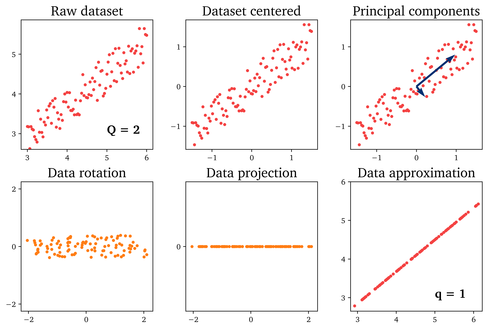

PCA-Python
==========

This is a documentation for the ``PCA-Python`` repository.
The core functionality is performing dimensionality reduction using Principal Component Analysis (PCA).

.. toctree::
   :maxdepth: 2
   :caption: User Guide

   user/PCA
   user/clustering
   user/cluster-biased-pca
   user/train-test-select

.. toctree::
   :maxdepth: 2
   :caption: Tutorials

   tutorials/train-test-selection

