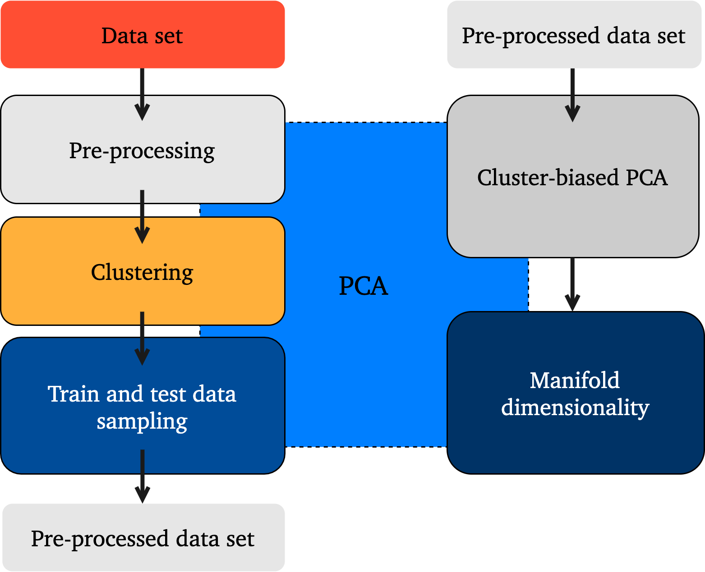

insertPyName
============

*insertPyName* is a Python library for generating and analyzing empirical low-dimensional manifolds obtained via Principal Component Analysis (PCA).
It incorporates data pre-processing, clustering and sampling techniques using PCA under the hood.

The general overview for the usage of *insertPyName* modules is presented below:

.. toctree::
   :maxdepth: 2
   :caption: User Guide

   user/PCA
   user/clustering
   user/cluster-biased-pca
   user/manifold-dimensionality
   user/train-test-select

.. toctree::
   :maxdepth: 2
   :caption: Tutorials

   tutorials/train-test-selection
