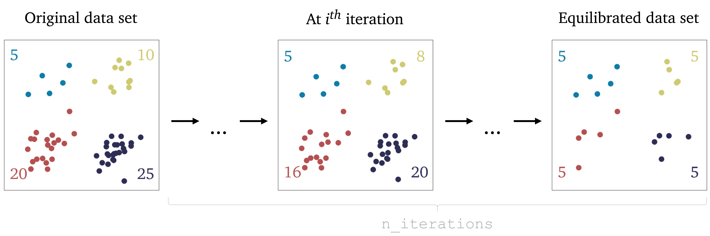
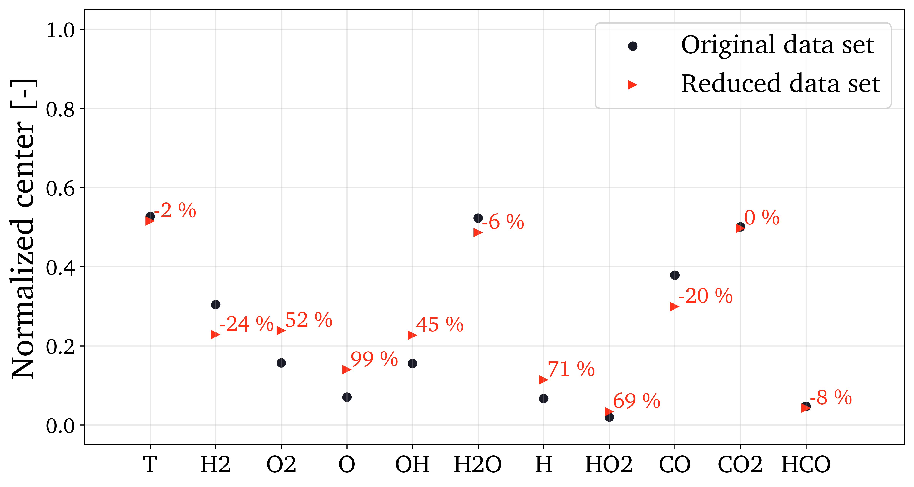
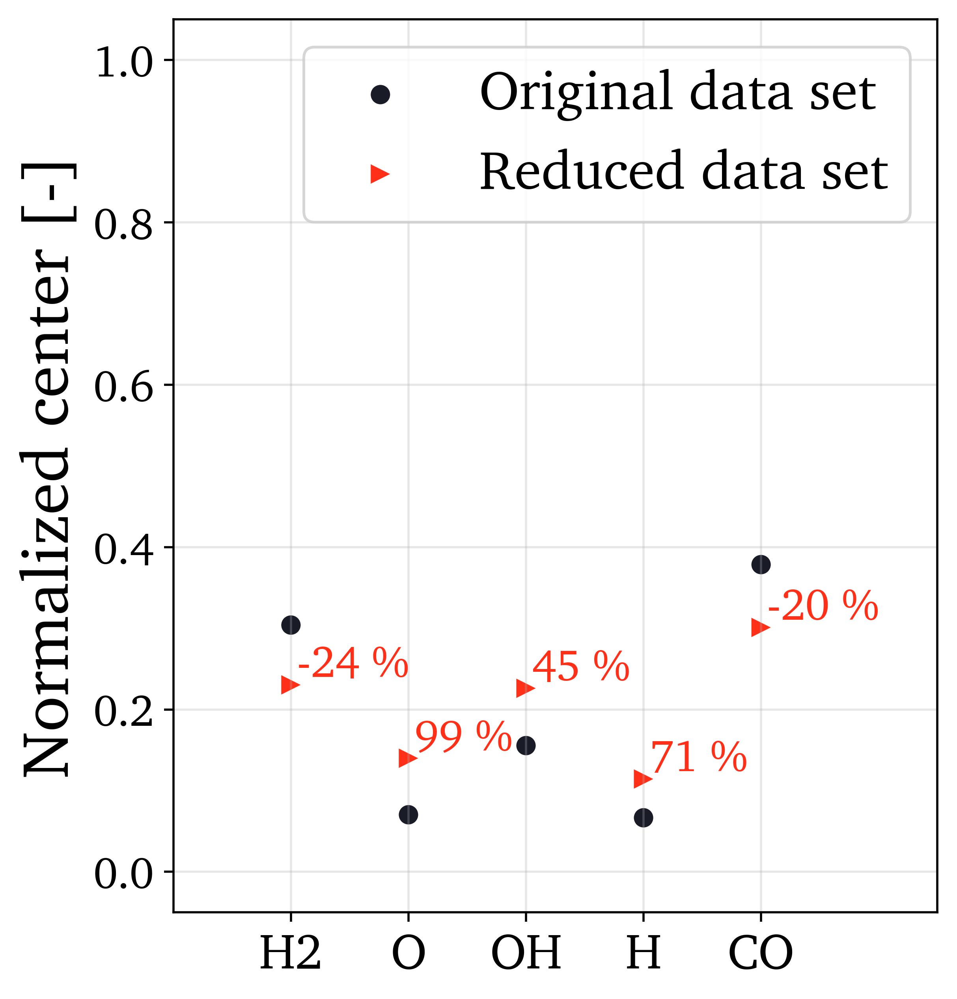
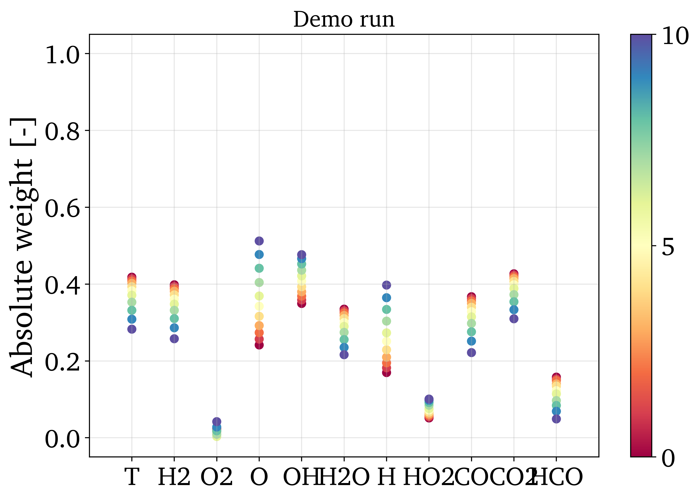
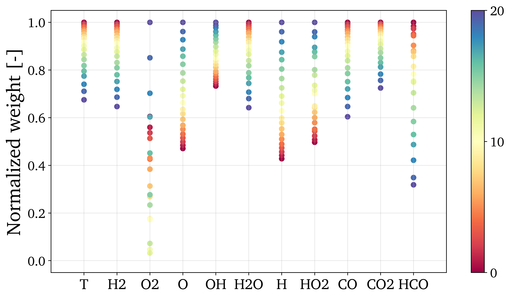
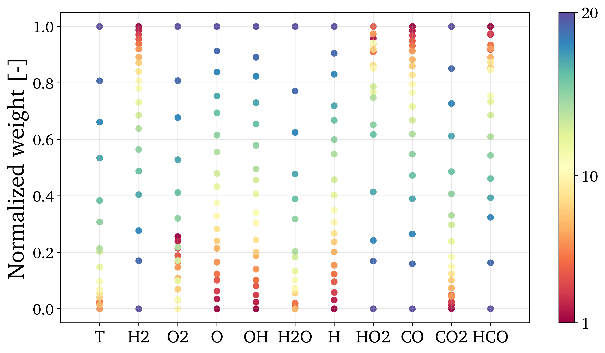
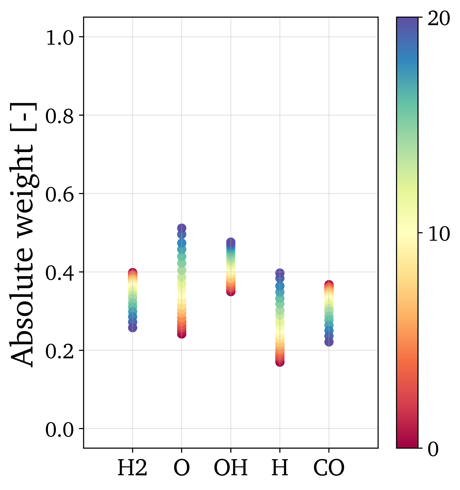

.. note:: This tutorial was generated from a Jupyter notebook that can be
          accessed `here <https://gitlab.multiscale.utah.edu/common/PCA-python/-/blob/regression/docs/tutorials/demo-cluster-biased-pca.ipynb>`_.

Cluster-biased PCA
==================

*Cluster-biased PCA* is a link between local PCA and global PCA - it is using
local features to inform (bias) the global PCs through changing sample densities.

The general methodology for cluster-biased PCA is presented in the scheme below:

In this tutorial we present how the cluster-biased PCA workflow can be run
using functions from ``reduction`` module. To import the module:

.. code:: python

  from PCAfold import reduction

As an example, we will use a data set representing combustion of syngas
(CO/H2 mixture) in air generated from steady laminar flamelet model.
This data set has 11 variables and 50,000 observations. To load the data set:

.. code:: python

  import numpy as np
  import pandas as pd

  state_space = pd.read_csv('data-state-space.csv', sep = ',', header=None).to_numpy()
  source_state_space = pd.read_csv('data-state-space-sources.csv', sep = ',', header=None).to_numpy()

Cluster-biased PCA starts with clustering the data set using any algorithm of choice. In this example we use K-Means algorithm and partition the data set into 4 clusters:

.. code:: python

  from sklearn.preprocessing import StandardScaler
  from sklearn.cluster import KMeans

  n_clusters = 4

  scaler = StandardScaler()
  conditioning_variable = scaler.fit_transform(state_space)
  kmeans = KMeans(n_clusters=n_clusters).fit(conditioning_variable)
  idx = kmeans.labels_

--------------------------------------------------------------------------------

Equilibrate cluster populations iteratively
-------------------------------------------

This function begins with performing PCA on the original data set and then in
``n_iterations`` it will gradually decrease the number of populations in each cluster larger than the smallest cluster.
At each iteration we obtain a new sampled data set on which PCA is performed.
At the last iteration, the number of populations in each cluster are equal and finally PCA is performed at the equilibrated data set.
A schematic representation of this procedure is presented in the figure below:

.. code:: python

  (eigenvalues, eigenvectors, pc_scores, pc_sources, idx_train, X_center, X_scale) = reduction.equilibrate_cluster_populations(state_space, idx, scaling=scal_crit, X_source=source_state_space, n_components=n_components, biasing_option=biasing_option, n_iterations=10, stop_iter=0, verbose=True)

With ``verbose=True`` we will see some detailed information on number of samples in each cluster at each iteration:

.. code-block:: text

  Biasing is performed with option 2.

  At iteration 1 taking samples:
  {0: 5315, 1: 18494, 2: 15739, 3: 7579}

  At iteration 2 taking samples:
  {0: 5315, 1: 17030, 2: 14581, 3: 7328}

  At iteration 3 taking samples:
  {0: 5315, 1: 15566, 2: 13423, 3: 7077}

  At iteration 4 taking samples:
  {0: 5315, 1: 14102, 2: 12265, 3: 6826}

  At iteration 5 taking samples:
  {0: 5315, 1: 12638, 2: 11107, 3: 6575}

  At iteration 6 taking samples:
  {0: 5315, 1: 11174, 2: 9949, 3: 6324}

  At iteration 7 taking samples:
  {0: 5315, 1: 9710, 2: 8791, 3: 6073}

  At iteration 8 taking samples:
  {0: 5315, 1: 8246, 2: 7633, 3: 5822}

  At iteration 9 taking samples:
  {0: 5315, 1: 6782, 2: 6475, 3: 5571}

  At iteration 10 taking samples:
  {0: 5315, 1: 5315, 2: 5315, 3: 5315}

Analyze centers movement
------------------------

This function compares centers computed on the original data set *(as-is)* versus on the sampled data set.
The ``idx_train`` that is an input parameter could for instance be obtained from ``equilibrate_cluster_populations``
and will thus represent the equilibrated data set sampled from the original data set.

.. code:: python

  (centers_X, centers_X_r, perc) = reduction.analyze_centers_movement(state_space, idx_train, variable_names=state_space_names, title=title, save_plot=save_plots, save_filename='')

Plotting example
^^^^^^^^^^^^^^^^

This function will produce a plot that shows the normalized centers and a percentage by which the new centers have moved with respect to the original ones. Example of a plot:

If you do not wish to plot all variables present in a data set, use the ``plot_variables`` list as an input parameter to select indices of variables to plot:

Analyze eigenvector weights movement
------------------------------------

The ``eigenvectors`` 3D array obtained from ``equilibrate_cluster_populations``
can now be used as an input parameter for plotting the eigenvector weights change
as we were gradually equilibrating cluster populations.

We are going to plot the first eigenvector (PC-1) weights movement with three variants of normalization.
To access the first eigenvector one can simply do:

.. code:: python

  eigenvectors[:,0,:]

similarly, to access the second eigenvector:

.. code:: python

  eigenvectors[:,1,:]

and so on.

.. code:: python

  reduction.analyze_eigenvector_weights_movement(eigenvectors[:,0,:], state_space_names, plot_variables=[], normalize=False, zero_norm=False, title=title, save_plot=save_plots, save_filename='')

Plotting example
^^^^^^^^^^^^^^^^

Three weight normalization variants are available:

- No normalization, the absolute values of the eigenvector weights are plotted. To use this variant set ``normalize=False``. Example can be seen below:

- Normalizing so that the highest weight is equal to 1 and the smallest weight is between 0 and 1. This is useful for judging the severity of the weight movement. To use this variant set ``normalize=True`` and ``zero_norm=False``. Example can be seen below:

- Normalizing so that weights are between 0 and 1. This is useful for judging the movement trends since it will blow up even the smallest changes to the entire range 0-1. To use this variant set ``normalize=True`` and ``zero_norm=True``. Example can be seen below:

If you do not wish to plot all variables present in a data set, use the ``plot_variables`` list as an input parameter to select indices of variables to plot:

Analyze eigenvalue distribution
-------------------------------

Plotting example
^^^^^^^^^^^^^^^^

This function will produce a plot that shows the eigenvalues distribution for the original data set and for different versions of the equilibrated data set. Example of a plot:

.. image:: ../images/documentation-eigenvalues.png
    :width: 500
    :align: center
