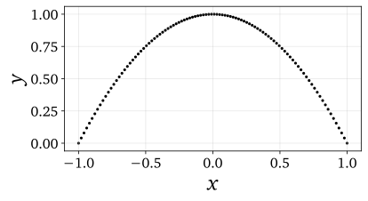
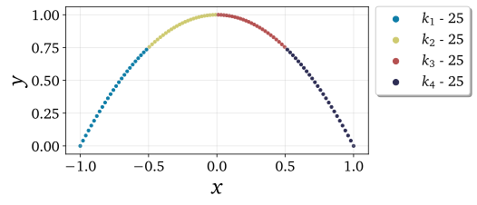
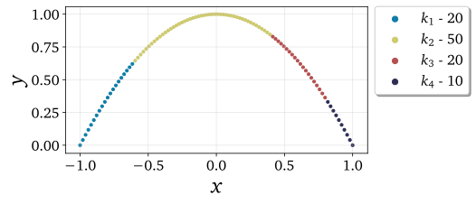
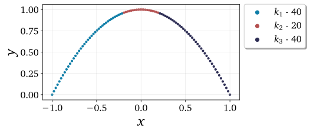
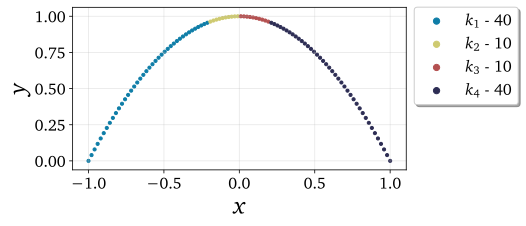
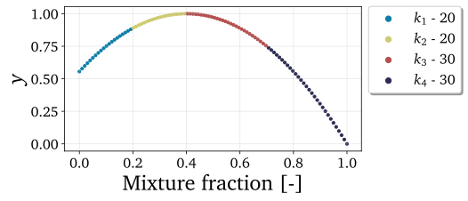
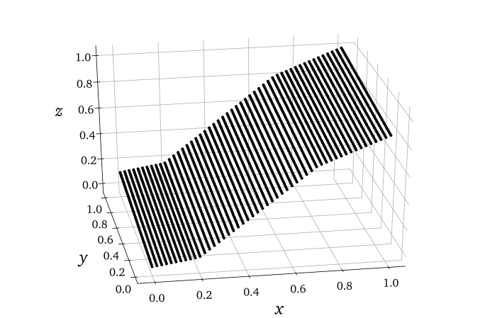
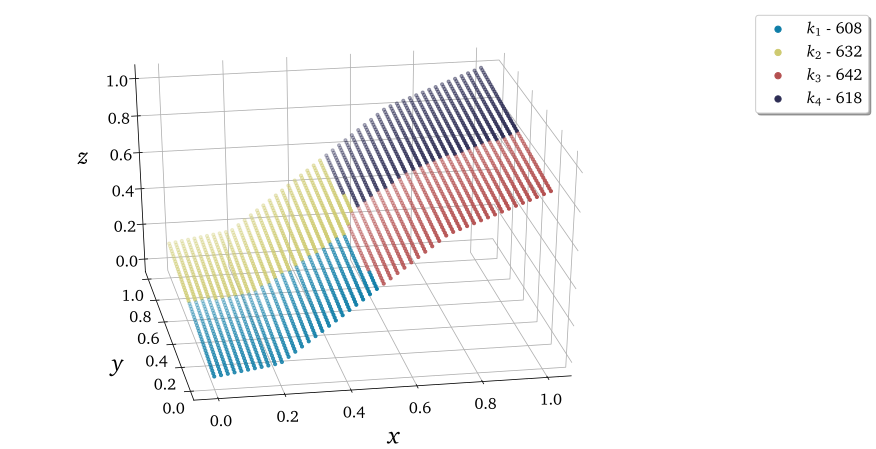

.. note:: This tutorial was generated from a Jupyter notebook that can be
          accessed `here <https://gitlab.multiscale.utah.edu/common/PCAfold/-/blob/master/docs/tutorials/demo-clustering.ipynb>`_.

Data clustering
====================

In this tutorial, we present the clustering functionalities of the ``preprocess``
module.

We import the necessary modules:

.. code:: python

  from PCAfold import preprocess
  from PCAfold import reduction
  import numpy as np
  from matplotlib.colors import ListedColormap
  from sklearn.preprocessing import StandardScaler
  from sklearn.cluster import KMeans

We set some initial parameters:

.. code:: python

  x_label = '$x$'
  y_label = '$y$'
  z_label = '$z$'
  figure_size = (6,3)
  color_map = ListedColormap(['#0e7da7', '#ceca70', '#b45050', '#2d2d54'])

First, we generate a synthetic two-dimensional data set:

.. code:: python

  x = np.linspace(-1,1,100)
  y = -x**2 + 1

The data set can be visualized using the function from the ``reduction`` module:

.. code:: python

  plt = reduction.plot_2d_manifold(x, y, x_label=x_label, y_label=y_label, figure_size=figure_size, save_filename=None)

Let's start with clustering the data set according to bins of a single vector.
This clustering will be performed based on ``x``.

--------------------------------------------------------------------------------

Cluster into variable bins
--------------------------

This clustering will divide the data set based on equal bins of a variable vector.

.. code:: python

  (idx_variable_bins, borders_variable_bins) = preprocess.variable_bins(x, 4, verbose=True)

With ``verbose=True`` we will see some detailed information on clustering:

.. code-block:: text

  Border values for bins:
  [-1.0, -0.5, 0.0, 0.5, 1.0]

  Bounds for cluster 0:
  	-1.0, -0.5152
  Bounds for cluster 1:
  	-0.4949, -0.0101
  Bounds for cluster 2:
  	0.0101, 0.4949
  Bounds for cluster 3:
  	0.5152, 1.0

The result of clustering can be plotted in 2D:

.. code:: python

  plt = preprocess.plot_2d_clusteringplt = preprocess.plot_2d_clustering(x, y, idx_variable_bins, x_label=x_label, y_label=y_label, color_map=color_map, first_cluster_index_zero=False, grid_on=True, figure_size=figure_size, save_filename=None)

The visual result of this clustering can be seen below:

Cluster into pre-defined variable bins
--------------------------------------

This clustering will divide the data set into bins of a one-dimensional variable vector whose borders are specified by the user. Let's specify the split values as ``split_values = [-0.6, 0.4, 0.8]``

.. code:: python

  split_values = [-0.6, 0.4, 0.8]
  (idx_predefined_variable_bins, borders_predefined_variable_bins) = preprocess.predefined_variable_bins(x, split_values, verbose=True)

With ``verbose=True`` we will see some detailed information on clustering:

.. code-block:: text

  Border values for bins:
  [-1.0, -0.6, 0.4, 0.8, 1.0]

  Bounds for cluster 0:
  	-1.0, -0.6162
  Bounds for cluster 1:
  	-0.596, 0.3939
  Bounds for cluster 2:
  	0.4141, 0.798
  Bounds for cluster 3:
  	0.8182, 1.0

The visual result of this clustering can be seen below:

Cluster into zero-neighborhood variable bins
--------------------------------------------

This partitioning relies on unbalanced variable vector which, in principle,
is assumed to have a lot of observations whose values are close to zero and
relatively few observations with values away from zero.
This function can be used to separate close-to-zero observations into one
cluster (``split_at_zero=False``) or two clusters (``split_at_zero=True``).

Without splitting at zero ``split_at_zero=False``
^^^^^^^^^^^^^^^^^^^^^^^^^^^^^^^^^^^^^^^^^^^^^^^^^

.. code:: python

  (idx_zero_neighborhood_bins, borders_zero_neighborhood_bins) = preprocess.zero_neighborhood_bins(x, 3, zero_offset_percentage=10, split_at_zero=False, verbose=True)

With ``verbose=True`` we will see some detailed information on clustering:

.. code-block:: text

  Border values for bins:
  [-1.  -0.2  0.2  1. ]

  Bounds for cluster 0:
  	-1.0, -0.2121
  Bounds for cluster 1:
  	-0.1919, 0.1919
  Bounds for cluster 2:
  	0.2121, 1.0

The visual result of this clustering can be seen below:

With splitting at zero ``split_at_zero=True``
^^^^^^^^^^^^^^^^^^^^^^^^^^^^^^^^^^^^^^^^^^^^^

.. code:: python

  (idx_zero_neighborhood_bins_split_at_zero, borders_zero_neighborhood_bins_split_at_zero) = preprocess.zero_neighborhood_bins(x, 4, zero_offset_percentage=10, split_at_zero=True, verbose=True)

With ``verbose=True`` we will see some detailed information on clustering:

.. code-block:: text

  Border values for bins:
  [-1.  -0.2  0.   0.2  1. ]

  Bounds for cluster 0:
  -1.0, -0.2121
  Bounds for cluster 1:
  -0.1919, -0.0101
  Bounds for cluster 2:
  0.0101, 0.1919
  Bounds for cluster 3:
  0.2121, 1.0

The visual result of this clustering can be seen below:

--------------------------------------------------------------------------------

Cluster into bins of mixture fraction vector
--------------------------------------------

In this example, we partition the data set according to bins of mixture fraction vector.
We generate a new synthetic data set based on a mixture fraction vector which attains values between 0 and 1.

.. code:: python

  Z = np.linspace(0,1,100)
  y_Z = (-25/9)*Z**2 + (20/9)*Z + (5/9)

The partitioning function will also require specifying the value for stoichiometric mixture fraction ``Z_stoich``.
For this example let's take ``Z_stoich=0.4``.
Note that the first split will be performed at ``Z_stoich`` and further splits will be performed automatically on lean and rich sides.

.. code:: python

  (idx_mixture_fraction_bins, borders_mixture_fraction_bins) = preprocess.mixture_fraction_bins(Z, 4, 0.4, verbose=True)

With ``verbose=True`` we will see some detailed information on clustering:

.. code-block:: text

  Border values for bins:
  [0.  0.2 0.4 0.7 1. ]

  Bounds for cluster 0:
  	0.0, 0.1919
  Bounds for cluster 1:
  	0.202, 0.3939
  Bounds for cluster 2:
  	0.404, 0.697
  Bounds for cluster 3:
  	0.7071, 1.0

The visual result of this clustering can be seen below:

--------------------------------------------------------------------------------

Visualize the clustering result in 3D
--------------------------------------------

Clustering result can also be visualized in a three-dimensional space. In this
example, we generate a synthetic 3D data set composed of three connected planes:

.. code:: python

  n_observations = 200

  x = np.tile(np.linspace(0,50,n_observations), n_observations)
  y = np.zeros((n_observations,1))
  z = np.zeros((n_observations*n_observations,1))

  for i in range(1,n_observations):
      y = np.vstack((y, np.ones((n_observations,1))*i))
  y = y.ravel()

  for observation, x_value in enumerate(x):

      y_value = y[observation]

      if x_value <= 10:
          z[observation] = 2 * x_value + y_value
      elif x_value > 10 and x_value <= 35:
          z[observation] = 10 * x_value + y_value - 80
      elif x_value > 35:
          z[observation] = 5 * x_value + y_value + 95

  (x, _, _) = preprocess.center_scale(x[:,None], scaling='0to1')
  (y, _, _) = preprocess.center_scale(y[:,None], scaling='0to1')
  (z, _, _) = preprocess.center_scale(z, scaling='0to1')

The original data set can be visualized using the function from the ``reduction`` module:

.. code:: python

  plt = reduction.plot_3d_manifold(x, y, z, elev=30, azim=-100, x_label=x_label, y_label=y_label, z_label=z_label, figure_size=(12,8), save_filename=None)

and divide it into four clusters using the K-Means algorithm:

.. code:: python

  from sklearn.preprocessing import StandardScaler
  from sklearn.cluster import KMeans

  scaler = StandardScaler()
  conditioning_var = scaler.fit_transform(data_set_3d)
  idx_kmeans = KMeans(n_clusters=3).fit(conditioning_var).labels_

The result of the K-Means clustering can be plotted in 3D:

.. code:: python

  plt = preprocess.plot_3d_clustering(x, y, z, idx_kmeans, elev=30, azim=-100, x_label=x_label, y_label=y_label, z_label=z_label, color_map=color_map, first_cluster_index_zero=False, figure_size=(12,8), save_filename=None)

