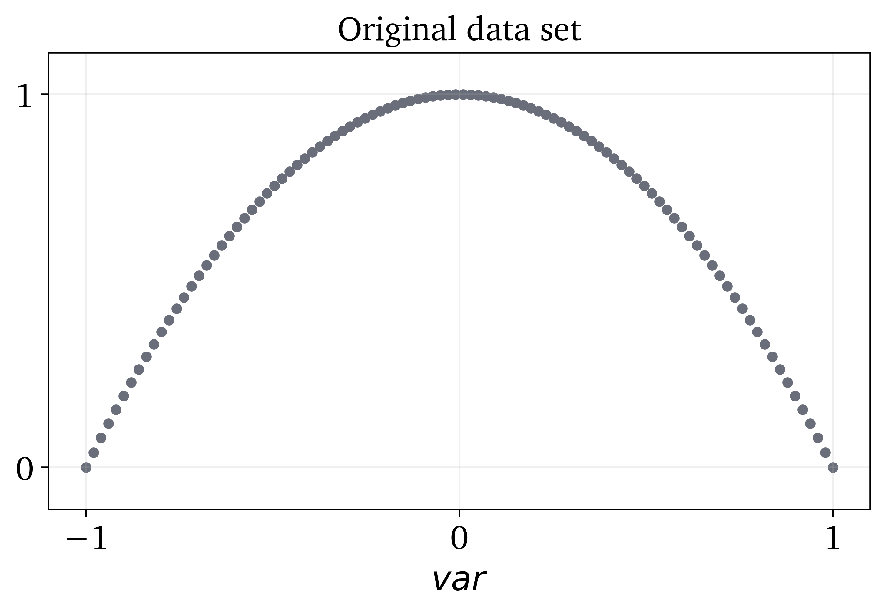
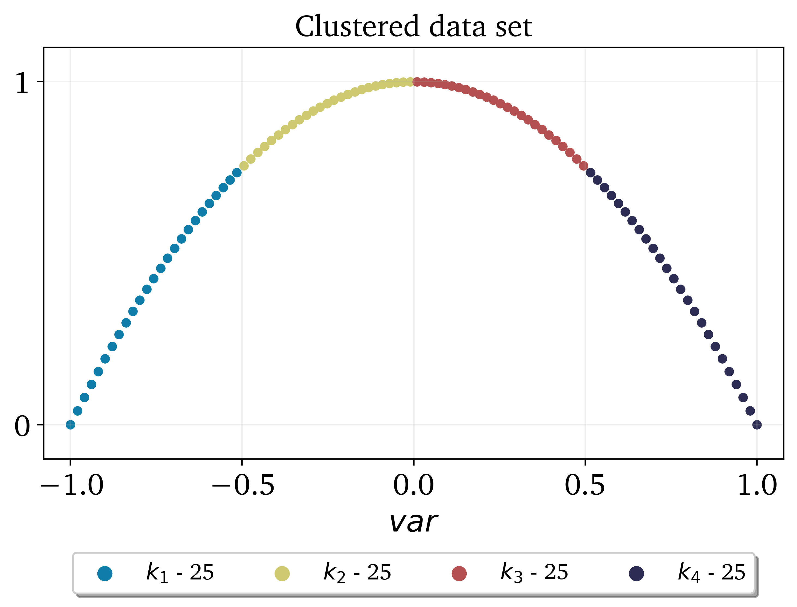
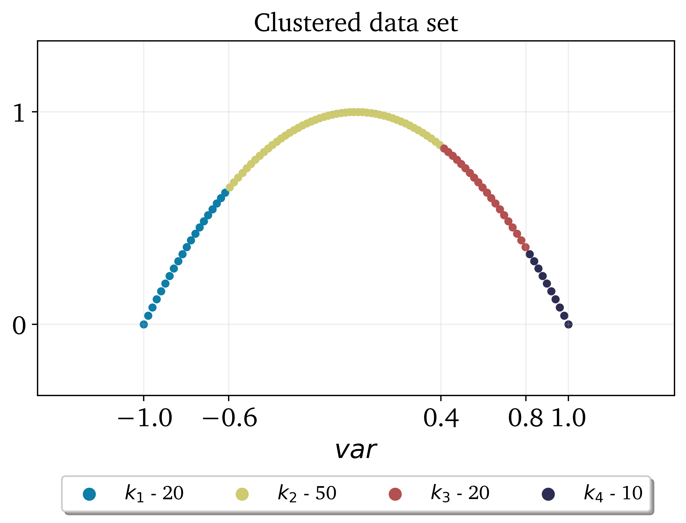
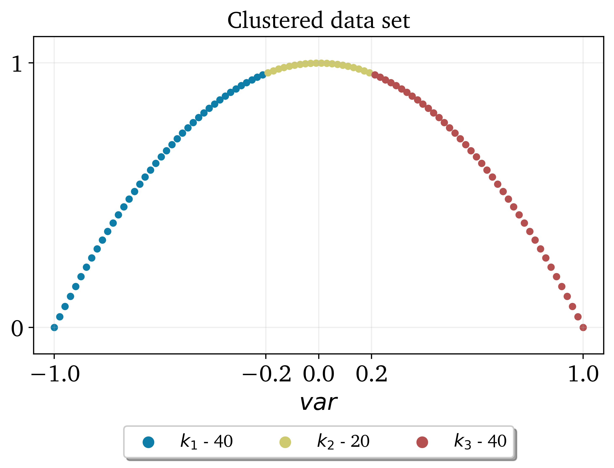
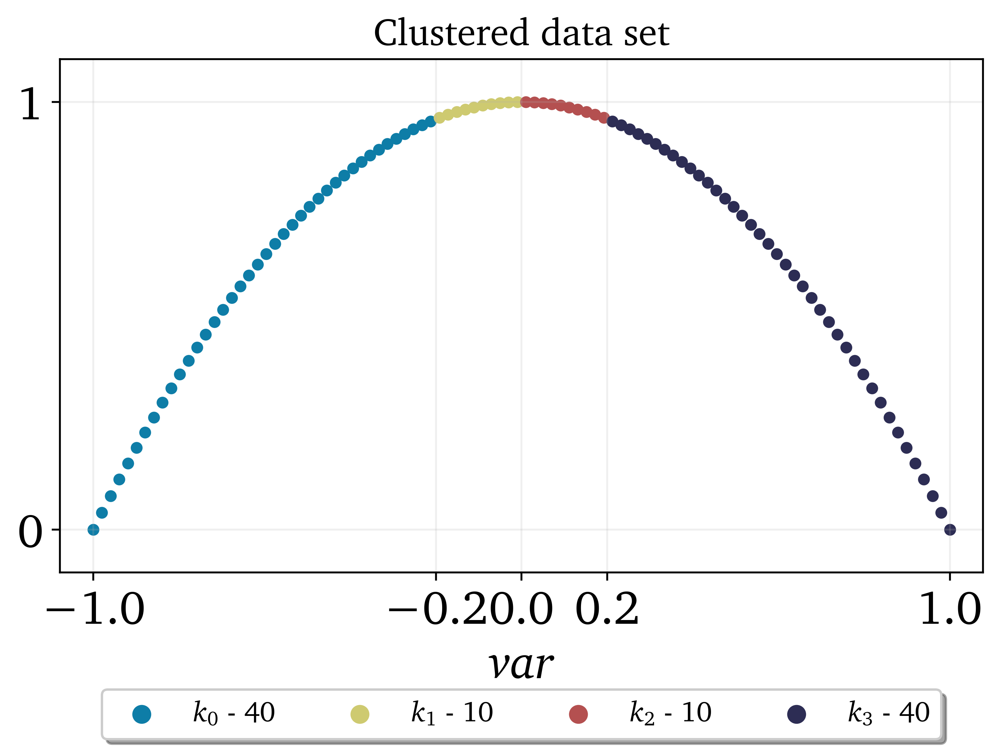
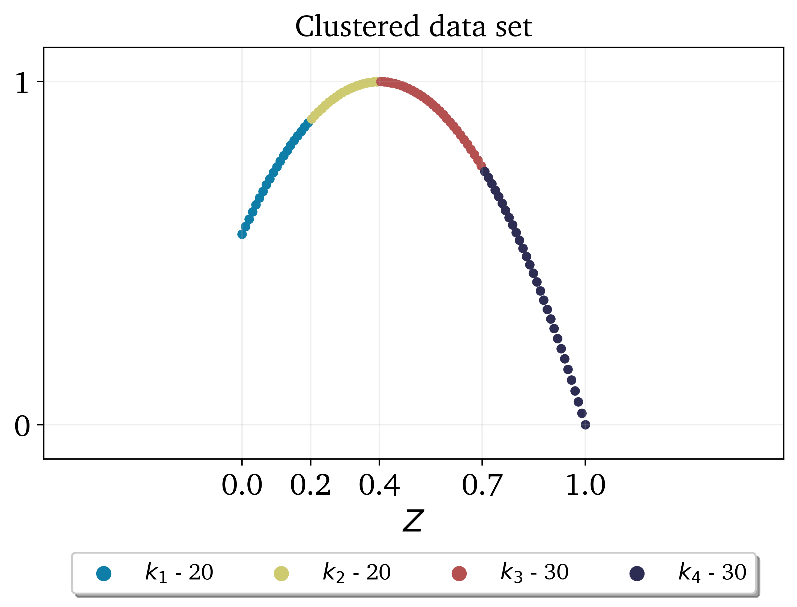

.. note:: This tutorial was generated from a Jupyter notebook that can be
          accessed `here <https://gitlab.multiscale.utah.edu/common/PCA-python/-/blob/regression/docs/tutorials/demo-clustering.ipynb>`_.

Clustering
==========

In this tutorial we present the main functionalities of the ``clustering_data`` module. To import the module:

.. code:: python

  import PCAfold.clustering_data as cl

First, we generate a synthetic two-dimensional data set:

.. code:: python

  import numpy as np

  var = np.linspace(-1,1,100)
  y = -var**2 + 1

Which can be seen below:

Let's start with clustering the data set according to bins of a single vector.
This clustering will be performed based on ``var``.

--------------------------------------------------------------------------------

Cluster into variable bins
--------------------------

This clustering will divide the data set based on equal bins of a variable vector.

.. code:: python

  (idx_variable_bins) = cl.variable_bins(var, 4, verbose=True)

With ``verbose=True`` we will see some detailed information on clustering:

.. code-block:: text

  Border values for bins:
  [-1.0, -0.5, 0.0, 0.5, 1.0]

  Bounds for cluster 1:
  	-1.0, -0.5152
  Bounds for cluster 2:
  	-0.4949, -0.0101
  Bounds for cluster 3:
  	0.0101, 0.4949
  Bounds for cluster 4:
  	0.5152, 1.0

The visual result of this clustering can be seen below:

Cluster into pre-defined variable bins
--------------------------------------

This clustering will divide the data set into bins of a one-dimensional variable vector whose borders are specified by the user. Let's specify the split values as ``split_values = [-0.6, 0.4, 0.8]``

.. code:: python

  split_values = [-0.6, 0.4, 0.8]
  (idx_predefined_variable_bins) = cl.predefined_variable_bins(var, split_values, verbose=True)

With ``verbose=True`` we will see some detailed information on clustering:

.. code-block:: text

  Border values for bins:
  [-1.0, -0.6, 0.4, 0.8, 1.0]

  Bounds for cluster 1:
  	-1.0, -0.6162
  Bounds for cluster 2:
  	-0.596, 0.3939
  Bounds for cluster 3:
  	0.4141, 0.798
  Bounds for cluster 4:
  	0.8182, 1.0

The visual result of this clustering can be seen below:

Cluster into bins of PC-source vector
-------------------------------------

This partitioning relies on unbalanced PC-source vector which, in principle, is assumed to have a lot of observations whose values are close to zero and relatively few observations with values away from zero.
This function can be used to separate close-to-zero observations into one cluster (``split_at_zero=False``) or two clusters (``split_at_zero=True``).

Without splitting at zero ``split_at_zero=False``
^^^^^^^^^^^^^^^^^^^^^^^^^^^^^^^^^^^^^^^^^^^^^^^^^

.. code:: python

  (idx_pc_source_bins) = cl.pc_source_bins(var, 3, zero_offset_percentage=10, split_at_zero=False, verbose=True)

With ``verbose=True`` we will see some detailed information on clustering:

.. code-block:: text

  Border values for bins:
  [-1.  -0.2  0.2  1. ]

  Bounds for cluster 1:
  	-1.0, -0.2121
  Bounds for cluster 2:
  	-0.1919, 0.1919
  Bounds for cluster 3:
  	0.2121, 1.0

The visual result of this clustering can be seen below:

With splitting at zero ``split_at_zero=True``
^^^^^^^^^^^^^^^^^^^^^^^^^^^^^^^^^^^^^^^^^^^^^

.. code:: python

  (idx_pc_source_bins_split_at_zero) = cl.pc_source_bins(var, 4, zero_offset_percentage=10, split_at_zero=True, verbose=True)

With ``verbose=True`` we will see some detailed information on clustering:

.. code-block:: text

  Border values for bins:
  [-1.  -0.2  0.   0.2  1. ]

  Bounds for cluster 1:
  -1.0, -0.2121
  Bounds for cluster 2:
  -0.1919, -0.0101
  Bounds for cluster 3:
  0.0101, 0.1919
  Bounds for cluster 4:
  0.2121, 1.0

The visual result of this clustering can be seen below:

Cluster into bins of mixture fraction vector
--------------------------------------------

In this example, we partition the data set according to bins of mixture fraction vector.
We generate a new synthetic data set based on a mixture fraction vector which attains values between 0 and 1.

.. code:: python

  Z = np.linspace(0,1,100)
  y_Z = (-25/9)*Z**2 + (20/9)*Z + (5/9)

The partitioning function will also require specifying the value for stoichiometric mixture fraction ``Z_stoich``.
For this example let's take ``Z_stoich=0.4``.
Note that the first split will be performed at ``Z_stoich`` and further splits will be performed automatically on lean and rich sides.

.. code:: python

  (idx_mixture_fraction_bins) = cl.mixture_fraction_bins(Z, 4, 0.4, verbose=True)

With ``verbose=True`` we will see some detailed information on clustering:

.. code-block:: text

  Border values for bins:
  [0.  0.2 0.4 0.7 1. ]

  Bounds for cluster 1:
  	0.0, 0.1919
  Bounds for cluster 2:
  	0.202, 0.3939
  Bounds for cluster 3:
  	0.404, 0.697
  Bounds for cluster 4:
  	0.7071, 1.0

The visual result of this clustering can be seen below:

