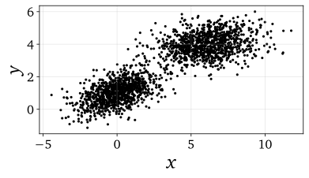
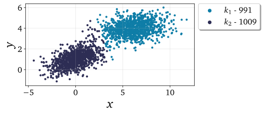

.. note:: This tutorial was generated from a Jupyter notebook that can be
          accessed `here <https://mybinder.org/v2/git/https%3A%2F%2Fgitlab.multiscale.utah.edu%2Fcommon%2FPCAfold/master?filepath=docs%2Ftutorials%2Fdemo-clustering.ipynb>`_.

##################
Data clustering
##################

In this tutorial, we present the clustering functionalities from the ``preprocess``
module.

We import the necessary modules:

.. code:: python

  from PCAfold import preprocess
  from PCAfold import reduction
  import numpy as np
  from matplotlib.colors import ListedColormap
  from sklearn.cluster import KMeans

and we set some initial parameters:

.. code:: python

  x_label = '$x$'
  y_label = '$y$'
  z_label = '$z$'
  figure_size = (6,3)
  color_map = ListedColormap(['#0e7da7', '#ceca70', '#b45050', '#2d2d54'])
  save_filename = None
  random_seed = 200

--------------------------------------------------------------------------------

******************************************************
Visualize the clustering result in 2D
******************************************************

We begin by demonstrating how the result of clustering can be visualized using the
plotting functionalities from the ``preprocess`` module.

We generate a synthetic 2D data set composed of two distinct clouds:

.. code:: python

  np.random.seed(seed=random_seed)

  n_observations = 1000

  mean_1 = [0,1]
  mean_2 = [6,4]
  covariance_1 = [[2, 0.5], [0.5, 0.5]]
  covariance_2 = [[3, 0.3], [0.3, 0.5]]

  x_1, y_1 = np.random.multivariate_normal(mean_1, covariance_1, n_observations).T
  x_2, y_2 = np.random.multivariate_normal(mean_2, covariance_2, n_observations).T
  x = np.concatenate([x_1, x_2])
  y = np.concatenate([y_1, y_2])

The original data set can be visualized using the function from the ``reduction`` module:

.. code:: python

  plt = reduction.plot_2d_manifold(x, y, x_label=x_label, y_label=y_label, figure_size=figure_size, save_filename=None)

We divide the data into two clusters using the K-Means algorithm:

.. code:: python

  idx_kmeans = KMeans(n_clusters=2).fit(np.hstack((x, y))).labels_

As soon as the ``idx`` vector of cluster classification is known for the data set,
the result of clustering can be visualized using the ``plot_2d_clustering`` function.

We plot the result of K-Means clustering on the 2D data set:

.. code:: python

  plt = preprocess.plot_2d_clustering(x, y, idx_kmeans, x_label=x_label, y_label=y_label, color_map=color_map, first_cluster_index_zero=False, figure_size=figure_size, save_filename=None)

Note, that the numbers in the legend, next to each cluster number, represent the
number of samples in a particular cluster. The populations of each cluster can also be
computed and printed, for instance through:

.. code:: python

  print(preprocess.get_populations(idx_kmeans))

which in this case will print:

.. code-block:: text

  [991, 1009]

--------------------------------------------------------------------------------

******************************************************
Visualize the clustering result in 3D
******************************************************

Clustering result can also be visualized in a three-dimensional space. In this
example, we generate a synthetic 3D data set composed of three connected planes:

.. code:: python

  n_observations = 50

  x = np.tile(np.linspace(0,50,n_observations), n_observations)
  y = np.zeros((n_observations,1))
  z = np.zeros((n_observations*n_observations,1))

  for i in range(1,n_observations):
      y = np.vstack((y, np.ones((n_observations,1))*i))
  y = y.ravel()

  for observation, x_value in enumerate(x):

      y_value = y[observation]

      if x_value <= 10:
          z[observation] = 2 * x_value + y_value
      elif x_value > 10 and x_value <= 35:
          z[observation] = 10 * x_value + y_value - 80
      elif x_value > 35:
          z[observation] = 5 * x_value + y_value + 95

  (x, _, _) = preprocess.center_scale(x[:,None], scaling='0to1')
  (y, _, _) = preprocess.center_scale(y[:,None], scaling='0to1')
  (z, _, _) = preprocess.center_scale(z, scaling='0to1')

The original data set can be visualized using the function from the ``reduction`` module:

.. code:: python

  plt = reduction.plot_3d_manifold(x, y, z, elev=30, azim=-100, x_label=x_label, y_label=y_label, z_label=z_label, figure_size=(12,8), save_filename=None)

.. image:: ../images/tutorial-clustering-3d-data-set.svg
  :width: 500
  :align: center

We divide the data into four clusters using the K-Means algorithm:

.. code:: python

  idx_kmeans = KMeans(n_clusters=4).fit(np.hstack((x, y, z))).labels_

The result of K-Means clustering can then be plotted in 3D:

.. code:: python

  plt = preprocess.plot_3d_clustering(x, y, z, idx_kmeans, elev=30, azim=-100, x_label=x_label, y_label=y_label, z_label=z_label, color_map=color_map, first_cluster_index_zero=False, figure_size=(12,8), save_filename=None)

.. image:: ../images/tutorial-clustering-3d-data-set-kmeans.svg
  :width: 630
  :align: center

--------------------------------------------------------------------------------

******************************************************
Clustering based on binning a single variable
******************************************************

In this section, we demonstrate a few clustering functions that are implemented
in **PCAfold**. All of them cluster data sets based on binning a single variable.

First, we generate a synthetic two-dimensional data set:

.. code:: python

  x = np.linspace(-1,1,100)
  y = -x**2 + 1

The data set can be visualized using the function from the ``reduction`` module:

.. code:: python

  plt = reduction.plot_2d_manifold(x, y, x_label=x_label, y_label=y_label, figure_size=figure_size, save_filename=None)

.. image:: ../images/tutorial-clustering-original-data-set.svg
  :width: 400
  :align: center

We will now cluster the 2D data set according to bins of a single variable, :math:`x`.

Cluster into equal variable bins
=================================

This clustering will divide the data set based on equal bins of a variable vector.

.. code:: python

  (idx_variable_bins, borders_variable_bins) = preprocess.variable_bins(x, 4, verbose=True)

With ``verbose=True`` we will see some detailed information on clustering:

.. code-block:: text

  Border values for bins:
  [-1.0, -0.5, 0.0, 0.5, 1.0]

  Bounds for cluster 0:
  	-1.0, -0.5152
  Bounds for cluster 1:
  	-0.4949, -0.0101
  Bounds for cluster 2:
  	0.0101, 0.4949
  Bounds for cluster 3:
  	0.5152, 1.0

The result of clustering can be plotted in 2D:

.. code:: python

  plt = preprocess.plot_2d_clusteringplt = preprocess.plot_2d_clustering(x, y, idx_variable_bins, x_label=x_label, y_label=y_label, color_map=color_map, first_cluster_index_zero=False, grid_on=True, figure_size=figure_size, save_filename=None)

The visual result of this clustering can be seen below:

.. image:: ../images/tutorial-clustering-variable-bins-k4.svg
  :width: 500
  :align: center

Note that this clustering function created four equal bins in the space of :math:`x`.
In this case, since :math:`x` ranges from -1 to 1, the bins are created as
intervals of length 0.5 in the :math:`x`-space.

Cluster into pre-defined variable bins
======================================

This clustering will divide the data set into bins of a one-dimensional variable vector whose borders are specified by the user. Let's specify the split values as ``split_values = [-0.6, 0.4, 0.8]``:

.. code:: python

  split_values = [-0.6, 0.4, 0.8]
  (idx_predefined_variable_bins, borders_predefined_variable_bins) = preprocess.predefined_variable_bins(x, split_values, verbose=True)

With ``verbose=True`` we will see some detailed information on clustering:

.. code-block:: text

  Border values for bins:
  [-1.0, -0.6, 0.4, 0.8, 1.0]

  Bounds for cluster 0:
  	-1.0, -0.6162
  Bounds for cluster 1:
  	-0.596, 0.3939
  Bounds for cluster 2:
  	0.4141, 0.798
  Bounds for cluster 3:
  	0.8182, 1.0

The visual result of this clustering can be seen below:

.. image:: ../images/tutorial-clustering-predefined-variable-bins-k4.svg
  :width: 500
  :align: center

This clustering function created four bins in the space of :math:`x`, where
the splits in the :math:`x`-space are located at :math:`x=-0.6`, :math:`x=0.4` and :math:`x=0.8`.

Cluster into zero-neighborhood variable bins
============================================

This partitioning relies on unbalanced variable vector which, in principle,
is assumed to have a lot of observations whose values are close to zero and
relatively few observations with values away from zero.
This function can be used to separate close-to-zero observations into one
cluster (``split_at_zero=False``) or two clusters (``split_at_zero=True``).

Without splitting at zero, ``split_at_zero=False``
------------------------------------------------------

.. code:: python

  (idx_zero_neighborhood_bins, borders_zero_neighborhood_bins) = preprocess.zero_neighborhood_bins(x, 3, zero_offset_percentage=10, split_at_zero=False, verbose=True)

With ``verbose=True`` we will see some detailed information on clustering:

.. code-block:: text

  Border values for bins:
  [-1.  -0.2  0.2  1. ]

  Bounds for cluster 0:
  	-1.0, -0.2121
  Bounds for cluster 1:
  	-0.1919, 0.1919
  Bounds for cluster 2:
  	0.2121, 1.0

The visual result of this clustering can be seen below:

.. image:: ../images/tutorial-clustering-zero-neighborhood-bins-k3.svg
  :width: 500
  :align: center

We note that the observations corresponding to :math:`x \approx 0` have been classified into one cluster (:math:`k_2`).

With splitting at zero, ``split_at_zero=True``
------------------------------------------------------

.. code:: python

  (idx_zero_neighborhood_bins_split_at_zero, borders_zero_neighborhood_bins_split_at_zero) = preprocess.zero_neighborhood_bins(x, 4, zero_offset_percentage=10, split_at_zero=True, verbose=True)

With ``verbose=True`` we will see some detailed information on clustering:

.. code-block:: text

  Border values for bins:
  [-1.  -0.2  0.   0.2  1. ]

  Bounds for cluster 0:
  -1.0, -0.2121
  Bounds for cluster 1:
  -0.1919, -0.0101
  Bounds for cluster 2:
  0.0101, 0.1919
  Bounds for cluster 3:
  0.2121, 1.0

The visual result of this clustering can be seen below:

.. image:: ../images/tutorial-clustering-zero-neighborhood-bins-split-at-zero-k4.svg
  :width: 500
  :align: center

We note that the observations corresponding to :math:`x \approx 0^{-}` have been classified into one cluster (:math:`k_2`)
and the observations corresponding to :math:`x \approx 0^{+}` have been classified into another cluster (:math:`k_3`).

--------------------------------------------------------------------------------

******************************************************
Clustering combustion data sets
******************************************************

In this section, we present functions that are specifically aimed for clustering
reactive flows data sets. We will use a data set representing combustion of
syngas in air, generated from the steady laminar
flamelet model using *Spitfire* software :cite:`Hansen2020` and a chemical
mechanism by Hawkes et al. :cite:`Hawkes2007`.

We import the flamelet data set:

.. code:: python

  X = np.genfromtxt('data-state-space.csv', delimiter=',')
  S_X = np.genfromtxt('data-state-space-sources.csv', delimiter=',')
  mixture_fraction = np.genfromtxt('data-mixture-fraction.csv', delimiter=',')

Cluster into bins of the mixture fraction vector
================================================

In this example, we partition the data set into five bins of the mixture fraction vector.
This is a feasible clustering strategy for non-premixed flames which takes advantage
of the physics-based (supervised) partitioning of the data set based on local stoichiometry.
The partitioning function requires specifying the value for
the stoichiometric mixture fraction, :math:`Z_{st}` (``Z_stoich``). Note that the first split in the data set is
performed at :math:`Z_{st}` and further splits are performed automatically on
the fuel-lean and the fuel-rich branch.

.. code:: python

  Z_stoich = 0.273
  (idx_mixture_fraction_bins, borders_mixture_fraction_bins) = preprocess.mixture_fraction_bins(mixture_fraction, 5, Z_stoich, verbose=True)

With ``verbose=True`` we will see some detailed information on clustering:

.. code-block:: text

  Border values for bins:
  [0.         0.1365     0.273      0.51533333 0.75766667 1.        ]

  Bounds for cluster 0:
  	0.0, 0.1313
  Bounds for cluster 1:
  	0.1414, 0.2727
  Bounds for cluster 2:
  	0.2828, 0.5152
  Bounds for cluster 3:
  	0.5253, 0.7576
  Bounds for cluster 4:
  	0.7677, 1.0

The visual result of this clustering can be seen below:

.. image:: ../images/tutorial-clustering-mixture-fraction-bins-k4.svg
  :width: 550
  :align: center

It can be seen that the data set is divided at the stoichiometric value of
mixture fraction, in this case :math:`Z_{st} \approx 0.273`. The fuel-lean branch
(the part of the flamelet to the left of :math:`Z_{st}`)
is divided into two clusters (:math:`k_1` and :math:`k_2`) and the fuel-rich branch
(the part of the flamelet to the right of :math:`Z_{st}`) is divided
into three clusters (:math:`k_3`, :math:`k_4` and :math:`k_5`),
since this branch has a longer range in the mixture fraction space.

Separating close-to-zero principal component source terms
=========================================================

The function ``zero_neighborhood_bins`` can be used to separate close-to-zero
source terms of the original variables (or close-to-zero source terms of the principal components (PCs)).
The zero source terms physically correspond to the steady-state.

We first compute the source terms of the principal components by transforming the
source terms of the original variables to the new PC-basis:

.. code:: python

  pca_X = reduction.PCA(X, scaling='auto', n_components=2)
  S_Z = pca_X.transform(S_X, nocenter=True)

and we use the first PC source term, :math:`S_{Z,1}`, as the conditioning variable
for the clustering function:

.. code:: python

  (idx_close_to_zero_source_terms, borders_close_to_zero_source_terms) = preprocess.zero_neighborhood_bins(S_Z[:,0], 4, zero_offset_percentage=5, split_at_zero=True, verbose=True)

With ``verbose=True`` we will see some detailed information on clustering:

.. code-block:: text

  Border values for bins:
  [-87229.83051401  -5718.91469641      0.           5718.91469641
    27148.46341416]

  Bounds for cluster 0:
  	-87229.8305, -5722.1432
  Bounds for cluster 1:
  	-5717.5228, -0.0
  Bounds for cluster 2:
  	0.0, 5705.7159
  Bounds for cluster 3:
  	5719.0347, 27148.4634

The visual result of this clustering can be seen below:

.. image:: ../images/tutorial-clustering-close-to-zero-source-terms-k4.svg
  :width: 550
  :align: center

From the verbose information, we can see that the first cluster (:math:`k_1`) contains observations
corresponding to the highly negative values of :math:`S_{Z,1}`, the second cluster (:math:`k_2`)
to the close-to-zero but negative values of :math:`S_{Z,1}`, the third cluster (:math:`k_3`) to the
close-to-zero but positive values of :math:`S_{Z,1}` and the fourth cluster (:math:`k_4`) to the
highly positive values of :math:`S_{Z,1}`.

We can further merge the two clusters that contain observations corresponding to the high magnitudes
of :math:`S_{Z, 1}` into one cluster. This can be achieved using the function
``flip_clusters``. We change the label of the fourth cluster to ``0`` and thus all
observations from the fourth cluster are now assigned to the first cluster.

.. code:: python

  idx_merged = preprocess.flip_clusters(idx_close_to_zero_source_terms, {3:0})

The visual result of this merged clustering can be seen below:

.. image:: ../images/tutorial-clustering-close-to-zero-source-terms-merged-k4.svg
  :width: 550
  :align: center

If we further plot the two-dimensional flamelet manifold, colored by :math:`S_{Z, 1}`,
we can check that the clustering technique correctly identified the regions on the manifold
where :math:`S_{Z, 1} \approx 0` as well as the regions where :math:`S_{Z, 1}` has high
positive or high negative magnitudes.

.. image:: ../images/tutorial-clustering-close-to-zero-source-terms-manifold.svg
  :width: 590
  :align: center

--------------------------------------------------------------------------------

**********************
Bibliography
**********************

.. bibliography:: ../references.bib
  :labelprefix: C
