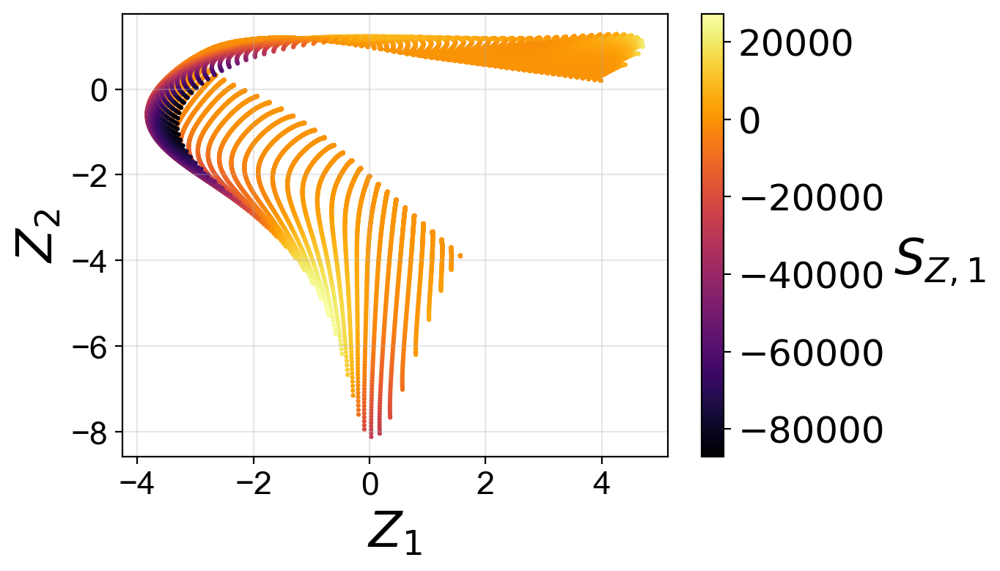
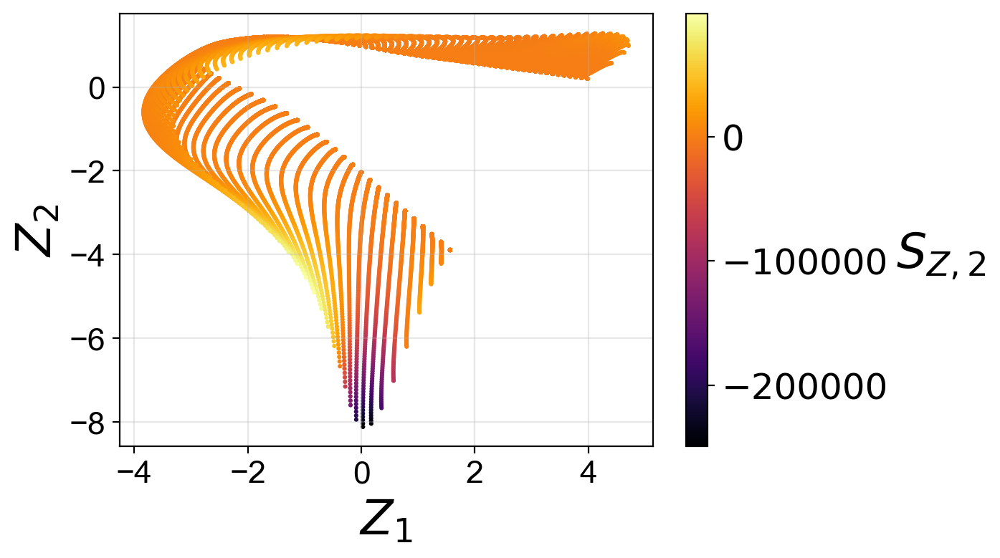
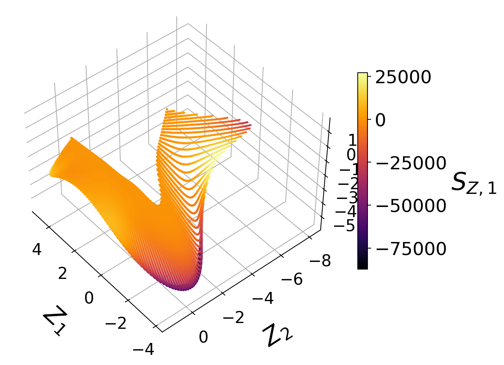
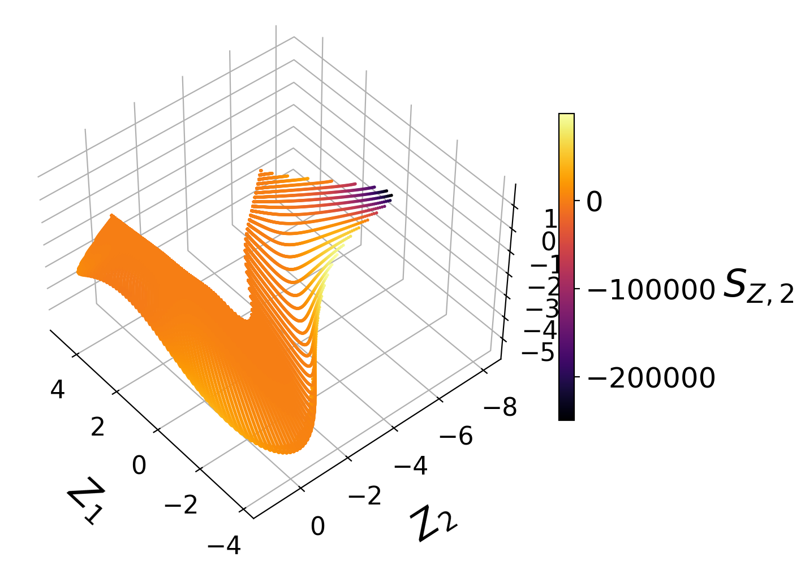
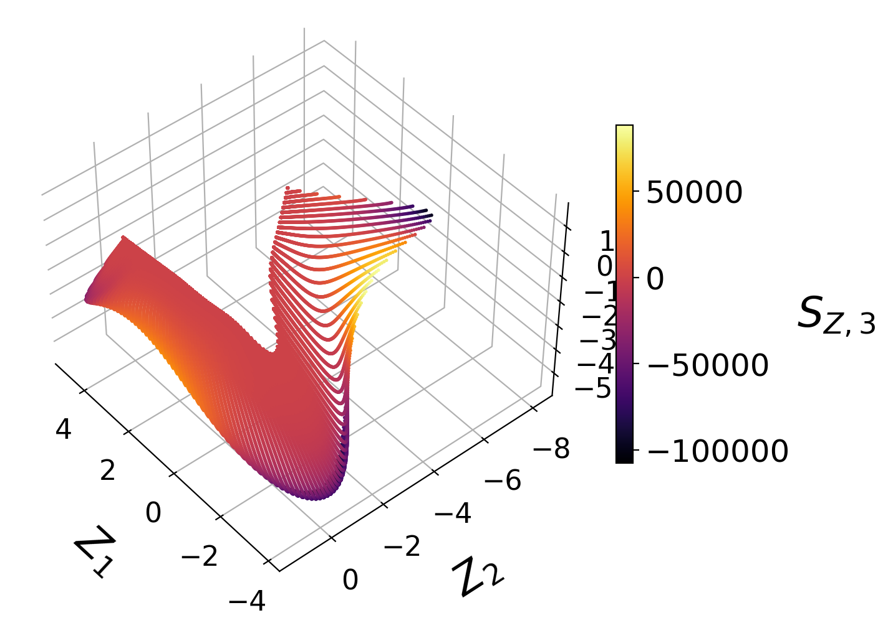
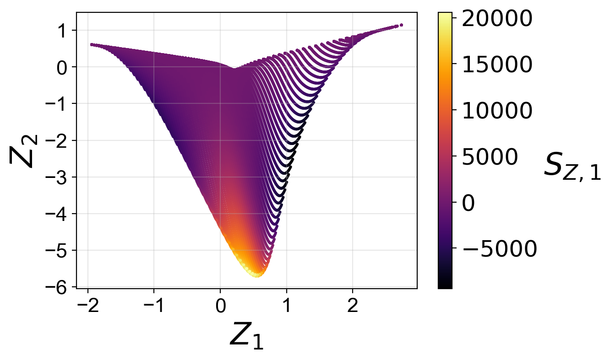
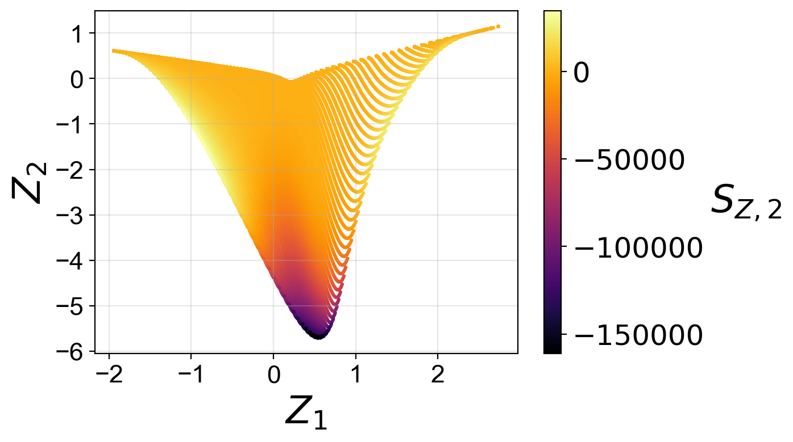

.. note:: This tutorial was generated from a Jupyter notebook that can be
          accessed `here <https://mybinder.org/v2/git/https%3A%2F%2Fgitlab.multiscale.utah.edu%2Fcommon%2FPCAfold/master?filepath=docs%2Ftutorials%2Fdemo-cost-function.ipynb>`_.

#######################################################################
Cost function for manifold topology assessment and optimization
#######################################################################

In this tutorial, we present the cost function from the ``analysis`` module which distills information from the normalized variance derivative into a single number. The cost function can be used for low-dimensional manifold topology assessment and manifold optimization.

We import the necessary modules:

.. code:: python

  from PCAfold import preprocess
  from PCAfold import reduction
  from PCAfold import analysis
  from PCAfold import manifold_informed_backward_variable_elimination as BVE
  import numpy as np

and we set some initial parameters:

.. code:: python

    save_filename = None

************************************
Upload a combustion data set
************************************

A data set representing combustion of syngas in air generated from steady laminar flamelet model using *Spitfire* and a chemical mechanism by Hawkes et al. is used as a demo data set.

We begin by importing the data set composed of the original state space variables,
:math:`\mathbf{X}`, and the corresponding source terms, :math:`\mathbf{S_X}`:

.. code:: python

    X = np.genfromtxt('data-state-space.csv', delimiter=',')
    S_X = np.genfromtxt('data-state-space-sources.csv', delimiter=',')
    X_names = ['T', 'H2', 'O2', 'O', 'OH', 'H2O', 'H', 'HO2', 'CO', 'CO2', 'HCO']

    (n_observations, n_variables) = np.shape(X)

****************************************************
Generate low-dimensional manifolds using PCA
****************************************************

Below, we generate two- and three-dimensional projections of the original data set from PCA for further assessment.

.. code:: python

    pca_X_2D = reduction.PCA(X, scaling='auto', n_components=2)
    Z_2D = pca_X_2D.transform(X)
    S_Z_2D = pca_X_2D.transform(S_X, nocenter=True)

.. code:: python

    pca_X_3D = reduction.PCA(X, scaling='auto', n_components=3)
    Z_3D = pca_X_3D.transform(X)
    S_Z_3D = pca_X_3D.transform(S_X, nocenter=True)

We visualize the generated manifolds:

****************************************************
Manifold assessment using the cost function
****************************************************

We are going to compute the cost function for the PC source terms as the target dependent variables.

We specify the penalty function to use:

.. code:: python

    penalty_function = 'log-sigma-over-peak'

and the bandwidth values, :math:`\sigma`, for normalized variance derivative computation:

.. code:: python

    bandwidth_values = np.logspace(-7, 3, 200)

We create lists of the target dependent variables names:

.. code:: python

    depvar_names_2D = ['SZ' + str(i) for i in range(1,3)]
    depvar_names_3D = ['SZ' + str(i) for i in range(1,4)]

and we begin with computing the normalized variance derivative for the two-dimensional PCA projection:

.. code:: python

    variance_data_2D = analysis.compute_normalized_variance(Z_2D,
                                                            S_Z_2D,
                                                            depvar_names=depvar_names_2D,
                                                            bandwidth_values=bandwidth_values)

The associated costs are computed from the generated object of the ``VarianceData`` class. With the ``norm=None`` we do not normalize the costs over all target variables (in this case the PC source terms), instead the output will give us the individual costs for each target variable.

.. code:: python

    costs_2D = analysis.cost_function_normalized_variance_derivative(variance_data_2D,
                                                                     penalty_function=penalty_function,
                                                                     norm=None)

We can print the individual costs:

.. code:: python

    for i, variable in enumerate(depvar_names_2D):
        print(variable + ':\t' + str(round(costs_2D[i],3)))

.. code-block:: text

    SZ1:	3.621
    SZ2:	1.249

Finally, we repeat the cost function computation for the three-dimensional PCA projection:

.. code:: python

    variance_data_3D = analysis.compute_normalized_variance(Z_3D,
                                                            S_Z_3D,
                                                            depvar_names=depvar_names_3D,
                                                            bandwidth_values=bandwidth_values)

.. code:: python

    costs_3D = analysis.cost_function_normalized_variance_derivative(variance_data_3D,
                                                                     penalty_function=penalty_function,
                                                                     norm=None)

and we print the individual costs:

.. code:: python

    for i, variable in enumerate(depvar_names_3D):
        print(variable + ':\t' + str(round(costs_3D[i],3)))

.. code-block:: text

    SZ1:	0.846
    SZ2:	0.958
    SZ3:	1.238

The cost function provides us information about the quality of the low-dimensional data projection with respect to target dependent variables, which in this case were the PC source terms. A higher cost indicates a worse manifold topology. The two topological aspects that the cost function takes into account are non-uniqueness and feature sizes.

We observe that individual costs are higher for the two-dimensional than for the three-dimensional PCA projection. This can be understood from our visualization of the manifolds, where we have seen a significant overlap affecting the first PC source term in particular. With the third manifold parameter added in the three-dimensional projection, the projection quality improves and the costs drop.

Moreover, for the two-dimensional PCA projection, the cost associated with the first PC source term is higher than the cost associated with the second PC source term. This can also be understood by comparing the two-dimensional projections colored by :math:`S_{Z, 1}` and by :math:`S_{Z, 2}`. The high magnitudes of :math:`S_{Z, 1}` values occur at the location where the manifold exhibits overlap, while the same overlap does not affect the :math:`S_{Z, 2}` values to the same extent.

****************************************************
Manifold optimization using the cost function
****************************************************

The ``analysis.manifold_informed_backward_elimination`` function implements an iterative feature selection algorithm that uses the cost function as an objective function. The algorithm selects an optimal subset of the original state variables that result in an optimized PCA manifold topology. Below, we demonstrate the algorithm on a 10% sample of the original data. The data is sampled to speed-up the calculations for the purpose of this demonstration. In real applications it is recommended to use the full data set.

Sample the original data:

.. code:: python

    sample_random = preprocess.DataSampler(np.zeros((n_observations,)).astype(int), random_seed=100, verbose=False)
    (idx_sample, _) = sample_random.random(10)

    sampled_X = X[idx_sample,:]
    sampled_S_X = S_X[idx_sample,:]

Specify the target variables to assess on the manifold (we will also add the PC source terms to the target variables by setting ``add_transformed_source=True``). In this case we take the temperature, $T$, and several important chemical species mass fractions: :math:`H_2`, :math:`O_2`, :math:`H_2O`, :math:`CO` and :math:`CO_2`:

.. code:: python

    target_variables = sampled_X[:,[0,1,2,5,8,9]]

Set the norm to take over all target dependent variables:

.. code:: python

    norm = 'cumulative'

Set the target manifold dimensionality:

.. code:: python

    q = 2

Run the algorithm:

.. code:: python

  _, selected_variables, _, _ = BVE(sampled_X,
                                    sampled_S_X,
                                    X_names,
                                    scaling='auto',
                                    bandwidth_values=bandwidth_values,
                                    target_variables=target_variables,
                                    add_transformed_source=True,
                                    target_manifold_dimensionality=q,
                                    penalty_function=penalty_function,
                                    norm=norm,
                                    verbose=True)

With ``verbose=True`` we will see additional information on costs at each iteration:

.. code-block:: text

    --------------------------------------------------
    Iteration No.4
    Currently eliminating variable from the following list:
    ['T', 'H2', 'O2', 'O', 'OH', 'H2O', 'H', 'CO2']
        Currently eliminated variable: T
        Running PCA for a subset:
        H2, O2, O, OH, H2O, H, CO2
        Cost:	9.3736
        WORSE
        Currently eliminated variable: H2
        Running PCA for a subset:
        T, O2, O, OH, H2O, H, CO2
        Cost:	11.7484
        WORSE
        Currently eliminated variable: O2
        Running PCA for a subset:
        T, H2, O, OH, H2O, H, CO2
        Cost:	12.4286
        WORSE
        Currently eliminated variable: O
        Running PCA for a subset:
        T, H2, O2, OH, H2O, H, CO2
        Cost:	11.1713
        WORSE
        Currently eliminated variable: OH
        Running PCA for a subset:
        T, H2, O2, O, H2O, H, CO2
        Cost:	8.4524
        SAME OR BETTER
        Currently eliminated variable: H2O
        Running PCA for a subset:
        T, H2, O2, O, OH, H, CO2
        Cost:	8.7855
        SAME OR BETTER
        Currently eliminated variable: H
        Running PCA for a subset:
        T, H2, O2, O, OH, H2O, CO2
        Cost:	10.0312
        WORSE
        Currently eliminated variable: CO2
        Running PCA for a subset:
        T, H2, O2, O, OH, H2O, H
        Cost:	9.0420
        WORSE

        Variable OH is removed.
        Cost:	8.4524

        Iteration time: 2.6 minutes.

Finally, we generate the PCA projection of the optimized subset of the original data set:

.. code:: python

    pca_X_optimized = reduction.PCA(X[:,selected_variables], scaling='auto', n_components=2)
    Z_optimized = pca_X_optimized.transform(X[:,selected_variables])
    S_Z_optimized = pca_X_optimized.transform(S_X[:,selected_variables], nocenter=True)

From the plots above, we observe that the optimized two-dimensional PCA projection exhibits much less overlap compared to the two-dimensional PCA projection that we computed earlier using the full data set.

Below, we compute the costs for the two PC source terms again for this optimized projection:

.. code:: python

    variance_data_optimized = analysis.compute_normalized_variance(Z_optimized,
                                                               S_Z_optimized,
                                                               depvar_names=depvar_names_2D,
                                                               bandwidth_values=bandwidth_values)

.. code:: python

    costs_optimized = analysis.cost_function_normalized_variance_derivative(variance_data_optimized,
                                                                            penalty_function=penalty_function,
                                                                            norm=None)

.. code:: python

    for i, variable in enumerate(depvar_names_2D):
        print(variable + ':\t' + str(round(costs_optimized[i],3)))

.. code-block:: text

    SZ1:	1.357
    SZ2:	0.831

We note that the costs for the two PC source terms are lower than the costs that we computed earlier using the full data set to generate the PCA projection.
