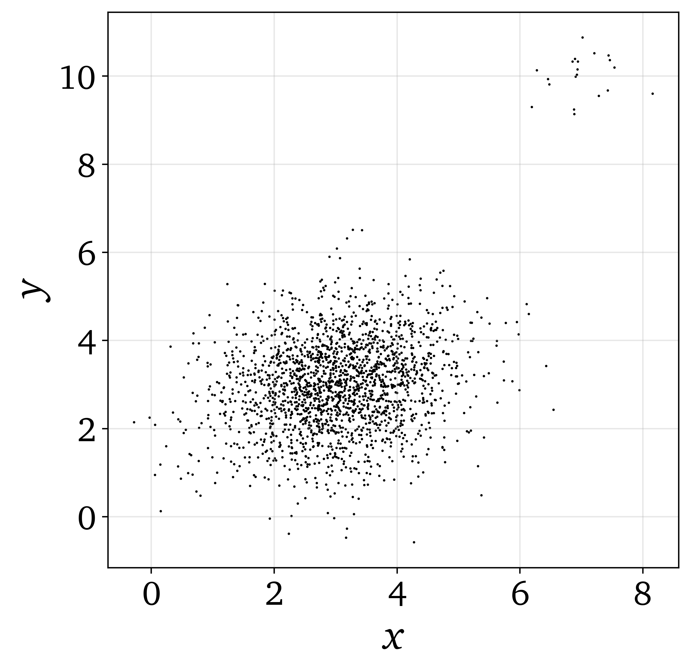
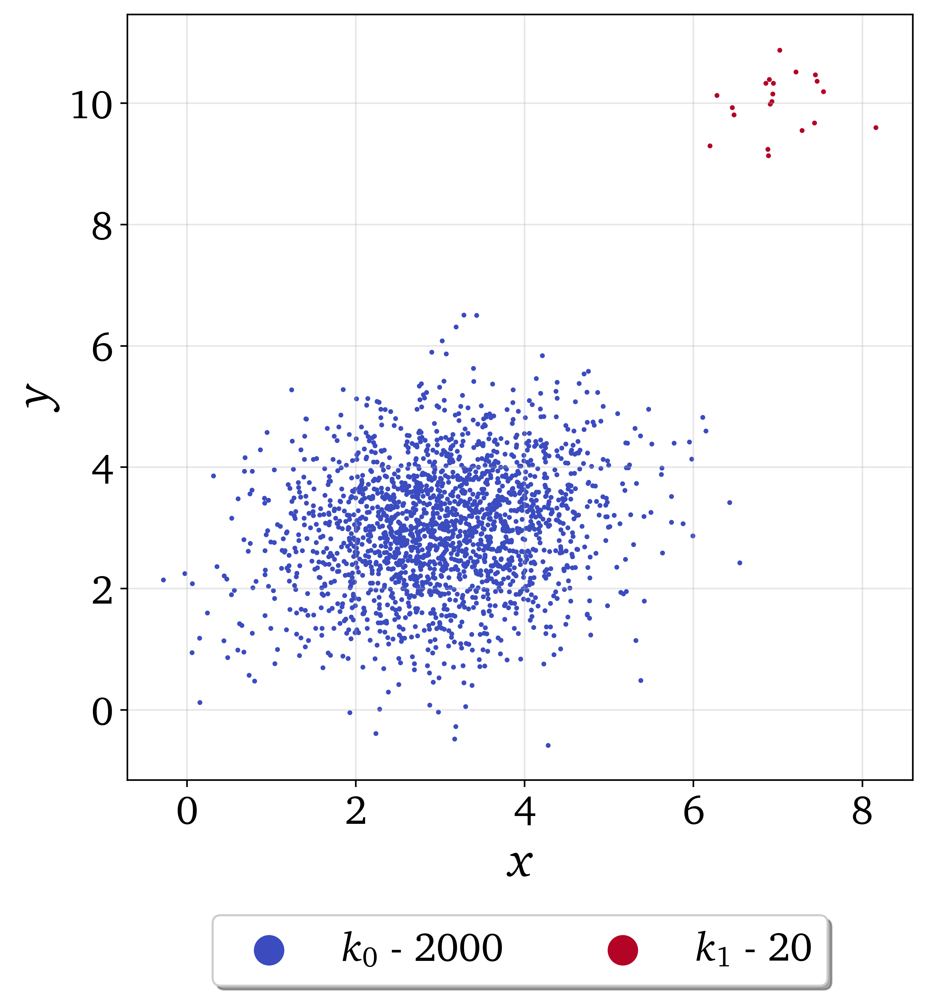
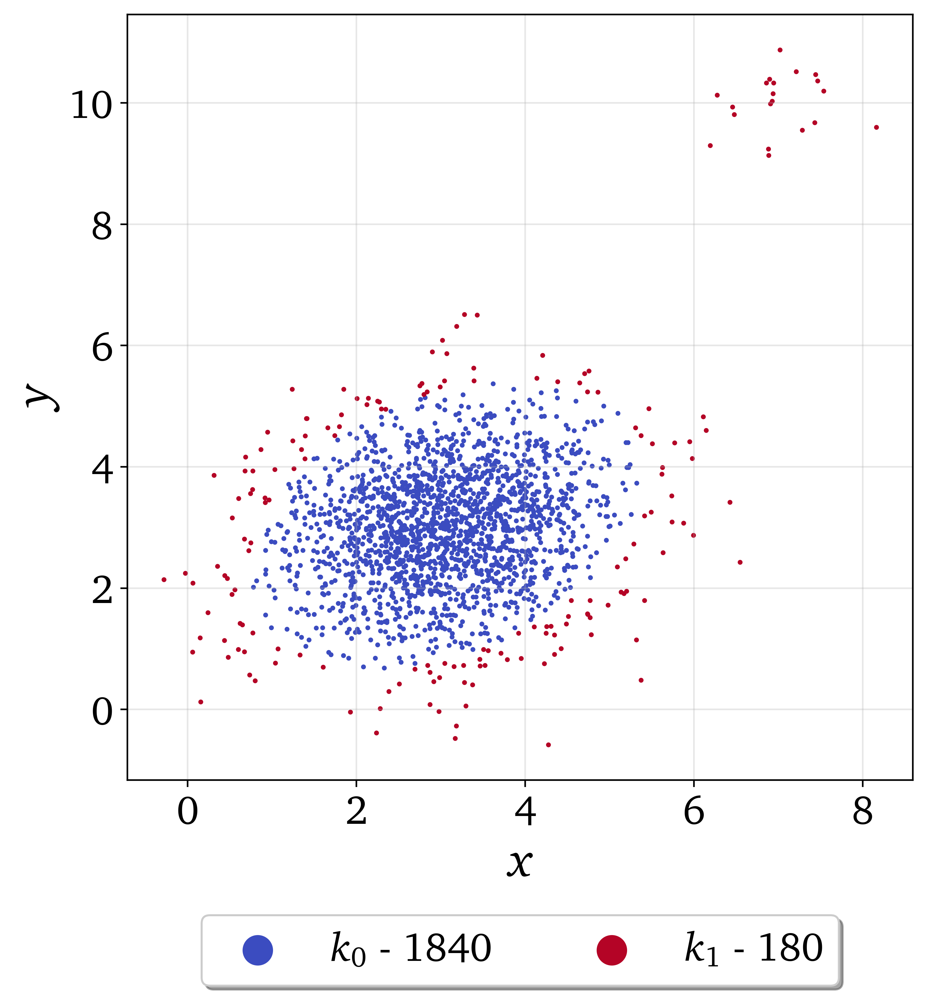

.. note:: This tutorial was generated from a Jupyter notebook that can be
          accessed `here <https://gitlab.multiscale.utah.edu/common/PCAfold/-/blob/regression/docs/tutorials/demo-data-manipulation.ipynb>`_.

#################
Preprocessing
#################

In this tutorial we present data manipulation functionalities of the ``preprocess`` module. To import the module:

.. code:: python

  from PCAfold import preprocess

--------------------------------------------------------------------------------

************************************************
Centering, scaling and constant variable removal
************************************************

We begin by generating a dummy data set:

.. code:: python

  import numpy as np

  X = np.random.rand(100,20)

Several popular scaling options have been implemented such as Auto (std), Range,
VAST or Pareto. Centering and scaling of data sets can be performed using
``preprocess.center_scale`` function:

.. code:: python

  (X_cs, X_center, X_scale) = preprocess.center_scale(X, 'range', nocenter=False)

To invert the centering and scaling using the current centers and scales
``preprocess.invert_center_scale`` function can be used:

.. code:: python

  X = preprocess.invert_center_scale(X_cs, X_center, X_scale)

If constant variables are present in the data set, they can be removed using
``preprocess.remove_constant_vars`` function which can be a useful pre-processing
before PCA is applied on a data set. If an artificial constant column is injected:

.. code:: python

  X[:,5] = np.ones((100,))

it can be removed by:

.. code:: python

  (X_removed, idx_removed, idx_retained) = preprocess.remove_constant_vars(X)

In addition to that, an object of the ``PreProcessing`` class can be created and
used to store the combination of the above pre-processing:

.. code:: python

  preprocessed = preprocess.PreProcessing(X, 'range', nocenter=False)

Centered and scaled data set can then be accessed as class attribute:

.. code:: python

  preprocessed.X_cs

as well as centers and scales:

.. code:: python

  preprocessed.X_center
  preprocessed.X_scale

--------------------------------------------------------------------------------

******************************
Multivariate outlier detection
******************************

We first generate a synthetic data set with artificially appended outliers.
This data set, with outliers visible as a cloud in the top right corner, can be seen below:

We will first detect outliers with ``'MULTIVARIATE TRIMMING'`` method and we
will demonstrate the effect of setting two levels of ``trimming_threshold``.

We first set ``trimming_threshold=0.6``:

.. code:: python

  (idx_outliers_removed, idx_outliers) = preprocess.outlier_detection(X, scaling='auto', detection_method='MULTIVARIATE TRIMMING', trimming_threshold=0.6, n_iterations=0, verbose=True)

With ``verbose=True`` we will see some more information on outliers detected:

.. code-block:: text

  Number of observations classified as outliers: 20

We can visualize the observations that were classified as outliers using the
``preprocess.plot_2d_clustering``, assuming that the cluster :math:`k_0` (blue) will be
observations with removed outliers and cluster :math:`k_1` (red) will be the detected outliers.

We first create a dummy ``idx_new`` vector of cluster classifications based on
``idx_outliers`` obtained. This can for instance be done in the following way:

.. code:: python

  idx_new = np.zeros((n_observations,))
  for i in range(0, n_observations):
    if i in idx_outliers:
        idx_new[i] = 1

where ``n_observations`` is the total number of observations in the data set.

The result of this detection can be seen below:

We then set the ``trimming_threshold=0.3`` which will capture outliers earlier (at smaller
Mahalanobis distances from the variables' centroids).

.. code:: python

  (idx_outliers_removed, idx_outliers) = preprocess.outlier_detection(X, scaling='auto', detection_method='MULTIVARIATE TRIMMING', trimming_threshold=0.3, n_iterations=0, verbose=True)

With ``verbose=True`` we will see some more information on outliers detected:

.. code-block:: text

  Number of observations classified as outliers: 180

The result of this detection can be seen below:

It can be seen that the algorithm started to pick up outlier observations at the perimeter of
the original data set.

--------------------------------------------------------------------------------

************************
Kernel density weighting
************************

In this tutorial we reproduce results from the following paper:

Coussement, A., Gicquel, O., & Parente, A. (2012). Kernel density weighted principal component analysis of combustion processes. Combustion and flame, 159(9), 2844-2855.
