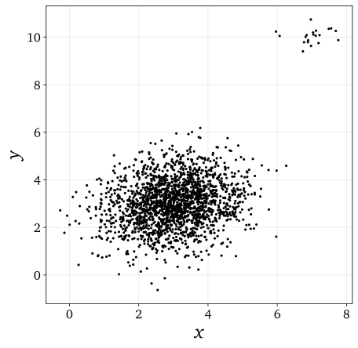
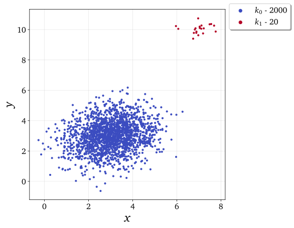
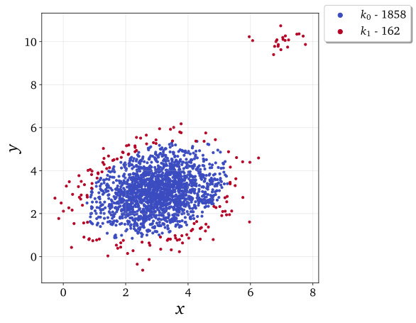
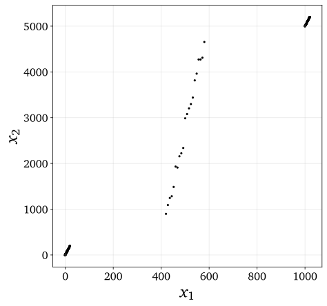
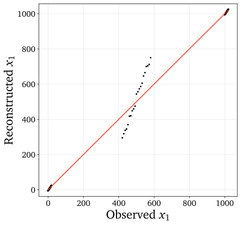
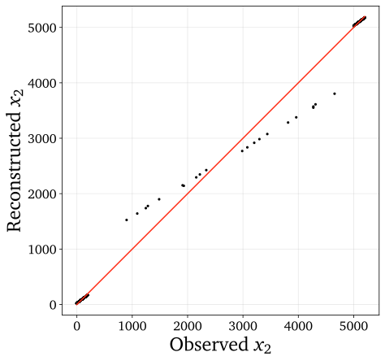
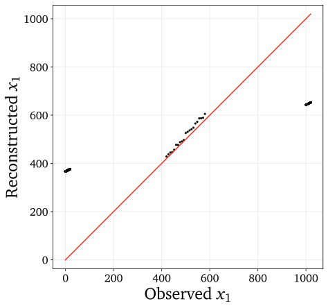

.. note:: This tutorial was generated from a Jupyter notebook that can be
          accessed `here <https://mybinder.org/v2/git/https%3A%2F%2Fgitlab.multiscale.utah.edu%2Fcommon%2FPCAfold/master?filepath=docs%2Ftutorials%2Fdemo-data-manipulation.ipynb>`_.

#################
Preprocessing
#################

In this tutorial we present data manipulation functionalities of the ``preprocess`` module. To import the module:

.. code:: python

  from PCAfold import preprocess

--------------------------------------------------------------------------------

************************************************
Centering, scaling and constant variable removal
************************************************

We begin by generating a dummy data set:

.. code:: python

  import numpy as np

  X = np.random.rand(100,20)

Several popular scaling options have been implemented such as Auto (std), Range,
VAST or Pareto. Centering and scaling of data sets can be performed using
``preprocess.center_scale`` function:

.. code:: python

  (X_cs, X_center, X_scale) = preprocess.center_scale(X, 'range', nocenter=False)

To invert the centering and scaling using the current centers and scales
``preprocess.invert_center_scale`` function can be used:

.. code:: python

  X = preprocess.invert_center_scale(X_cs, X_center, X_scale)

If constant variables are present in the data set, they can be removed using
``preprocess.remove_constant_vars`` function which can be a useful pre-processing
before PCA is applied on a data set. If an artificial constant column is injected:

.. code:: python

  X[:,5] = np.ones((100,))

it can be removed by:

.. code:: python

  (X_removed, idx_removed, idx_retained) = preprocess.remove_constant_vars(X)

In addition to that, an object of the ``PreProcessing`` class can be created and
used to store the combination of the above pre-processing:

.. code:: python

  preprocessed = preprocess.PreProcessing(X, 'range', nocenter=False)

Centered and scaled data set can then be accessed as class attribute:

.. code:: python

  preprocessed.X_cs

as well as centers and scales:

.. code:: python

  preprocessed.X_center
  preprocessed.X_scale

--------------------------------------------------------------------------------

************************************************
Conditional statistics
************************************************

In this section, we demonstrate how conditional statistics can be computed and plotted for the original data set. A data set representing combustion of syngas in air generated from steady laminar flamelet model using *Spitfire* software :cite:`Hansen2020` and a chemical mechanism by Hawkes et al. :cite:`Hawkes2007` is used as a demo data set. We begin by importing the data set composed of the original state space variables, :math:`\mathbf{X}`, and the corresponding mixture fraction observations, :math:`Z`, that will serve as the conditioning variable:

.. code:: python

    X = np.genfromtxt('data-state-space.csv', delimiter=',')
    Z = np.genfromtxt('data-mixture-fraction.csv', delimiter=',')

First, we create an object of the ``ConditionalStatistics`` class. We condition the entire data set :math:`\mathbf{X}`, using the mixture fraction as a conditioning variable. We compute the conditional stastics in 20 bins of the conditioning variable:

.. code:: python

    cond = preprocess.ConditionalStatistics(X, Z, k=20)

We can then retrieve the centroids for which the conditional statistics

.. code:: python

    cond.centroids

and retrieve different conditional statistics. For instance, the conditional mean can be accessed through:

.. code:: python

    conditional_mean = cond.conditional_mean

The conditional statistics can also be ploted using a dedicated function:

.. code:: python
    
    plt = preprocess.plot_conditional_statistics(X[:,0], Z, k=20, x_label='Mixture fraction [-]', y_label='$T$ [K]', color='#c0c0c0', statistics_to_plot=['mean', 'max', 'min'], figure_size=(10,4), save_filename=save_filename)

.. image:: ../images/conditional-statistics.svg
  :width: 600
  :align: center

Note, that the original data set that is plotted in the backround can be colored using any vector variable:

.. code:: python

    plt = preprocess.plot_conditional_statistics(X[:,0], Z, k=20, statistics_to_plot=['mean', 'max', 'min'], x_label='Mixture fraction [-]', y_label='$T$ [K]', color=X[:,2], color_map='inferno', colorbar_label='$Y_{O_2}$ [-]', figure_size=(12.5,4), save_filename=save_filename)

.. image:: ../images/conditional-statistics-colored.svg
  :width: 700
  :align: center

--------------------------------------------------------------------------------

******************************
Multivariate outlier detection
******************************

We first generate a synthetic data set with artificially appended outliers.
This data set, with outliers visible as a cloud in the top right corner, can be seen below:

We will first detect outliers with ``'MULTIVARIATE TRIMMING'`` method and we
will demonstrate the effect of setting two levels of ``trimming_threshold``.

We first set ``trimming_threshold=0.6``:

.. code:: python

  (idx_outliers_removed, idx_outliers) = preprocess.outlier_detection(X, scaling='auto', detection_method='MULTIVARIATE TRIMMING', trimming_threshold=0.6, n_iterations=0, verbose=True)

With ``verbose=True`` we will see some more information on outliers detected:

.. code-block:: text

  Number of observations classified as outliers: 20

We can visualize the observations that were classified as outliers using the
``preprocess.plot_2d_clustering``, assuming that the cluster :math:`k_0` (blue) will be
observations with removed outliers and cluster :math:`k_1` (red) will be the detected outliers.

We first create a dummy ``idx_new`` vector of cluster classifications based on
``idx_outliers`` obtained. This can for instance be done in the following way:

.. code:: python

  idx_new = np.zeros((n_observations,))
  for i in range(0, n_observations):
    if i in idx_outliers:
        idx_new[i] = 1

where ``n_observations`` is the total number of observations in the data set.

The result of this detection can be seen below:

We then set the ``trimming_threshold=0.3`` which will capture outliers earlier (at smaller
Mahalanobis distances from the variables' centroids).

.. code:: python

  (idx_outliers_removed, idx_outliers) = preprocess.outlier_detection(X, scaling='auto', detection_method='MULTIVARIATE TRIMMING', trimming_threshold=0.3, n_iterations=0, verbose=True)

With ``verbose=True`` we will see some more information on outliers detected:

.. code-block:: text

  Number of observations classified as outliers: 180

The result of this detection can be seen below:

It can be seen that the algorithm started to pick up outlier observations at the perimeter of
the original data set.

--------------------------------------------------------------------------------

************************
Kernel density weighting
************************

In this tutorial we reproduce results on a synthetic data set from the following paper:

*Coussement, A., Gicquel, O., & Parente, A. (2012). Kernel density weighted principal component analysis of combustion processes. Combustion and flame, 159(9), 2844-2855.*

We begin by generating the synthetic data set that has two distinct clouds with many
observations and an intermediate region with few observations:

.. code:: python

  from PCAfold import KernelDensity
  from PCAfold import PCA
  from PCAfold import reduction
  import numpy as np

  n_observations = 2021
  x1 = np.zeros((n_observations,1))
  x2 = np.zeros((n_observations,1))

  for i in range(0,n_observations):

    R = np.random.rand()

    if i <= 999:

        x1[i] = -1 + 20*R
        x2[i] = 5*x1[i] + 100*R

    if i >= 1000 and i <= 1020:

        x1[i] = 420 + 8*(i+1 - 1001)
        x2[i] = 5000/200 * (x1[i] - 400) + 500*R

    if i >= 1021 and i <= 2020:

        x1[i] = 1000 + 20*R
        x2[i] = 5*x1[i] + 100*R

  X = np.hstack((x1, x2))

This data set can be seen below:

We perform PCA on the data set and approximate it with a single principal component:

.. code:: python

  pca = PCA(X, scaling='auto', n_components=1)
  PCs = pca.transform(X)
  X_rec = pca.reconstruct(PCs)

Using the ``reduction.plot_parity`` function we can visualize how each variable is reconstructed:

We thus note that PCA adjusts to reconstruct well the two regions with many observations
and the intermediate region is not reconstructed well.

Single-variable case
====================

We will weight the data set using kernel density weighting method in order to
give more importance to the intermediate region. Kernel density weighting
can be performed by instantiating an object of the ``KernelDensity`` class.
As the first variable we pass the entire centered and scaled data set and as a
second variable we specify what should be the conditioning variable based on
which weighting will be computed:

.. code:: python

  kernd_single = KernelDensity(pca.X_cs, pca.X_cs[:,0], verbose=True)

With ``verbose=True`` we will see which case is being run:

.. code-block:: text

  Single-variable case will be applied.

In general, whenever the conditioning variable is a single vector a single-variable
case will be used.

We then obtain the weighted data set:

.. code::

  X_weighted_single = kernd_single.X_weighted

Weights :math:`\mathbf{W_c}` used to scale the data set can be accessed as well:

.. code::

  weights_single = kernd_single.weights

We perform PCA on the weighted data set and we project the centered and scaled
original data set onto the basis identified on ``X_weighted_single``:

.. code::

  pca_single = PCA(X_weighted_single, 'none', n_components=1, nocenter=True)
  PCs_single = pca_single.transform(pca.X_cs)

Reconstruction of that data set can be obtained:

.. code::

  X_rec_single = pca_single.reconstruct(PCs_single)
  X_rec_single = (X_rec_single * pca.X_scale) + pca.X_center

We can now use ``reduction.plot_parity`` function to visualize the new reconstruction:

.. image:: ../images/kernel-density-single-x2.svg
  :width: 350
  :align: center

We note that this time the intermediate region got better represented in the
PCA reconstruction.

Multi-variable case
====================

In a similar way, multi-variable case can be used by passing the entire two-dimensional
data set as a conditioning variable:

.. code:: python

  kernd_multi = KernelDensity(pca.X_cs, pca.X_cs, verbose=True)

We then perform analogous steps to obtain the new reconstruction:

.. code:: python

  X_weighted_multi = kernd_multi.X_weighted
  weights_multi = kernd_multi.weights

  pca_multi = PCA(X_weighted_multi, 'none', n_components=1)
  PCs_multi = pca_multi.transform(pca.X_cs)
  X_rec_multi = pca_multi.reconstruct(PCs_multi)
  X_rec_multi = (X_rec_multi * pca.X_scale) + pca.X_center

The result of this reconstruction can be seen below:

.. image:: ../images/kernel-density-multi-x2.svg
  :width: 350
  :align: center

--------------------------------------------------------------------------------

**********************
Bibliography
**********************

.. bibliography:: demo-handling-source-terms.bib
  :labelprefix: M
