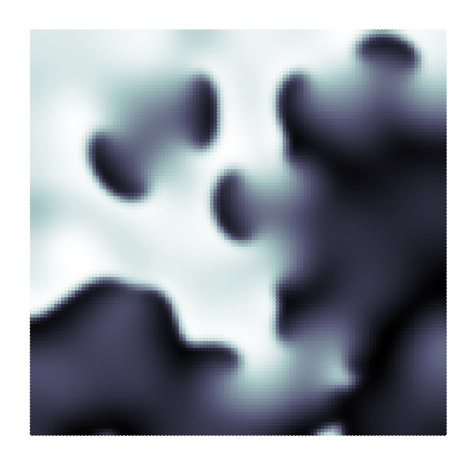
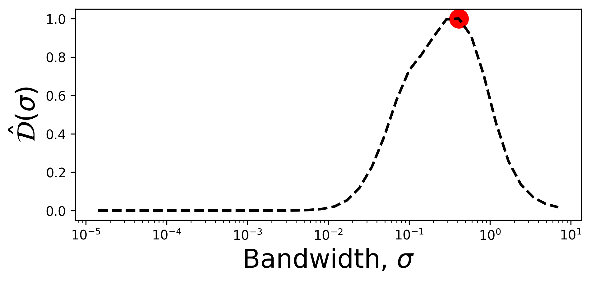
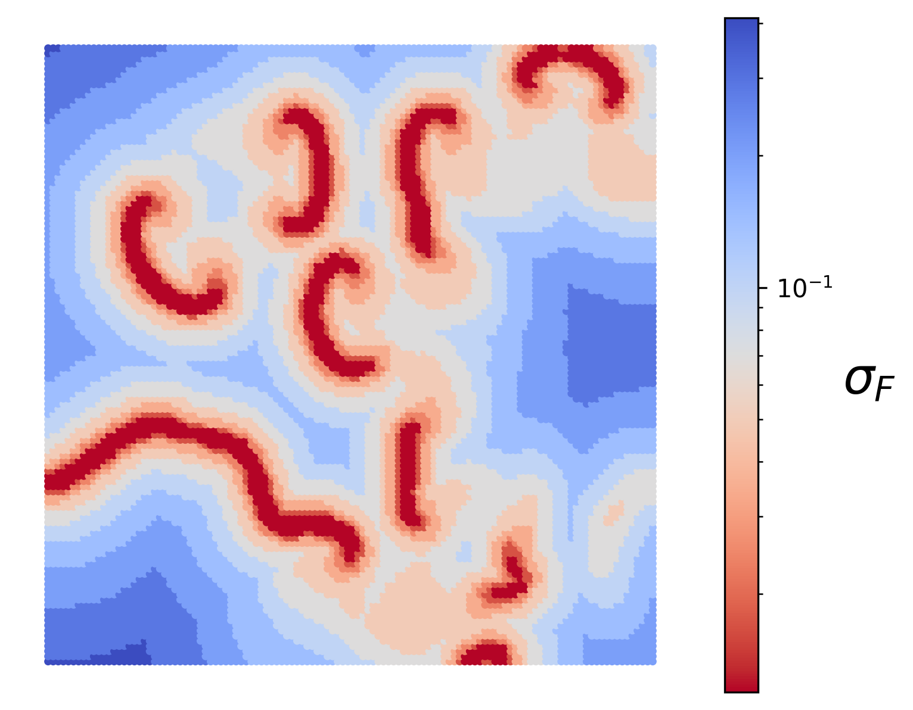

.. note:: This tutorial was generated from a Jupyter notebook that can be
          accessed `here <https://mybinder.org/v2/git/https%3A%2F%2Fgitlab.multiscale.utah.edu%2Fcommon%2FPCAfold/master?filepath=docs%2Ftutorials%2Fdemo-feature-size-map.ipynb>`_.

##################################
Local feature size estimation
##################################

In this tutorial, we present the local feature size estimation tool from the ``analysis`` module.

We import the necessary modules:

.. code:: python

    from PCAfold import preprocess
    from PCAfold import reduction
    from PCAfold import analysis
    import numpy as np
    import pandas as pd
    import time
    import matplotlib
    import matplotlib.pyplot as plt

and we set some initial parameters:

.. code:: python

    save_filename = None
    bandwidth_values = np.logspace(-5, 1, 40)
    
We upload the dataset which comes from solving the Brusselator PDE. The datasets has two independent variables, :math:`x` and :math:`y`, and one dependent variable, :math:`\phi`. The dataset is generated on a uniform :math:`x`-:math:`y` grid.
    
.. code:: python

    data = pd.read_csv('brusselator-PDE.csv', header=None).to_numpy()
    indepvars = data[:,0:2]
    depvar = data[:,2:3]
    

  
--------------------------------------------------------------------------------

******************************************************
Compute the feature sizes map on a synthetic dataset
******************************************************

We start by computing the normalized variance, :math:`\hat{\mathcal{N}}(\sigma)`. In order to compute the quantities necessary for drawing the feature size map, we need to set either ``compute_sample_norm_var=True`` or ``compute_sample_norm_range=True``.

.. code:: python

    tic = time.perf_counter()

    variance_data = analysis.compute_normalized_variance(indepvars,
                                                         depvars=depvar,
                                                         depvar_names=['phi'],
                                                         bandwidth_values=bandwidth_values,
                                                         compute_sample_norm_range=True)

    toc = time.perf_counter()
    print(f'\tTime it took: {(toc - tic)/60:0.1f} minutes.\n' + '-'*40)

We compute the normalized variance derivative, :math:`\hat{\mathcal{D}}(\sigma)`:

.. code:: python

    derivative, sigmas, _ = analysis.normalized_variance_derivative(variance_data)
    derivatives = derivative['phi']

The local feature size estimation algorithm iteratively updates the size of the local features by running "bandwidth descent" algorithm. The goal is to compute the bandwidth vector :math:`\mathbf{B}` which contains estimation of the local feature size tied to every data point. The vector :math:`\mathbf{B}` is first initialized with the largest feature sizes indicated by the ``starting_bandwidth_idx`` parameter. Entries in :math:`\mathbf{B}` are iteratively updated based on the ``cutoff`` value.

.. code:: python

    starting_bandwidth_idx = 29
    

  
We run bandwidth descent algorithm. This will update the bandwidth vector at each location where the sample normalized variance is above ``cutoff`` of its maximum value.

.. code:: python

    cutoff = 15
    
.. code:: python

    B = analysis.feature_size_map(variance_data, 
                                  variable_name='phi', 
                                  cutoff=cutoff, 
                                  starting_bandwidth_idx='peak', 
                                  use_variance=False,
                                  verbose=True)

