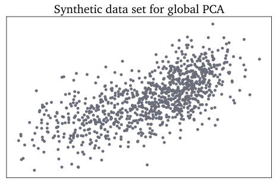
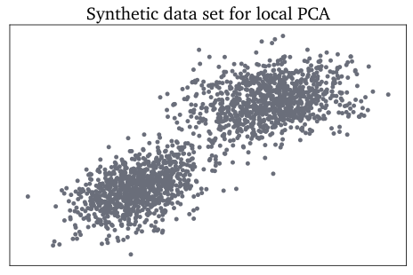
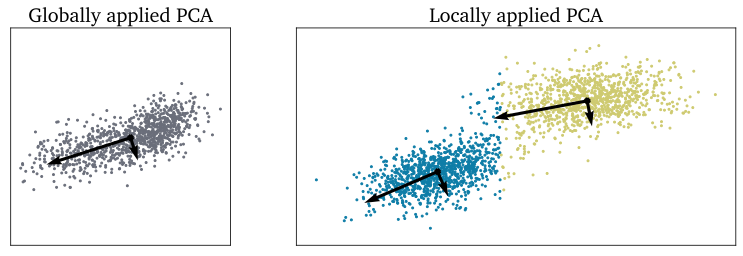

.. note:: This tutorial was generated from a Jupyter notebook that can be
          accessed `here <https://mybinder.org/v2/git/https%3A%2F%2Fgitlab.multiscale.utah.edu%2Fcommon%2FPCAfold/master?filepath=docs%2Ftutorials%2Fdemo-global-vs-local-pca.ipynb>`_.

Global and local PCA
====================

In this example we present how global and local PCA can be performed on a
synthetic data set using the ``reduction`` module.
We need to import the ``PCA`` and ``LPCA`` classes:

.. code:: python

  from PCAfold import preprocess
  from PCAfold import reduction
  from PCAfold import PCA, LPCA
  import numpy as np

We generate a synthetic data set on which the global PCA will be performed:

.. code:: python

  mean_global = [0,1]
  covariance_global = [[3.4, 1.1], [1.1, 2.1]]

  x_noise, y_noise = np.random.multivariate_normal(mean_global, covariance_global, n_points).T
  y_global = np.linspace(0,4,n_points)
  x_global = -(y_global**2) + 7*y_global + 4
  y_global = y_global + y_noise
  x_global = x_global + x_noise

  Dataset_global = np.hstack((x_global[:,np.newaxis], y_global[:,np.newaxis]))

This data set can be seen below:

We perform global PCA to obtain PC-scores, eigenvectors and eigenvalues:

.. code:: python

  # Perform PCA:
  pca = PCA(Dataset_global, 'none', n_components=2)
  PC_scores_global = pca.transform(Dataset_global, nocenter=False)
  eigenvectors_global = pca.A
  eigenvalues_global = pca.L

  # Centered data set:
  Dataset_global_pp = pca.X_cs

Similarly, we generate another synthetic data set that is composed of two distinct clouds of points:

.. code:: python

  mean_local_1 = [0,1]
  mean_local_2 = [6,4]
  covariance_local_1 = [[2, 0.5], [0.5, 0.5]]
  covariance_local_2 = [[3, 0.3], [0.3, 0.5]]

  x_noise_1, y_noise_1 = np.random.multivariate_normal(mean_local_1, covariance_local_1, n_points).T
  x_noise_2, y_noise_2 = np.random.multivariate_normal(mean_local_2, covariance_local_2, n_points).T
  x_local = np.concatenate([x_noise_1, x_noise_2])
  y_local = np.concatenate([y_noise_1, y_noise_2])

  Dataset_local = np.hstack((x_local[:,np.newaxis], y_local[:,np.newaxis]))

This data set can be seen below:

We perform clustering based on pre-defined bins using the available
``preprocess.predefined_variable_bins`` function.
We obtain cluster classifications and centroids for each cluster:

.. code:: python

  (idx, borders) = preprocess.predefined_variable_bins(Dataset_local[:,0], [2.5], verbose=False)
  centroids = preprocess.get_centroids(Dataset_local, idx)

We perform local PCA to obtain local PC-scores, eigenvectors and eigenvalues:

.. code:: python

  lpca = LPCA(Dataset_local, idx, scaling='none')

  eigenvectors_local = lpca.A
  eigenvalues_local = lpca.L

Finally, we plot the identified global and local eigenvectors on top of the synthetic data sets.
The visual result of performing PCA globally and locally can be seen below:

