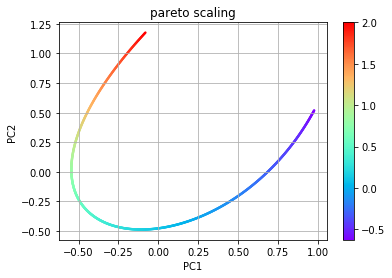
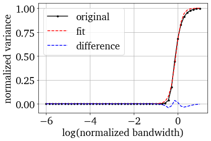
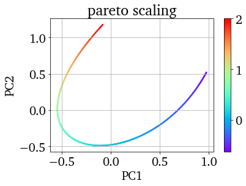

.. note:: This tutorial was generated from a Jupyter notebook that can be
          accessed `here <https://gitlab.multiscale.utah.edu/common/PCAfold/-/blob/master/docs/tutorials/demo-manifold-assessment.ipynb>`_.

Manifold Assessment
===================

In this notebook we demonstrate tools that may be used for assessing
manifold quality and dimensionality as well as comparing manifolds
(parameterizations) in terms of representing dependent variables of
interest.

.. code:: python

    import numpy as np
    import matplotlib.pyplot as plt
    from PCAfold import compute_normalized_variance, PCA, logistic_fit, assess_manifolds, plot_normalized_variance, plot_normalized_variance_comparison

Here we are creating a two-dimensional manifold to assess with a
dependent variable. Independent variables :math:`x` and :math:`y` and
dependent variable :math:`f` will be defined as

.. math::

    x = e^{g} \cos^2(g)

.. math::

    y = \cos^2(g)

.. math::

    f = g^3+g

for a grid :math:`g` between [-0.5,1].

.. code:: python

    npts = 1001
    grid = np.linspace(-0.5,1.,npts)

    x = np.exp(grid)*np.cos(grid)**2
    y = np.cos(grid)**2

    f = grid**3+grid
    depvar_name = 'f' # dependent variable name

    plt.scatter(x, y, c=f, s=5, cmap='rainbow')
    plt.colorbar()
    plt.grid()
    plt.xlabel('x')
    plt.ylabel('y')
    plt.title('colored by f')
    plt.show()

.. image:: ../images/output_3_0.png

We now want to assess the manifold in one and two dimensions using
``compute_normalized_variance``. In order to use this function, the
independent and dependent variables must be arranged into
two-dimensional arrays size npts by number of variables. This is done in
the following code.

.. code:: python

    indepvars = np.vstack((x, y)).T
    depvars = np.expand_dims(f, axis=1)
    print('indepvars shape:', indepvars.shape, '\n  depvars shape:', depvars.shape)

.. parsed-literal::

    indepvars shape: (1001, 2)
      depvars shape: (1001, 1)

We can now call ``compute_normalized_variance`` on both the
two-dimensional manifold and one-dimensional slices of it in order to
assess the true dimensionality of the manifold (which should be two in
this case). A normalized variance is computed at various bandwidths
(Gaussian kernel filter widths) which can provide indications of
overlapping states in the manifold (or non-uniqueness) as well as
indications of how spread out the dependent variables are. A unique
manifold with large spread in the data should better facilitate building
models for accurate representations of the dependent variables of
interest. Details on the normalized variance equations may be found in
the documentation.

The bandwidths are applied to the independent variables after they are
centered and scaled inside a unit box (by default). The bandwidth values
may be computed by default according to interpoint distances or may be
specified directly by the user.

Below is a demonstration of using default bandwidth values and plotting
the resulting normalized variance.

.. code:: python

    orig2D_default  = compute_normalized_variance(indepvars, depvars, [depvar_name])

    plt = plot_normalized_variance(orig2D_default, figure_size=(6,4))
    plt.show()

.. image:: ../images/output_7_0.png

Now we will define an array for the bandwidths in order for the same
values to be applied to our manifolds of interest.

.. code:: python

    depvar_name = 'depvar' # dependent variable name
    bandwidth = np.logspace(-6,1) # array of bandwidth values

    # one-dimensional manifold represented by x
    orig1Dx = compute_normalized_variance(indepvars[:,:1], depvars, [depvar_name], bandwidth_values=bandwidth)
    # one-dimensional manifold represented by y
    orig1Dy = compute_normalized_variance(indepvars[:,1:], depvars, [depvar_name], bandwidth_values=bandwidth)
    # original two-dimensional manifold
    orig2D  = compute_normalized_variance(indepvars,       depvars, [depvar_name], bandwidth_values=bandwidth)

The following plot shows the normalized variance calculated for the
dependent variable on each of the three manifolds. A single smooth rise
in the normalized variance over bandwidth values indicates a unique
manifold. Multiple rises, as can be seen in the one-dimensional
manifolds, indicate overlapping states. A curve that rises at larger
bandwidth values also indicates more spread in the dependent variable
over the manifold. Therefore the desired curve for an optimal manifold
is one that has a single smooth rise that occurs at larger bandwidth
values.

.. code:: python

    plt = plot_normalized_variance_comparison((orig1Dx, orig1Dy, orig2D), ([], [], []), ('Blues', 'Reds', 'Greens'), title='Normalized variance for '+depvar_name, figure_size=(7,4))
    plt.legend(['orig,1D_x', 'orig,1D_y', 'orig,2D'])
    plt.show()

.. image:: ../images/output_11_0.png

The ``assess_manifolds`` function may be used for a clearer visual
comparison of manifolds with multiple dependent variables. The idea
behind this comparison is to assess how well a logistic function fits
the normalized variance over a log scale of the bandwidth values. The
logistic function represents the desired single smooth rise that
indicates the uniqueness of the manifold. The shift in this logistic
function then gives a representation of the spread in the dependent
variable. We use the :math:`R^2` value for how well a logistic function
represents the normalized variance as well as the shift in the logistic
fitted function to indicate whether or not a manifold is appropriate for
representing the dependent variables of interest. Typically, :math:`R^2`
values less then ~0.999 indicate regions of overlap. The shift may be
related to where the normalized variance reaches about 50% of the
maximum, but only in the cases of a good logistic fit. Therefore, the
shift is used as secondary criteria for a manifold assessment.

In this example, we just have a single dependent variable, but with
multiple variables, the ``assess_method`` input to ``assess_manifolds``
specifies which logistic parameters across variables should be used to
represent a manifold. Options include min, max, or avg.

The output of ``assess_manifolds`` is a dictionary of the :math:`R^2`
and shift parameters from the logistic fits described above for each
manifold as well as a plot for comparing the manifolds, as shown below.
In this plot, the manifold uniqueness parameter is the :math:`R^2` of
the logistic fit and the manifold spread parameter is the shift in the
logistic fit. The ``R2`` key may be used to access the :math:`R^2`
values for all dependent variables and the ``sigma0`` key may be used to
access the logistic shift value for all dependent variables in the
returned dictionary.

We first create a dictionary of the classes returned by
``compute_normalized_variance``, then feed this to ``assess_manifolds``.
The result shows that the two-dimensional representation is the best for
our dependent variable as it has both the largest manifold uniqueness
parameter and manifold spread parameter. The manifold uniqueness
parameter of the one-dimensional manifolds being less than ~0.999
indicates these representations have overlapping states.

.. code:: python

    variance_data_dict = {}
    variance_data_dict['orig,1D_x'] = orig1Dx
    variance_data_dict['orig,1D_y'] = orig1Dy
    variance_data_dict['orig,2D'] = orig2D

    assessment = assess_manifolds(variance_data_dict)
    for key in assessment.keys():
        print(f"manifold: {key:9}   R2: {assessment[key]['R2'][0]:1.3f}   sigma0: {assessment[key]['sigma0'][0]:1.2e}")

.. image:: ../images/output_13_0.png

.. parsed-literal::

    manifold: orig,1D_x   R2: 0.925   sigma0: 5.04e-03
    manifold: orig,1D_y   R2: 0.926   sigma0: 4.98e-01
    manifold: orig,2D     R2: 0.999   sigma0: 8.07e-01

The plots below show more details on the logistic fitting that occurs in
``assess_manifolds``. These call the ``logistic_fit`` function which
returns the parameters we analyze for assessing manifolds and show the
fit against the original data as well as the difference between the two
when ``show_plot`` is set to True.

The first plot is a one-dimensional manifold with overlap while the
second plot is for the two-dimensional manifold.

.. code:: python

    print('Example of overlapping manifold resulting in bad logistic fit:')
    spread, R2 = logistic_fit(orig1Dx.normalized_variance[depvar_name], orig1Dx.bandwidth_values, show_plot=True)
    print(f'manifold spread parameter (shift in logistic fit): {spread:1.2e} \nmanifold uniqueness parameter (R-squared of logistic fit): {R2:1.3f}\n')

    print('Example of unique manifold resulting in good logistic fit:')
    spread, R2 = logistic_fit(orig2D.normalized_variance[depvar_name], orig2D.bandwidth_values, show_plot=True)
    print(f'manifold spread parameter (shift in logistic fit): {spread:1.2e} \nmanifold uniqueness parameter (R-squared of logistic fit): {R2:1.3f}\n')

.. parsed-literal::

    Example of overlapping manifold resulting in bad logistic fit:

.. parsed-literal::

    manifold spread parameter (shift in logistic fit): 5.04e-03
    manifold uniqueness parameter (R-squared of logistic fit): 0.925

    Example of unique manifold resulting in good logistic fit:

.. parsed-literal::

    manifold spread parameter (shift in logistic fit): 8.07e-01
    manifold uniqueness parameter (R-squared of logistic fit): 0.999

As an example of comparing multiple representations of a manifold in the
same dimensional space, we will use PCA. Below, two pca objects are
created with different scalings. The first uses the default scaling
``std`` while the second uses the scaling ``pareto``. The plots of the
resulting manifolds are shown below for comparison to the original. The
dimensions for the PCA manifolds are referred to as PC1 and PC2.

.. code:: python

    # PCA using std scaling
    pca_std = PCA(indepvars)
    eta_std = pca_std.transform(indepvars)

    plt.scatter(eta_std[:,0], eta_std[:,1], c=f, s=2, cmap='rainbow')
    plt.colorbar()
    plt.grid()
    plt.xlabel('PC1')
    plt.ylabel('PC2')
    plt.title('std scaling')
    plt.show()

    # PCA using pareto scaling
    pca_pareto = PCA(indepvars,'pareto')
    eta_pareto = pca_pareto.transform(indepvars)

    plt.scatter(eta_pareto[:,0], eta_pareto[:,1], c=f, s=2, cmap='rainbow')
    plt.colorbar()
    plt.grid()
    plt.xlabel('PC1')
    plt.ylabel('PC2')
    plt.title('pareto scaling')
    plt.show()

.. image:: ../images/output_17_0.png

We call ``compute_normalized_variance`` in order to assess these
manifolds in one and two dimensional space. Since PCA orders the PCs
according the amount of variance explained, we will use PC1 for
representing a one-dimensional manifold.

.. code:: python

    pca1D_std = compute_normalized_variance(eta_std[:,:1], depvars, [depvar_name],bandwidth_values=bandwidth)
    pca2D_std = compute_normalized_variance(eta_std,       depvars, [depvar_name],bandwidth_values=bandwidth)

    pca1D_pareto = compute_normalized_variance(eta_pareto[:,:1], depvars, [depvar_name],bandwidth_values=bandwidth)
    pca2D_pareto = compute_normalized_variance(eta_pareto,       depvars, [depvar_name],bandwidth_values=bandwidth)

Now we add the resulting data to our dictionary containing the original
manifold results and feed it to ``assess_manifolds`` to compare across
all manifolds.

These results show that PCA with ``std`` scaling improved our
two-dimensional manifold compared to the original and has a better
representation of the dependent variable of interest since it has higher
parameters for manifold uniqueness and manifold spread. We can also see
that PCA with ``pareto`` scaling created a similar representation to the
original manifold, and therefore offered no additional benefit. The
``std`` PCA manifold does a much better job at representing the data
with one dimension than the other techniques as the manifold uniqueness
parameter, while still indicating regions of overlap, indicates a lot
fewer regions of overlap than the others. This can be seen in collapsing
the ``std`` PCA figure above onto PC1 alone compared to collapsing the
other manifolds onto one dimension.

.. code:: python

    variance_data_dict['pca_std,1D'] = pca1D_std
    variance_data_dict['pca_std,2D'] = pca2D_std
    variance_data_dict['pca_pareto,1D'] = pca1D_pareto
    variance_data_dict['pca_pareto,2D'] = pca2D_pareto

    assessment = assess_manifolds(variance_data_dict)
    for key in assessment.keys():
        print(f"manifold: {key:13}   R2: {assessment[key]['R2'][0]:1.3f}   sigma0: {assessment[key]['sigma0'][0]:1.2e}")

.. image:: ../images/output_21_0.png

.. parsed-literal::

    manifold: orig,1D_x       R2: 0.925   sigma0: 5.04e-03
    manifold: orig,1D_y       R2: 0.926   sigma0: 4.98e-01
    manifold: orig,2D         R2: 0.999   sigma0: 8.07e-01
    manifold: pca_std,1D      R2: 0.975   sigma0: 7.55e-01
    manifold: pca_std,2D      R2: 0.999   sigma0: 9.44e-01
    manifold: pca_pareto,1D   R2: 0.886   sigma0: 9.36e-02
    manifold: pca_pareto,2D   R2: 0.999   sigma0: 8.10e-01

The optimal manifold out of the choices shown above would be the
two-dimensional ``std`` PCA manifold.
