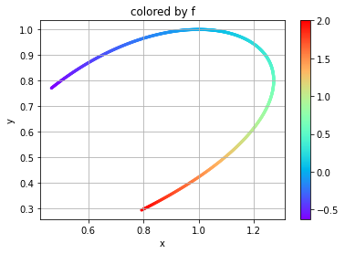
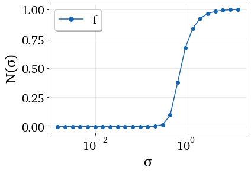
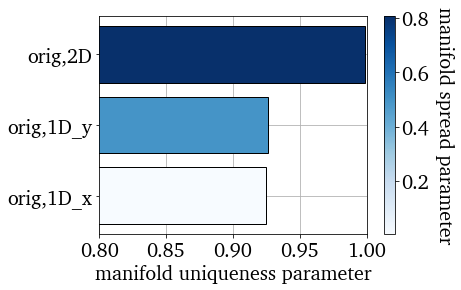
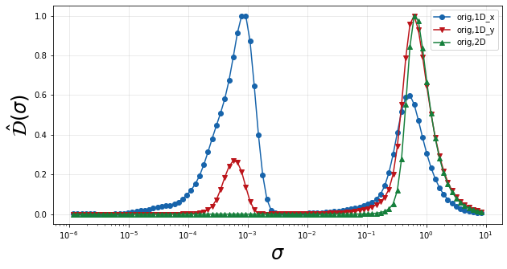
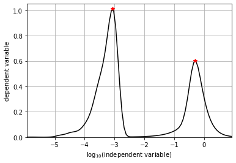
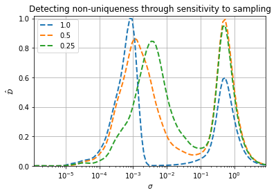
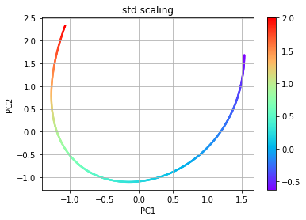
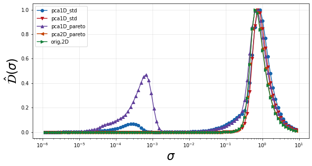

.. note:: This tutorial was generated from a Jupyter notebook that can be
          accessed `here <https://gitlab.multiscale.utah.edu/common/PCAfold/-/blob/master/docs/tutorials/demo-manifold-assessment.ipynb>`_.

Manifold Assessment
===================

In this notebook we demonstrate tools that may be used for assessing
manifold quality and dimensionality as well as comparing manifolds
(parameterizations) in terms of representing dependent variables of
interest.

.. code:: python

    import numpy as np
    import matplotlib.pyplot as plt
    from PCAfold import compute_normalized_variance, PCA, normalized_variance_derivative,\
    find_local_maxima, plot_normalized_variance, plot_normalized_variance_comparison,\
    plot_normalized_variance_derivative, plot_normalized_variance_derivative_comparison, random_sampling_normalized_variance

Here we are creating a two-dimensional manifold to assess with a
dependent variable. Independent variables :math:`x` and :math:`y` and
dependent variable :math:`f` will be defined as

.. math::

    x = e^{g} \cos^2(g)

.. math::

    y = \cos^2(g)

.. math::

    f = g^3+g

for a grid :math:`g` between [-0.5,1].

.. code:: python

    npts = 1001
    grid = np.linspace(-0.5,1.,npts)

    x = np.exp(grid)*np.cos(grid)**2
    y = np.cos(grid)**2

    f = grid**3+grid
    depvar_name = 'f' # dependent variable name

    plt.scatter(x, y, c=f, s=5, cmap='rainbow')
    plt.colorbar()
    plt.grid()
    plt.xlabel('x')
    plt.ylabel('y')
    plt.title('colored by f')
    plt.show()

We now want to assess the manifold in one and two dimensions using
``compute_normalized_variance``. In order to use this function, the
independent and dependent variables must be arranged into
two-dimensional arrays size npts by number of variables. This is done in
the following code.

.. code:: python

    indepvars = np.vstack((x, y)).T
    depvars = np.expand_dims(f, axis=1)
    print('indepvars shape:', indepvars.shape, '\n  depvars shape:', depvars.shape)

.. parsed-literal::

    indepvars shape: (1001, 2)
      depvars shape: (1001, 1)

We can now call ``compute_normalized_variance`` on both the
two-dimensional manifold and one-dimensional slices of it in order to
assess the true dimensionality of the manifold (which should be two in
this case). A normalized variance is computed at various bandwidths
(Gaussian kernel filter widths) which can provide indications of
overlapping states in the manifold (or non-uniqueness) as well as
indications of how spread out the dependent variables are. A unique
manifold with large spread in the data should better facilitate building
models for accurate representations of the dependent variables of
interest. Details on the normalized variance equations may be found in
the documentation.

The bandwidths are applied to the independent variables after they are
centered and scaled inside a unit box (by default). The bandwidth values
may be computed by default according to interpoint distances or may be
specified directly by the user.

Below is a demonstration of using default bandwidth values and plotting
the resulting normalized variance.

.. code:: python

    orig2D_default  = compute_normalized_variance(indepvars, depvars, [depvar_name])

    plt = plot_normalized_variance(orig2D_default)
    plt.show()

Now we will define an array for the bandwidths in order for the same
values to be applied to our manifolds of interest.

.. code:: python

    bandwidth = np.logspace(-6,1,100) # array of bandwidth values

    # one-dimensional manifold represented by x
    orig1Dx = compute_normalized_variance(indepvars[:,:1], depvars, [depvar_name], bandwidth_values=bandwidth)
    # one-dimensional manifold represented by y
    orig1Dy = compute_normalized_variance(indepvars[:,1:], depvars, [depvar_name], bandwidth_values=bandwidth)
    # original two-dimensional manifold
    orig2D  = compute_normalized_variance(indepvars,       depvars, [depvar_name], bandwidth_values=bandwidth)

The following plot shows the normalized variance calculated for the
dependent variable on each of the three manifolds. A single smooth rise
in the normalized variance over bandwidth values indicates a unique
manifold. Multiple rises, as can be seen in the one-dimensional
manifolds, indicate multiple scales of variation. In this example, those
smaller scales can be attributed to non-uniqueness introduced through
the projection into one dimension. A curve that rises at larger
bandwidth values also indicates more spread in the dependent variable
over the manifold. Therefore the desired curve for an optimal manifold
is one that has a single smooth rise that occurs at larger bandwidth
values.

.. code:: python

    plt = plot_normalized_variance_comparison((orig1Dx, orig1Dy, orig2D), ([], [], []), ('Blues', 'Reds', 'Greens'), title='Normalized variance for '+depvar_name)
    plt.legend(['orig,1D_x', 'orig,1D_y', 'orig,2D'])
    plt.show()

.. image:: ../images/output_11_0.png

In order to better highlight the fastest changes in the normalized
variance, we look at a scaled derivative over the logarithmically scaled
bandwidths which relays how fast the variance is changing as the
bandwidth changes. Specifically we compute
:math:`\hat{\mathcal{D}}(\sigma)`, whose equation can be found in the
documentation. Below we show this quantity for the original
two-dimensional manifold.

We see a single peak in :math:`\hat{\mathcal{D}}(\sigma)` corresponding
to the single rise in :math:`\mathcal{N}(\sigma)` pointed out above. The
location of this peak gives an idea of the feature sizes or length
scales associated with variation in the dependent variable over the
manifold.

.. code:: python

    plt = plot_normalized_variance_derivative(orig2D)
    plt.show()

We can also plot a comparison of these peaks using
``plot_normalized_variance_derivative_comparison`` for the three
manifold representations discussed thus far. In the plot below, we can
see that the two one-dimensional projections have two peaks in
:math:`\hat{\mathcal{D}}(\sigma)` corresponding to the two humps in the
normalized variance. This clearly shows that the projections are
introducing a significant scale of variation not present on the original
two-dimensional manifold. The locations of these peaks indicate the
feature sizes or scales of variaiton present in the dependent variable
on the manifolds.

.. code:: python

    plt = plot_normalized_variance_derivative_comparison((orig1Dx, orig1Dy, orig2D), ([],[],[]), ('Blues', 'Reds','Greens'))
    plt.legend(['orig,1D_x', 'orig,1D_y', 'orig,2D'])
    plt.show()

We can also break down the analysis of these peaks to determine the
:math:`\sigma` where they occur. The ``normalized_variance_derivative``
function will return a dictionary of :math:`\hat{\mathcal{D}}(\sigma)`
for each dependent variable along with the corresponding :math:`\sigma`
values. The ``find_local_maxima`` function can then be used to report
the locations of the peaks in :math:`\hat{\mathcal{D}}(\sigma)` along
with the peak values themselves. In order to properly analyze these
peaks, we leave the ``logscaling`` parameter to its default True value.
We can also set ``show_plot`` to True to display the peaks found. This
is demonstrated for the one-dimensional projection onto x below.

.. code:: python

    orig1Dx_derivative, orig1Dx_sigma = normalized_variance_derivative(orig1Dx)
    orig1Dx_peak_locs, orig1Dx_peak_values = find_local_maxima(orig1Dx_derivative[depvar_name], orig1Dx_sigma, show_plot=True)
    print('peak locations:', orig1Dx_peak_locs)
    print('peak values:', orig1Dx_peak_values)

.. parsed-literal::

    peak locations: [0.00086033 0.5070298 ]
    peak values: [1.01351778 0.60217727]

In this example, we know in the case of the one-dimensional projections
that non-uniqueness or overlap is introduced in the dependent variable
representation. This shows up as an additional peak in
:math:`\hat{\mathcal{D}}(\sigma)` compared to the original
two-dimensional manifold. In general, though, we may not know whether
that additional scale of variation is due to non-uniqueness or is a new
characteristic feature from sharpening gradients. We can analyze
sensitivity to data sampling in order to distinguish between the two.

As an example, we will analyze the projection onto x. We can use the
``random_sampling_normalized_variance`` to compute the normalized
variance for various random samplings based on the provided
``sampling_percentages`` argument. We can also specify multiple
realizations through the ``n_sample_iterations`` argument, which will be
averaged for returning :math:`\hat{\mathcal{D}}(\sigma)`. We will test
100%, 50%, and 25% specified as [1., 0.5, 0.25]. Note that specifying
100% returns the same result as calling compute_normalized variance on
the full dataset as we did above.

.. code:: python

    pctdict, pctsig, _ = random_sampling_normalized_variance([1., 0.5, 0.25],
                                                                 indepvars[:,:1],
                                                                 depvars,
                                                                 [depvar_name],
                                                                 bandwidth_values=bandwidth,
                                                                 n_sample_iterations=5)

.. parsed-literal::

    sampling 100.0 % of the data
      iteration 1 of 5
      iteration 2 of 5
      iteration 3 of 5
      iteration 4 of 5
      iteration 5 of 5
    sampling 50.0 % of the data
      iteration 1 of 5
      iteration 2 of 5
      iteration 3 of 5
      iteration 4 of 5
      iteration 5 of 5
    sampling 25.0 % of the data
      iteration 1 of 5
      iteration 2 of 5
      iteration 3 of 5
      iteration 4 of 5
      iteration 5 of 5

We then plot the result below and report the peak locations for the two
dominant peaks. We can see that the peak at the larger :math:`\sigma`
isn’t very sensitive to data sampling. It remains around 0.5. The peak
at smaller :math:`\sigma` though experiences a shift to larger
:math:`\sigma` as less data is included (lower percent sampling). This
is because variation from non-uniqueness is much more sensitive to data
spacing than characteristic feature variation. We would therefore
conclude that the second scale of variation introduced by the projection
onto x is due to non-uniqueness, not a characteristic feature size, and
therefore the projection is unacceptable. This confirms what we already
knew from the visual analysis.

.. code:: python

    peakthreshold = 0.4

    for pct in pctdict.keys():
        plt.semilogx(pctsig, pctdict[pct][depvar_name], '--', linewidth=2, label=pct)
        peak_locs, peak_vals = find_local_maxima(pctdict[pct][depvar_name], pctsig, threshold=peakthreshold)
        print(f'{pct*100:3.0f}% sampling peak locations: {peak_locs[0]:.2e}, {peak_locs[1]:.2e}')

    plt.grid()
    plt.xlabel('$\sigma$')
    plt.ylabel('$\hat{\mathcal{D}}$')
    plt.legend()
    plt.xlim([np.min(pctsig), np.max(pctsig)])
    plt.ylim([0,1.02])
    plt.title('Detecting non-uniqueness through sensitivity to sampling')
    plt.show()

.. parsed-literal::

    100% sampling peak locations: 8.60e-04, 5.07e-01
     50% sampling peak locations: 1.15e-03, 5.06e-01
     25% sampling peak locations: 3.68e-03, 4.98e-01

As an example of comparing multiple representations of a manifold in the
same dimensional space, we will use PCA. Below, two pca objects are
created with different scalings. The first uses the default scaling
``std`` while the second uses the scaling ``pareto``. The plots of the
resulting manifolds are shown below for comparison to the original. The
dimensions for the PCA manifolds are referred to as PC1 and PC2.

.. code:: python

    # PCA using std scaling
    pca_std = PCA(indepvars)
    eta_std = pca_std.transform(indepvars)

    plt.scatter(eta_std[:,0], eta_std[:,1], c=f, s=2, cmap='rainbow')
    plt.colorbar()
    plt.grid()
    plt.xlabel('PC1')
    plt.ylabel('PC2')
    plt.title('std scaling')
    plt.show()

    # PCA using pareto scaling
    pca_pareto = PCA(indepvars,'pareto')
    eta_pareto = pca_pareto.transform(indepvars)

    plt.scatter(eta_pareto[:,0], eta_pareto[:,1], c=f, s=2, cmap='rainbow')
    plt.colorbar()
    plt.grid()
    plt.xlabel('PC1')
    plt.ylabel('PC2')
    plt.title('pareto scaling')
    plt.show()

We call ``compute_normalized_variance`` in order to assess these
manifolds in one and two dimensional space. Since PCA orders the PCs
according the amount of variance explained, we will use PC1 for
representing a one-dimensional manifold.

.. code:: python

    pca1D_std = compute_normalized_variance(eta_std[:,:1], depvars, [depvar_name],bandwidth_values=bandwidth)
    pca2D_std = compute_normalized_variance(eta_std,       depvars, [depvar_name],bandwidth_values=bandwidth)

    pca1D_pareto = compute_normalized_variance(eta_pareto[:,:1], depvars, [depvar_name],bandwidth_values=bandwidth)
    pca2D_pareto = compute_normalized_variance(eta_pareto,       depvars, [depvar_name],bandwidth_values=bandwidth)

We then go straight to plotting :math:`\hat{\mathcal{D}}` to see if new
peaks are introduced compared to the original two-dimensional manifold,
indicating new scales of variation. We again find that the
one-dimensional projections are introducing a new scale. We could
perform a similar analysis as shown above on the projection onto x to
conclude that these new scales are also from non-uniqueness introduced
in the projection. We therefore continue the analysis only considering
two-dimensional parameterizations to figure out which one may be best in
representing f.

.. code:: python

    plt = plot_normalized_variance_derivative_comparison((pca1D_std, pca2D_std, pca1D_pareto, pca2D_pareto, orig2D),
                                                         ([],[],[],[],[]),
                                                         ('Blues', 'Reds', 'Purples', 'Oranges', 'Greens'))
    plt.legend(['pca1D_std', 'pca2D_std', 'pca1D_pareto', 'pca2D_pareto', 'orig,2D'])
    plt.show()

We compute the locations of the peaks in :math:`\hat{\mathcal{D}}` over
:math:`\sigma` below.

.. code:: python

    pca2D_std_derivative, pca2D_std_sigma  = normalized_variance_derivative(pca2D_std)
    pca2D_pareto_derivative, pca2D_pareto_sigma  = normalized_variance_derivative(pca2D_pareto)
    orig2D_derivative,  orig2D_sigma  = normalized_variance_derivative(orig2D)

    pca2D_std_peak_locs, _ = find_local_maxima(pca2D_std_derivative[depvar_name], pca2D_std_sigma)
    pca2D_pareto_peak_locs, _ = find_local_maxima(pca2D_pareto_derivative[depvar_name], pca2D_pareto_sigma)
    orig2D_peak_locs, _ = find_local_maxima(orig2D_derivative[depvar_name], orig2D_sigma)

    print('peak locations:')
    print('orig2D',orig2D_peak_locs)
    print('pca2D_std',pca2D_std_peak_locs)
    print('pca2D_pareto',pca2D_pareto_peak_locs)

.. parsed-literal::

    peak locations:
    orig2D [0.66762295]
    pca2D_std [0.78185085]
    pca2D_pareto [0.67063695]

The results show that PCA with ``std`` scaling results in the largest
feature size (largest :math:`\sigma`) and is therefore the best for
parameterizing f. This representation should better facilitate modeling
of f as the features are more spread out.
