.. note:: This tutorial was generated from a Jupyter notebook that can be
          accessed `here <https://gitlab.multiscale.utah.edu/common/PCAfold/-/blob/regression/docs/tutorials/demo-pca-on-sampled-data-sets.ipynb>`_.

PCA on sampled data sets
========================

In this tutorial we present how PCA can be performed on sampled data sets using
various helpful functions from ``preprocess`` and ``reduction`` modules.

We are first going to present major functionalities for performing and analyzing PCA
on sampled data set using a special case of sampling - by taking equal number
of samples from each cluster. Later, we are going to show a more general way to
perform PCA on data sets that are sampled in any way of choice.

Reach out to the relevant section that you'd like to learn about:

- `Special case of PCA on sampled data sets <https://pcafold.readthedocs.io/en/latest/tutorials/demo-pca-on-sampled-data-sets.html#equilibrate-cluster-populations-iteratively>`_ (for data sets formed by taking equal number of samples from local clusters)
- `Generalization of PCA on sampled data sets <https://pcafold.readthedocs.io/en/latest/tutorials/demo-pca-on-sampled-data-sets.html#generalization-of-pca-on-sampled-data-set>`_

To import the modules:

.. code:: python

  from PCAfold import preprocess
  from PCAfold import reduction

A general overview for performing PCA on sampled data set is presented below:

.. image:: ../images/cluster-biased-PCA-scheme-sampling-highlighted.png
  :width: 700

The main goal is to inform PCA of some of the characteristics of the sampled
data set :math:`\mathbf{X_r}`. There are several ways in which that information
can be used and they can be controlled using a selected
`Biasing options <https://pcafold.readthedocs.io/en/latest/user/data-reduction.html#id4>`_
and setting the ``biasing_option`` input parameter whenever needed. In this
example we choose ``biasing_option=2``. It is understood that PCA performed on a
sampled data set is *biased* in some way, since it usually contains different
ratios of various features identified with a clustering technique in terms of
sample density.

As an example, we will use a data set representing combustion of syngas
(CO/H2 mixture) in air generated from steady laminar flamelet model.
This data set has 11 variables and 50,000 observations. To load the data set
from the tutorials directory:

.. code:: python

  import numpy as np
  import pandas as pd

  state_space = pd.read_csv('data-state-space.csv', sep = ',', header=None).to_numpy()

We are also going to set some useful parameters, some of which will be used in
plotting functions:

.. code:: python

  # Select scaling method as per `preprocess.center_scale` function:
  scal_crit = 'auto'

  # Select biasing option:
  biasing_option = 2

  # Select number of clusters to partition the data set:
  n_clusters = 4

  # Select number of Principal Components that will be returned:
  n_components = 2

  # Set random seed for clustering and sampling techniques:
  random_seed = 100

  # Create labels for legends:
  legend_label = ['$\mathbf{X}$', '$\mathbf{X_r}$']

  # Create a list for variable annotations:
  state_space_names = ['$T$', '$H_2$', '$O_2$', '$O$', '$OH$', '$H_2O$', '$H$', '$HO_2$', '$CO$', '$CO_2$', '$HCO$']

We begin with clustering the data set using any algorithm of choice.
In this example we will use K-Means algorithm and partition the data set into
4 clusters:

.. code:: python

  from sklearn.preprocessing import StandardScaler
  from sklearn.cluster import KMeans

  scaler = StandardScaler()
  conditioning_variable = scaler.fit_transform(state_space)
  kmeans = KMeans(n_clusters=n_clusters, random_state=random_seed).fit(conditioning_variable)
  idx = kmeans.labels_

--------------------------------------------------------------------------------

Equilibrate cluster populations iteratively
-------------------------------------------

This function is a special case of performing PCA on sampled data set.
Specifically, it uses equal number of samples from each cluster and allows to
analyze what happens when the data set is sampled gradually. It begins with
performing PCA on the original data set and then in
``n_iterations`` it will gradually decrease the number of populations in each
cluster larger than the smallest cluster, heading towards population of the
smallest cluster, in each cluster.
At each iteration we obtain a new sampled data set on which PCA is performed.
At the last iteration, the number of populations in each cluster are equal and
finally PCA is performed at the *equilibrated* data set.

A schematic representation of this procedure is presented in the figure below:

.. image:: ../images/cluster-biased-PCA-equilibration.png
    :width: 700
    :align: center

.. code:: python

  (eigenvalues, eigenvectors, pc_scores, _, idx_train, _, _) = reduction.equilibrate_cluster_populations(state_space, idx, scaling=scal_crit, X_source=[], n_components=n_components, biasing_option=biasing_option, n_iterations=10, stop_iter=0, random_seed=random_seed, verbose=True)

With ``verbose=True`` we will see some detailed information on number of samples
in each cluster at each iteration:

.. code-block:: text

  Biasing is performed with option 2.

  At iteration 1 taking samples:
  {0: 15740, 1: 18492, 2: 5316, 3: 7579}

  At iteration 2 taking samples:
  {0: 14582, 1: 17028, 2: 5316, 3: 7328}

  At iteration 3 taking samples:
  {0: 13424, 1: 15564, 2: 5316, 3: 7077}

  At iteration 4 taking samples:
  {0: 12266, 1: 14100, 2: 5316, 3: 6826}

  At iteration 5 taking samples:
  {0: 11108, 1: 12636, 2: 5316, 3: 6575}

  At iteration 6 taking samples:
  {0: 9950, 1: 11172, 2: 5316, 3: 6324}

  At iteration 7 taking samples:
  {0: 8792, 1: 9708, 2: 5316, 3: 6073}

  At iteration 8 taking samples:
  {0: 7634, 1: 8244, 2: 5316, 3: 5822}

  At iteration 9 taking samples:
  {0: 6476, 1: 6780, 2: 5316, 3: 5571}

  At iteration 10 taking samples:
  {0: 5316, 1: 5316, 2: 5316, 3: 5316}

Analyze centers movement
------------------------

This function compares centers computed on the original data set
:math:`\mathbf{X}` versus on the sampled data set :math:`\mathbf{X_r}`.
The ``idx_train`` that is an input parameter could for instance be obtained
from ``equilibrate_cluster_populations``
and will thus represent the equilibrated data set sampled from the original data
set. It could also be obtained as sampled indices using any of the sampling
function from the ``DataSampler`` class.

.. code:: python

  (centers_X, centers_X_r, perc) = preprocess.analyze_centers_change(state_space, idx_train, variable_names=state_space_names, legend_label=legend_label, title=title, save_filename=save_filename)

Plotting example
^^^^^^^^^^^^^^^^

This function will produce a plot that shows the normalized centers and a
percentage by which the new centers have moved with respect to the original
ones. Example of a plot:

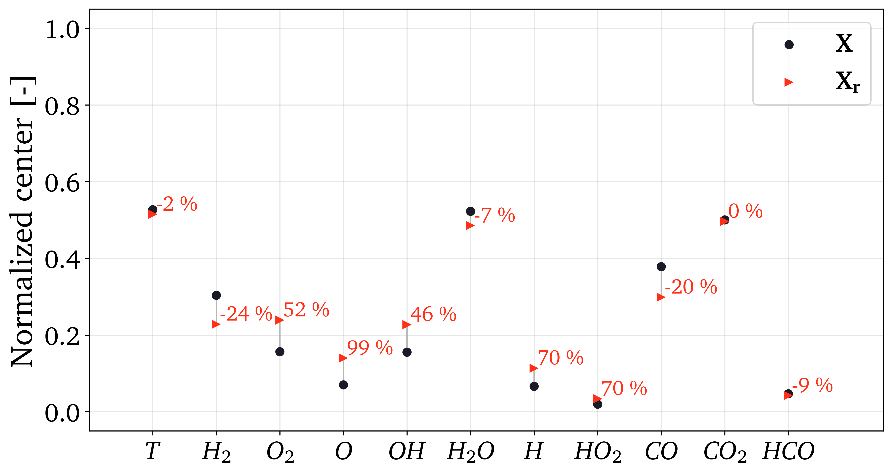

If you do not wish to plot all variables present in a data set, use the
``plot_variables`` list as an input parameter to select indices of variables to
plot:

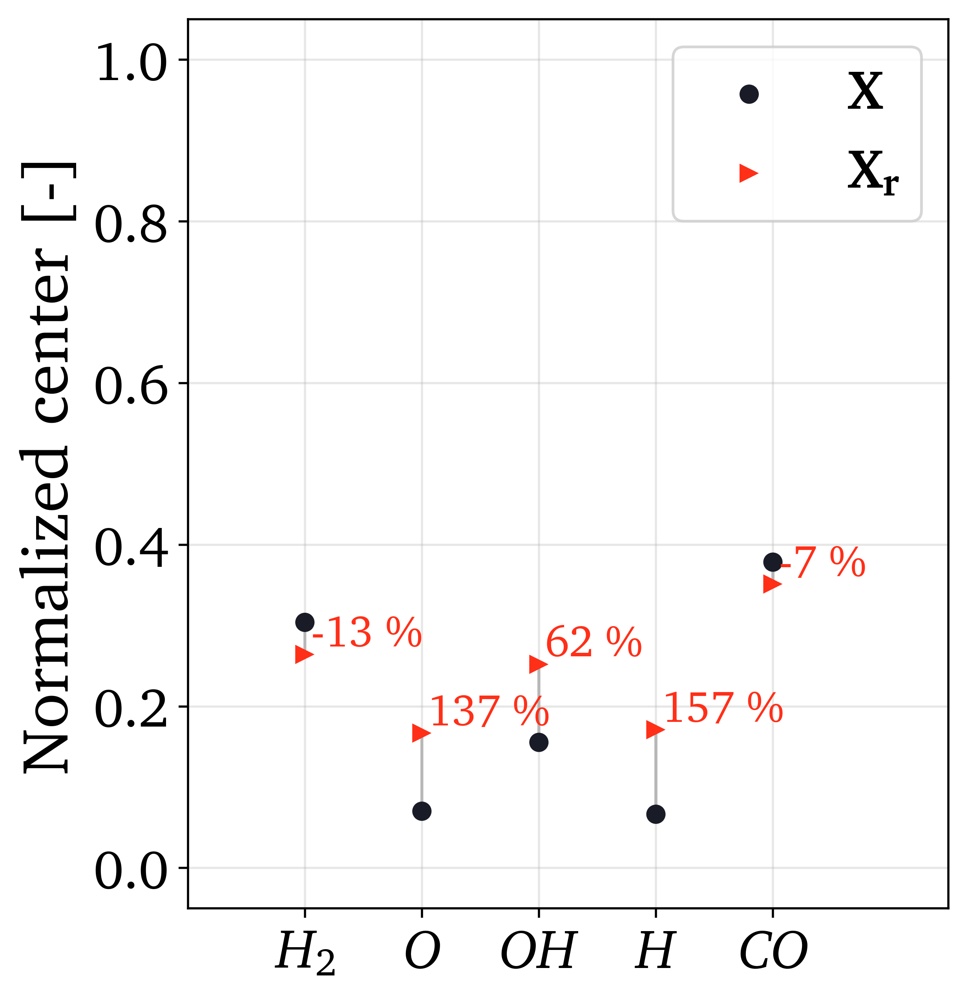

Analyze eigenvector weights movement
------------------------------------

The ``eigenvectors`` 3D array obtained from ``equilibrate_cluster_populations``
can now be used as an input parameter for plotting the eigenvector weights change
as we were gradually equilibrating cluster populations.

We are going to plot the first eigenvector (PC-1) weights movement with three
variants of normalization.
To access the first eigenvector one can simply do:

.. code:: python

  eigenvectors[:,0,:]

similarly, to access the second eigenvector:

.. code:: python

  eigenvectors[:,1,:]

and so on.

.. code:: python

  reduction.analyze_eigenvector_weights_movement(eigenvectors[:,0,:], state_space_names, plot_variables=[], normalize=False, zero_norm=False, title=title, save_filename=save_filename)

Plotting example
^^^^^^^^^^^^^^^^

Three weight normalization variants are available:

- No normalization, the absolute values of the eigenvector weights are plotted.\
  To use this variant set ``normalize=False``. Example can be seen below:

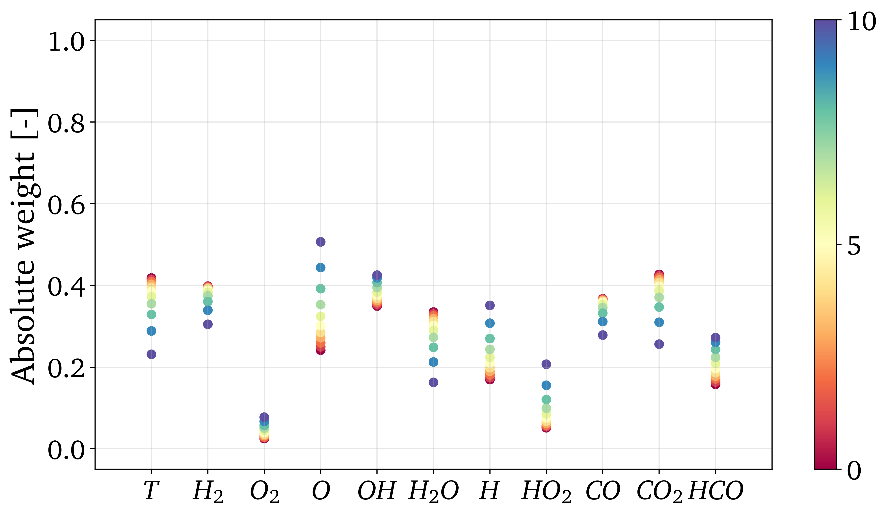

- Normalizing so that the highest weight is equal to 1 and the smallest weight\
  is between 0 and 1. This is useful for judging the severity of the weight movement.\
  To use this variant set ``normalize=True`` and ``zero_norm=False``.\
  Example can be seen below:

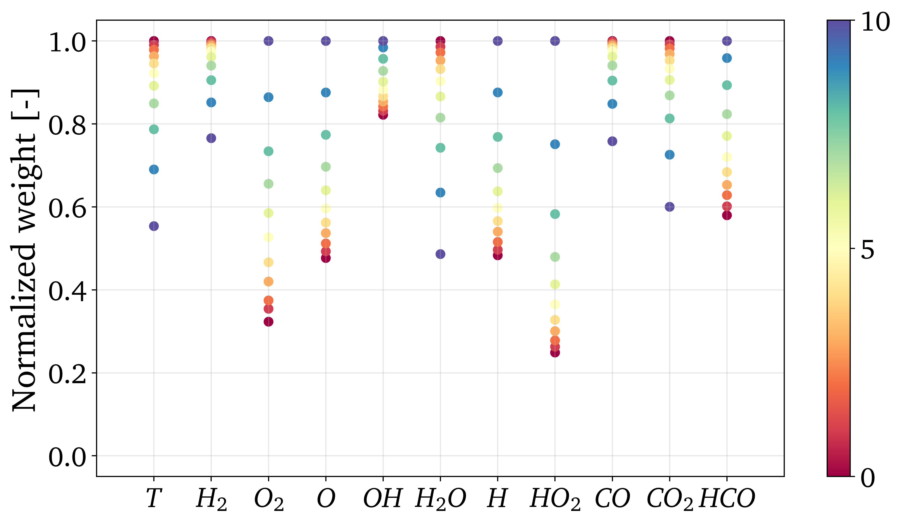

- Normalizing so that weights are between 0 and 1. This is useful for judging\
  the movement trends since it will blow up even the smallest changes to the entire\
  range 0-1. To use this variant set ``normalize=True`` and ``zero_norm=True``.\
  Example can be seen below:

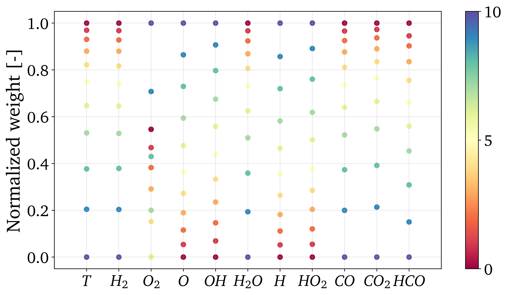

If you do not wish to plot all variables present in a data set, use the
``plot_variables`` list as an input parameter to select indices of variables to
plot:

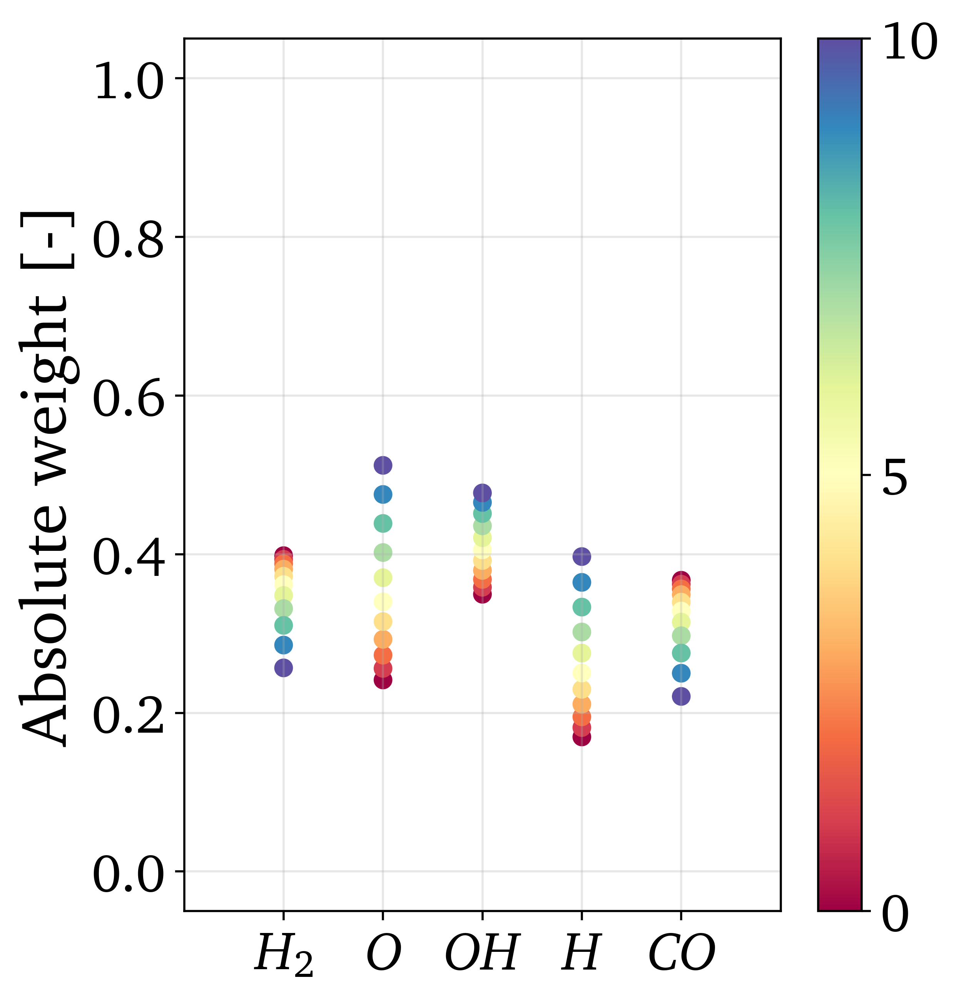

If you are only interested in plotting a comparison in eigenvector weights
change between the original data set :math:`\mathbf{X}` and the sampled data set
:math:`\mathbf{X_r}`, you can set the ``eigenvectors`` input parameter to only
contain these two sets of weights.
The function will then understand that only these two should be compared:

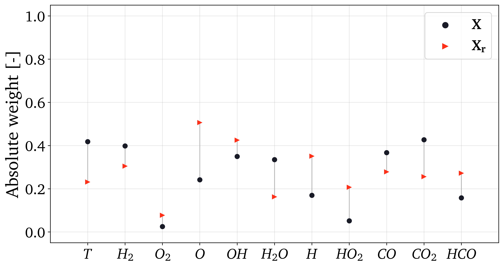

Such plot can be done as well for pre-selected variables using the
``plot_variables`` list:

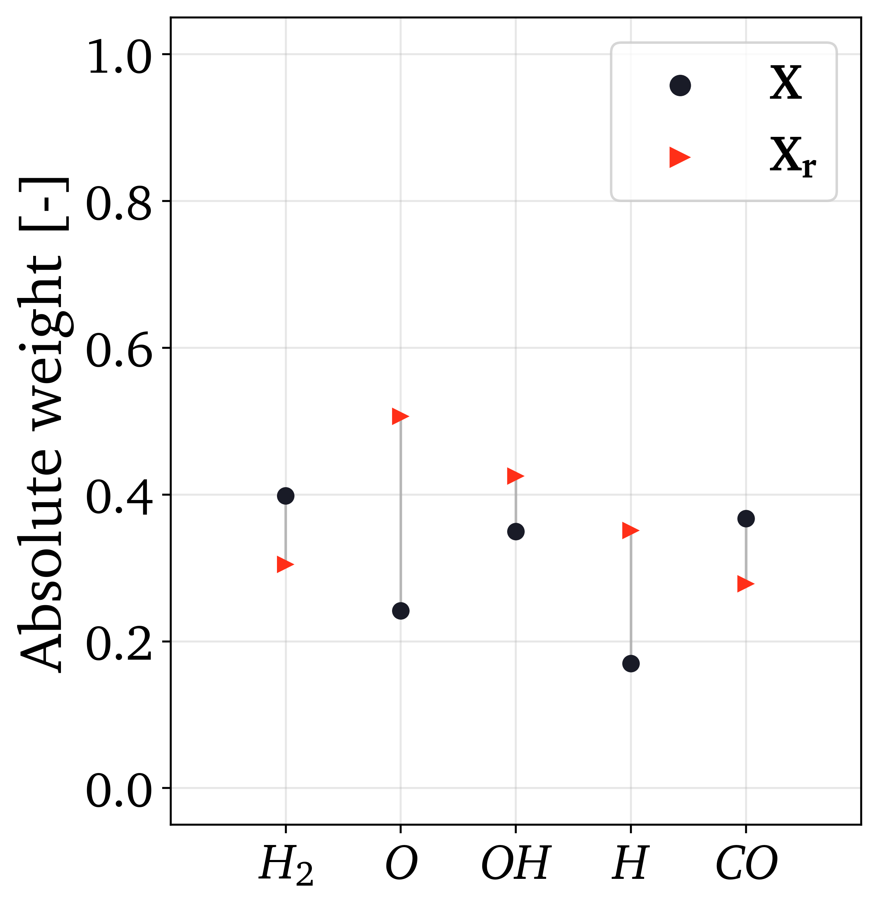

Analyze eigenvalue distribution
-------------------------------

Plotting example
^^^^^^^^^^^^^^^^

This function will produce a plot that shows the eigenvalues distribution for
the original data set :math:`\mathbf{X}` and for the sampled data set
:math:`\mathbf{X_r}`.
Example of a plot:

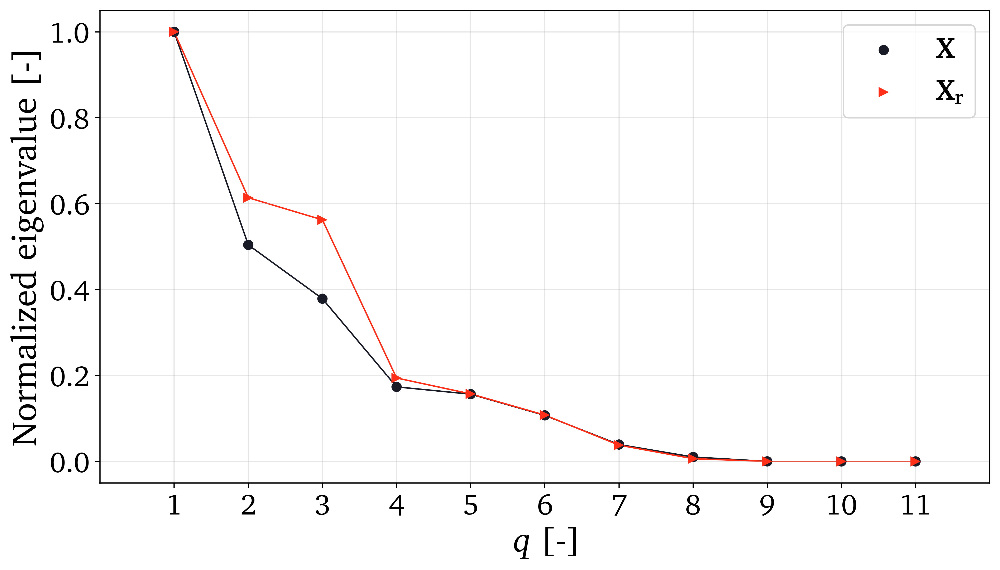

Visualize the biased manifold
-----------------------------

Plotting example
^^^^^^^^^^^^^^^^

Using the function ``reduction.plot_2d_manifold`` you can visualize any
2-dimensional manifold and additionally color it with a variable of choice.
Here we are going to plot the biased manifold resulting from performing PCA on
the sampled data set. Example of a plot:

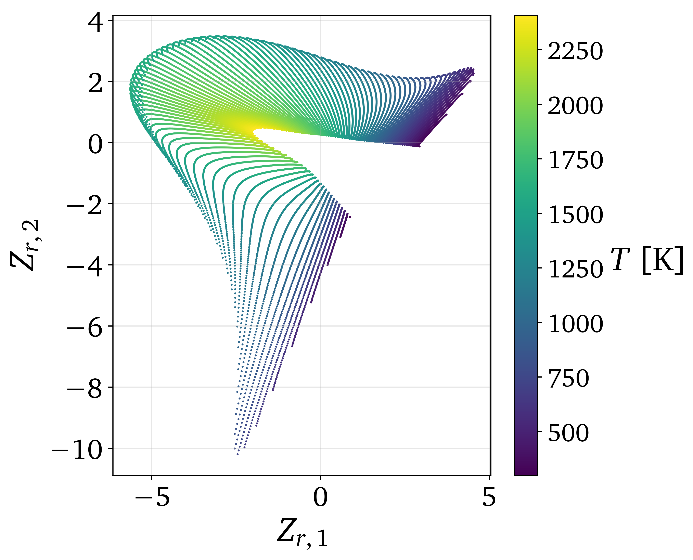

--------------------------------------------------------------------------------

Generalization of PCA on sampled data set
-----------------------------------------

A more general approach to performing PCA on sampled data sets (instead of using
``equilibrate_cluster_populations`` function) is to use
``pca_on_sampled_data_set`` function. This function allows to perform PCA on
data that has been sampled in any way (in contrast to *equilibrated* sampling
which always samples equal number of samples from each cluster).

.. note::

  It is worth noting that function ``equilibrate_cluster_populations`` uses
  ``pca_on_sampled_data_set`` inside.

We will first inspect how many samples each cluster has (in the earlier
identified clusters by K-Means algorithm):

.. code:: python

  print(preprocess.get_populations(idx))

which shows us populations of each cluster to be:

.. code-block:: text

  [7830, 16903, 19959, 5308]

We begin by generating a sampling using the already identified clusters and
perform manual sampling. Suppose that we'd like to severely under-represent the
two largest clusters and over-represent the features of the two smallest
clusters. Let's select 7000 samples from :math:`k_0`, 1000 samples from :math:`k_1`,
1000 samples from :math:`k_2` and 5000 samples from :math:`k_3`:

.. code:: python

  from PCAfold import DataSampler

  sample = DataSampler(idx, idx_test=[], random_seed=random_seed, verbose=True)

  (idx_manual, _) = sample.manual({0:7000, 1:1000, 2:1000, 3:5000}, sampling_type='number', test_selection_option=1)

In this example we are not interested in generating test samples, so we can
suppress returning those. The verbose information will tell us how the sample
densities compare in terms of percentage of samples in each cluster:

.. code-block:: text

  Cluster 0: taking 7000 train samples out of 7830 observations (89.4%).
  Cluster 1: taking 1000 train samples out of 16903 observations (5.9%).
  Cluster 2: taking 1000 train samples out of 19959 observations (5.0%).
  Cluster 3: taking 5000 train samples out of 5308 observations (94.2%).

  Cluster 0: taking 830 test samples out of 830 remaining observations (100.0%).
  Cluster 1: taking 15903 test samples out of 15903 remaining observations (100.0%).
  Cluster 2: taking 18959 test samples out of 18959 remaining observations (100.0%).
  Cluster 3: taking 308 test samples out of 308 remaining observations (100.0%).

  Selected 14000 train samples (28.0%) and 36000 test samples (72.0%).

We now perform PCA on a data set that has been sampled according to
``idx_manual`` using the ``pca_on_sampled_data_set`` function:

.. code:: python

  (eigenvalues, eigenvectors, pc_scores, _, _, _, _, _) = reduction.pca_on_sampled_data_set(state_space, idx_manual, scal_crit, n_components, biasing_option)

Finally, we can generate all the same plots that were shown before.
Here, we are only going to present the new biased manifold using current sampling:

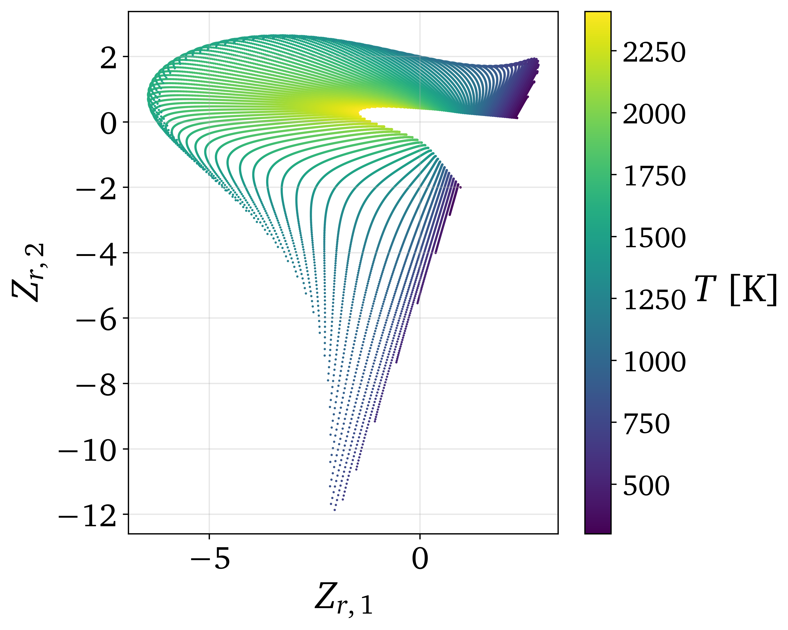
