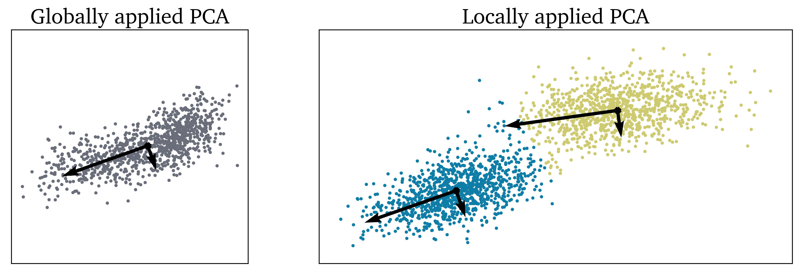

Principal Component Analysis
============================

In this tutorial we present the main functionalities of the ``pca_impl`` module. To import the module:

.. code:: python

  import PCAfold.pca_impl as PCA

--------------------------------------------------------------------------------

Global versus local PCA
-----------------------

.. note:: This tutorial was generated from a Jupyter notebook that can be
          accessed `here <https://gitlab.multiscale.utah.edu/common/PCA-python/-/blob/regression/docs/tutorials/demo-pca-global-local-PCA.ipynb>`_.

In this example we present how global and local PCA can be performed on a synthetic data set.
Here we will only need to import the ``PCA`` class:

.. code:: python

  from PCAfold.pca_impl import PCA

We generate a synthetic data set on which the global PCA will be performed:

.. code:: python

  import numpy as np

  mean_global = [0,1]
  covariance_global = [[3.4, 1.1], [1.1, 2.1]]

  x_noise, y_noise = np.random.multivariate_normal(mean_global, covariance_global, n_points).T
  y_global = np.linspace(0,4,n_points)
  x_global = -(y_global**2) + 7*y_global + 4
  y_global = y_global + y_noise
  x_global = x_global + x_noise

  Dataset_global = np.hstack((x_global[:,np.newaxis], y_global[:,np.newaxis]))

We perform global PCA to obtain PC-scores, eigenvectors and eigenvalues:

.. code:: python

  # Perform PCA:
  pca = PCA(Dataset_global, 'none', 2, useXTXeig=True)
  PC_scores_global = pca.x2eta(Dataset_global, nocenter=False)
  eigenvectors_global = pca.Q
  eigenvalues_global = pca.L

Similarly, we generate another synthetic data set ``Dataset_local`` that is composed of two distinct clouds of points.
We can use K-Means clustering algorithm to obtain cluster classifications and centroids for each cluster:

.. code:: python

  from sklearn.cluster import KMeans

  kmeans = KMeans(n_clusters=2, random_state=0).fit(Dataset_local)
  idx = kmeans.labels_
  centroids = kmeans.cluster_centers_

Local PCA function can be easily constructed using the existing features of the ``PCA`` class.
This function will perform the standard PCA transformation on local portions of the data set identified by K-Means algorithm.
An example function is shown below:

.. code:: python

  def local_pca(X, idx):

      n_k = len(np.unique(idx))

      # Initialize the outputs:
      eigenvectors = []
      eigenvalues = []
      PC_scores = []

      for k in range(0, n_k):

          # Extract local cluster:
          X_k = X[idx==k]

          # Perform PCA in a local cluster:
          pca = PCA(X_k, 'none', 2, useXTXeig=True)
          PC_scores = pca.x2eta(X_k, nocenter=False)
          eigenvectors.append(pca.Q)
          eigenvalues.append(pca.L)

      return (eigenvectors, eigenvalues, PC_scores)

Finally, we plot the identified global and local eigenvectors on top of the sythetic data sets.
The visual result of performing PCA globally and locally can be seen below:

