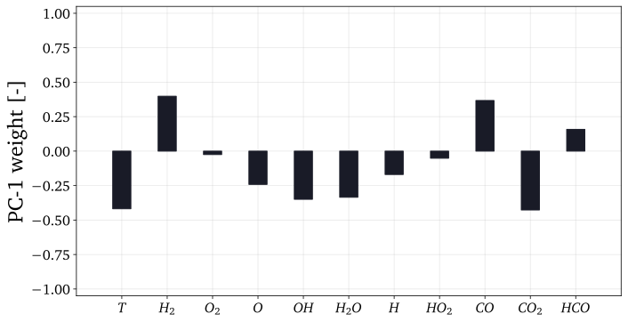
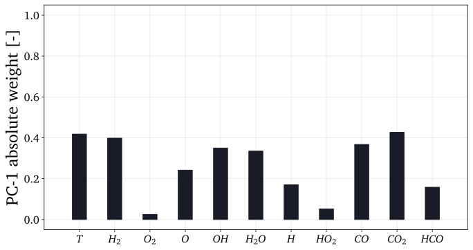
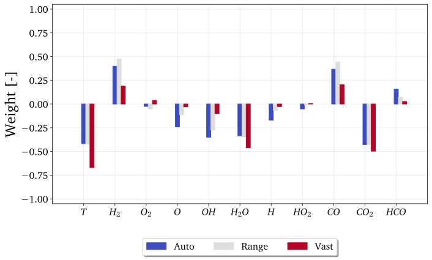
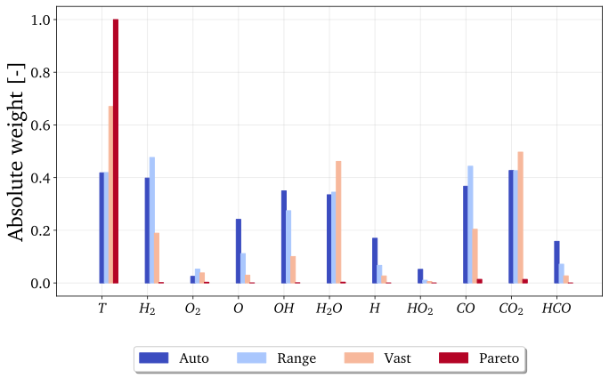
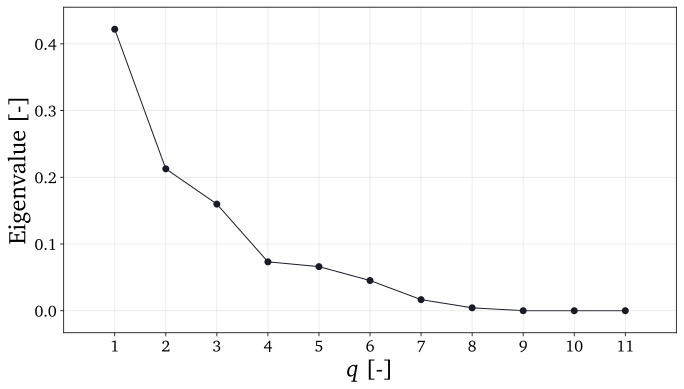
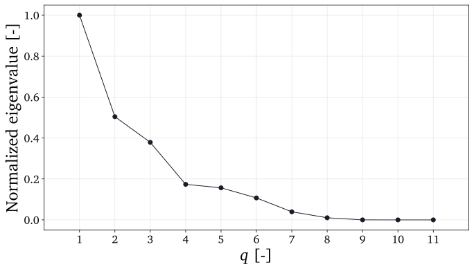
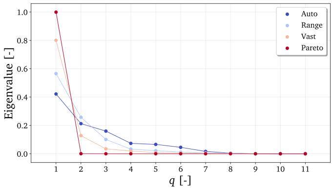
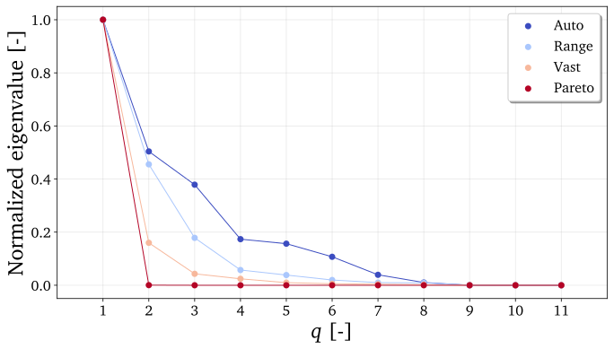
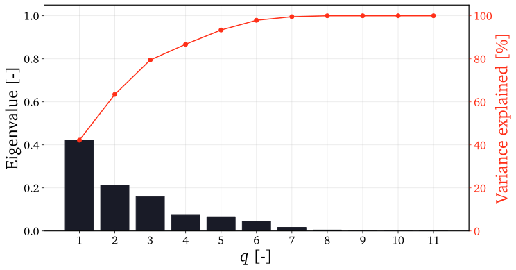
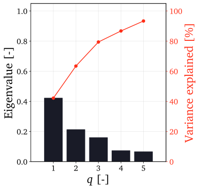

.. note:: This tutorial was generated from a Jupyter notebook that can be
          accessed `here <https://mybinder.org/v2/git/https%3A%2F%2Fgitlab.multiscale.utah.edu%2Fcommon%2FPCAfold/master?filepath=docs%2Ftutorials%2Fdemo-pca.ipynb>`_.

####################
Plotting PCA results
####################

In this tutorial we present plotting functionalities of the ``reduction`` module,
specifically some functions that aid in visualizing PCA results.

As an example, we will use a data set representing combustion of syngas
(CO/H2 mixture) in air generated from steady laminar flamelet model.
This data set has 11 variables and 50,000 observations. To load the data set
from the tutorials directory:

.. code:: python

  from PCAfold import PCA
  from PCAfold import reduction
  import numpy as np
  import pandas as pd

  X = pd.read_csv('data-state-space.csv', sep = ',', header=None).to_numpy()
  X_names = ['$T$', '$H_2$', '$O_2$', '$O$', '$OH$', '$H_2O$', '$H$', '$HO_2$', '$CO$', '$CO_2$', '$HCO$']

We generate three PCA objects corresponding to three scaling criteria:

.. code:: python

  pca_X_Auto = PCA(X, scaling='auto', n_components=3)
  pca_X_Range = PCA(X, scaling='range', n_components=3)
  pca_X_Vast = PCA(X, scaling='vast', n_components=3)

and we will plot PCA results from the generated objects.

--------------------------------------------------------------------------------

*******************
Single eigenvectors
*******************

Weights of a single eigenvector can be plotted using ``reduction.plot_eigenvectors`` function.
Note that multiple eigenvectors can be passed as an input and this function will
generate as many plots as there are eigenvectors supplied.

Below is an example of plotting just the first eigenvector:

.. code::

  plt = reduction.plot_eigenvectors(pca_X_Auto.A[:,0], variable_names=X_names, plot_absolute=False, title=None, save_filename=None)

To plot all eigenvectors resulting from a single ``PCA`` class object:

.. code::

  plts = reduction.plot_eigenvectors(pca_X_Auto.A, variable_names=X_names, plot_absolute=False, title=None, save_filename=None)

Plotting example
^^^^^^^^^^^^^^^^

Two weight normalizations are available:

- No normalization. To use this variant set ``plot_absolute=False``. Example can be seen below:

- Absolute values. To use this variant set ``plot_absolute=True``. Example can be seen below:

***********************
Eigenvectors comparison
***********************

Eigenvectors resulting from, for instance, different ``PCA`` class objects can
be compared on a single plot using ``reduction.plot_eigenvectors_comparison`` function.

.. code::

  plt = reduction.plot_eigenvectors_comparison((pca_X_Auto.A[:,0], pca_X_Range.A[:,0], pca_X_Vast.A[:,0]), legend_labels=['Auto', 'Range', 'Vast'], variable_names=X_names, plot_absolute=False, color_map='coolwarm', title=None, save_filename=None)

Plotting example
^^^^^^^^^^^^^^^^

Two weight normalizations are available:

- No normalization. To use this variant set ``plot_absolute=False``. Example can be seen below:

- Absolute values. To use this variant set ``plot_absolute=True``. Example can be seen below:

***********************
Eigenvalue distribution
***********************

Eigenvalue distribution can be plotted using ``reduction.plot_eigenvalue_distribution``.

.. code::

  plt = reduction.plot_eigenvalue_distribution(pca_X_Auto.L, normalized=False, title=None, save_filename=None)

Plotting example
^^^^^^^^^^^^^^^^

Two eigenvalue normalizations are available:

- No normalization. To use this variant set ``normalized=False``. Example can be seen below:

- Normalized to 1. To use this variant set ``normalized=True``. Example can be seen below:

**********************************
Eigenvalue distribution comparison
**********************************

Eigenvalues resulting from, for instance, different ``PCA`` class objects can
be compared on a single plot using ``reduction.plot_eigenvalues_comparison`` function.

.. code::

  plt = reduction.plot_eigenvalue_distribution_comparison((pca_X_Auto.L, pca_X_Range.L, pca_X_Vast.L), legend_labels=['Auto', 'Range', 'Vast'], normalized=True, color_map='coolwarm', title=None, save_filename=None)

Plotting example
^^^^^^^^^^^^^^^^

Two eigenvalue normalizations are available:

- No normalization. To use this variant set ``normalized=False``. Example can be seen below:

- Normalized to 1. To use this variant set ``normalized=True``. Example can be seen below:

*******************
Cumulative variance
*******************

Cumulative variance computed from eigenvalues can be plotted using
``reduction.plot_cumulative_variance`` function.

.. code::

  plt = reduction.plot_cumulative_variance(pca_X_Auto.L, n_components=0, title=None, save_filename=None)

Plotting example
^^^^^^^^^^^^^^^^

Example of a plot:

The number of eigenvalues to look at can also be truncated by setting
``n_components`` input parameter accordingly. Example of a plot when
``n_components=5`` in this case:

************************
Two-dimensional manifold
************************

Two-dimensional manifold resulting from performing PCA transformation can be
plotted using ``reduction.plot_2d_manifold`` function. We first calculate
the principal components by transforming the original data set to the new basis:

.. code::

  principal_components = pca_X_Vast.transform(X)

and we plot the resulting manifold:

.. code::

  plt = reduction.plot_2d_manifold(principal_components[:,0], principal_components[:,1], color='k', x_label='$Z_1$', y_label='$Z_2$', colorbar_label=None, figure_size=(10,4), save_filename=None)

By setting ``color=X[:,0]`` parameter, the manifold can be additionally
colored by the first variable in the data set:

.. code::

  plt = reduction.plot_2d_manifold(principal_components[:,0], principal_components[:,1], color=X[:,0], x_label='$Z_1$', y_label='$Z_2$', colorbar_label='$T$ [K]', color_map='inferno', figure_size=(10,4), save_filename=None)

Note that you can select the colormap to use through ``color_map`` parameter.

Plotting example
^^^^^^^^^^^^^^^^

Example of an uncolored plot:

.. image:: ../images/plotting-pca-2d-manifold-black.svg
    :width: 400
    :align: center

Example of using ``color_map='inferno'`` and coloring by the first variable in the data set:

.. image:: ../images/plotting-pca-2d-manifold-inferno.svg
    :width: 500
    :align: center

Example of using ``color_map='Blues'`` and coloring by the first variable in the data set:

.. image:: ../images/plotting-pca-2d-manifold-blues.svg
    :width: 500
    :align: center

**************************
Three-dimensional manifold
**************************

Similarly, a three-dimensional manifold can be plotted:

.. code::

  plt = reduction.plot_3d_manifold(principal_components[:,0], principal_components[:,1], principal_components[:,2], elev=30, azim=-20, color=X[:,0], x_label='$Z_1$', y_label='$Z_2$', z_label='$Z_3$', colorbar_label='$T$ [K]', color_map='inferno', figure_size=(15,8), save_filename=None)

Plotting example
^^^^^^^^^^^^^^^^

.. image:: ../images/plotting-pca-3d-manifold.svg
    :width: 500
    :align: center

************************
Parity plot
************************

Parity plots of reconstructed variables can be visualized using
``reduction.plot_parity`` function. We approximate the data set using the previously
obtained two principal components:

.. code::

  X_rec = pca_X_Vast.reconstruct(principal_components)

and we generate the parity plot:

.. code::

  plt = reduction.plot_parity(X[:,0], X_rec[:,0], color=X[:,0], x_label='Observed $T$', y_label='Reconstructed $T$', colorbar_label='$T$ [K]', color_map='inferno', figure_size=(7,7), save_filename=None)

Plotting example
^^^^^^^^^^^^^^^^

Example of a plot:

.. image:: ../images/plotting-pca-parity.svg
    :width: 500
    :align: center

Similarly as in ``plot_2d_manifold`` function, you can select the colormap to use.
