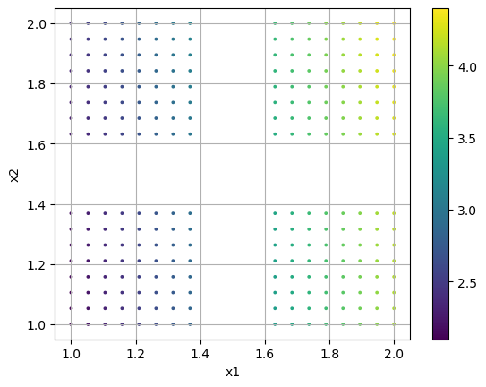
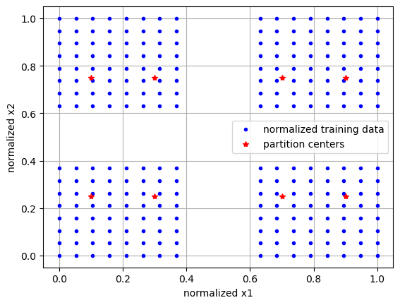
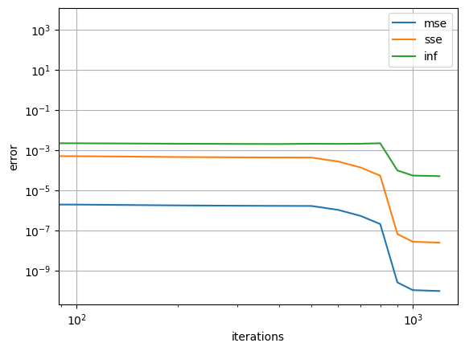
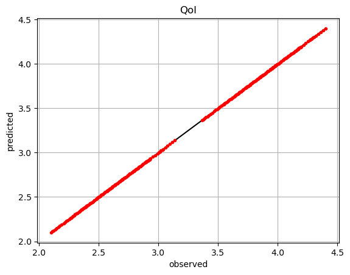
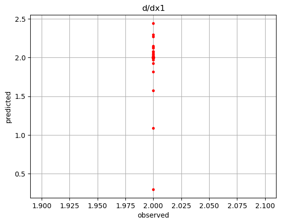
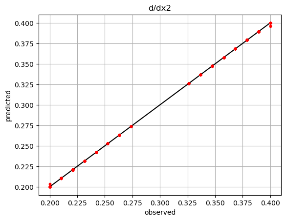
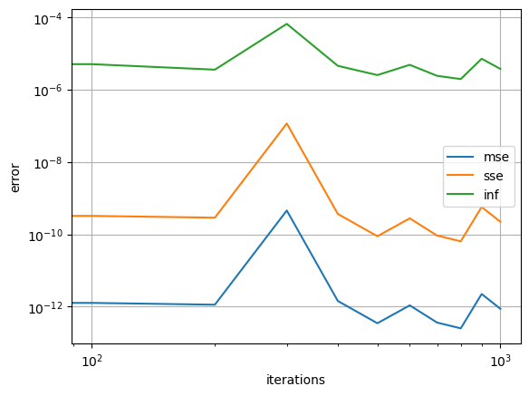
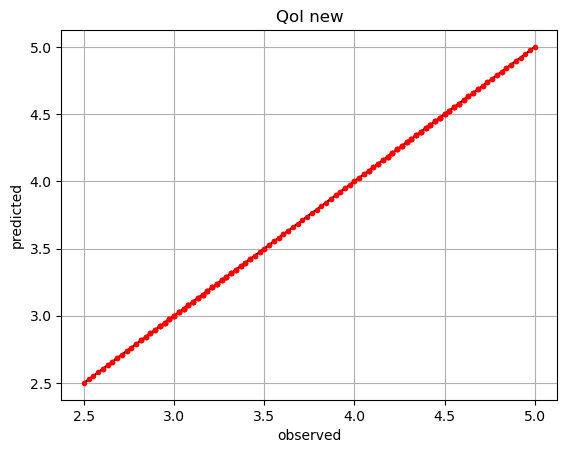

.. note:: This tutorial was generated from a Jupyter notebook that can be
          accessed `here <https://mybinder.org/v2/git/https%3A%2F%2Fgitlab.multiscale.utah.edu%2Fcommon%2FPCAfold/master?filepath=docs%2Ftutorials%2Fdemo-pounets.ipynb>`_.

Partition of Unity Networks (POUnets)
=====================================

In this tutorial, we demonstrate how POUnets may be initialized and
trained to reconstruct quantities of interest (QoIs).

.. code:: python

    from PCAfold import PartitionOfUnityNetwork, init_uniform_partitions
    import numpy as np
    import matplotlib.pyplot as plt

First, we create a two-dimensional manifold with vacant patches. This is
shown in the first plot, colored by a dependent variable or QoI. We then
ask to initialize partitions over a 5x2 grid. We find that only 8 of the
10 partitions are retained, as those initialized in the vacant spaces
are discarded. We then visualize the locations of these partition
centers, which exist in the normalized manifold space, along with the
normalized data.

.. code:: python

    ivar1 = np.linspace(1,2,20)
    ivar1 = ivar1[np.argwhere((ivar1<1.4)|(ivar1>1.6))[:,0]] # create hole
    ivars = np.meshgrid(ivar1, ivar1) # make 2D
    ivars = np.vstack([b.ravel() for b in ivars]).T # reshape (nobs x ndim)
    
    dvar = 2.*ivars[:,0] + 0.1*ivars[:,1]**2
    
    plt.scatter(ivars[:,0],ivars[:,1], s=3, c=dvar)
    plt.colorbar()
    plt.grid()
    plt.xlabel('x1')
    plt.ylabel('x2')
    plt.show()
    
    init_data = init_uniform_partitions([5,2], ivars, verbose=True) # initialize partitions
    ivars_cs = (ivars - init_data['ivar_center'])/init_data['ivar_scale'] # center/scale ivars
    
    plt.plot(ivars_cs[:,0],ivars_cs[:,1], 'b.', label='normalized training data')
    plt.plot(init_data['partition_centers'][:,0], init_data['partition_centers'][:,1], 'r*', label='partition centers')
    plt.grid()
    plt.xlabel('normalized x1')
    plt.ylabel('normalized x2')
    plt.legend()
    plt.show()

.. parsed-literal::

    kept 8 partitions out of 10

We can now initialize a POUnet with a linear basis, build the graph with
absolute training errors, and train for 1000 iterations.

There are also options, as outlined in the documentation, to set
transformation parameters for training on a transformed dvar.

.. code:: python

    net = PartitionOfUnityNetwork(**init_data, 
                                  basis_type='linear',
    #                               transform_power=1.,
    #                               transform_shift=0.,
    #                               transform_sign_shift=0.
                                 )
    net.build_training_graph(ivars, dvar, error_type='abs')
    net.train(1000, archive_rate=100, verbose=True)

.. parsed-literal::

    ------------------------------------------------------------
       iteration |   mean sqr |      % max  |    sum sqr
    ------------------------------------------------------------
             100 |   1.93e-06 |       0.22% |   4.93e-04
    resetting best error
             200 |   1.75e-06 |       0.21% |   4.49e-04
    resetting best error
             300 |   1.69e-06 |       0.20% |   4.33e-04
    resetting best error
             400 |   1.66e-06 |       0.20% |   4.25e-04
    resetting best error
             500 |   1.64e-06 |       0.20% |   4.21e-04
    resetting best error
             600 |   1.05e-06 |       0.20% |   2.68e-04
    resetting best error
             700 |   5.25e-07 |       0.21% |   1.34e-04
    resetting best error
             800 |   2.07e-07 |       0.22% |   5.29e-05
    resetting best error
             900 |   2.57e-10 |       0.01% |   6.58e-08
    resetting best error
            1000 |   1.06e-10 |       0.01% |   2.72e-08
    resetting best error

The learning rate (default 1e-3) and least squares l2 regularization
(default 1e-10) can also be updated at any time.

.. code:: python

    net.update_lr(1.e-4)
    net.update_l2reg(1.e-12)
    net.train(200, archive_rate=100, verbose=True)

.. parsed-literal::

    updating lr: 0.0001
    updating l2reg: 1e-12
    ------------------------------------------------------------
       iteration |   mean sqr |      % max  |    sum sqr
    ------------------------------------------------------------
             100 |   1.01e-10 |       0.01% |   2.58e-08
    resetting best error
             200 |   9.61e-11 |       0.01% |   2.46e-08
    resetting best error

Here we visualize the error during training at every 100th iteration,
which is the default archive rate.

.. code:: python

    err_dict = net.training_archive
    
    for k in ['mse', 'sse', 'inf']:
        plt.loglog(net.iterations,err_dict[k],'-', label=k)
    plt.grid()
    plt.xlabel('iterations')
    plt.ylabel('error')
    plt.legend()
    plt.show()

We can evaluate the POUnet and its derivatives.

.. code:: python

    pred = net(ivars)
    
    plt.plot(dvar,dvar,'k-')
    plt.plot(dvar,pred,'r.')
    plt.grid()
    plt.xlabel('observed')
    plt.ylabel('predicted')
    plt.title('QoI')
    plt.show()

.. code:: python

    der = net.derivatives(ivars) # predicted
    
    der1 = 2.*np.ones_like(dvar) # observed
    der2 = 0.2*ivars[:,1] # observed
    
    plt.plot(der1,der1,'k-')
    plt.plot(der1,der[:,0],'r.')
    plt.grid()
    plt.xlabel('observed')
    plt.ylabel('predicted')
    plt.title('d/dx1')
    plt.show()
    
    plt.plot(der2,der2,'k-')
    plt.plot(der2,der[:,1],'r.')
    plt.grid()
    plt.xlabel('observed')
    plt.ylabel('predicted')
    plt.title('d/dx2')
    plt.show()
    

We can then save and load the POUnet parameters to/from file. The
training history needs to be saved separately if desired.

.. code:: python

    # Save the POUnet to a file
    net.write_data_to_file('filename.pkl')
    
    # Load a POUnet from file
    net2 = PartitionOfUnityNetwork.load_from_file('filename.pkl')
    
    # Evaluate the loaded POUnet (without needing to build the graph)
    pred2 = net2(ivars)

It is also possible to train a POUnet more after loading from file…

.. code:: python

    net2.build_training_graph(ivars, dvar, error_type='abs')
    net2.train(1000, archive_rate=100, verbose=False)

Notice how the error history for the loaded POUnet only includes the
recent training.

.. code:: python

    err_dict = net2.training_archive
    
    for k in ['mse', 'sse', 'inf']:
        plt.loglog(net2.iterations,err_dict[k],'-', label=k)
    plt.grid()
    plt.xlabel('iterations')
    plt.ylabel('error')
    plt.legend()
    plt.show()

More training may be beneficial if new training data, perhaps with more
resolution, become available…

.. code:: python

    ivars2 = np.meshgrid(np.linspace(1,2,20), np.linspace(1,2,20))
    ivars2 = np.vstack([b.ravel() for b in ivars2]).T
    
    dvar2 = 2.*ivars2[:,0] + 0.1*ivars2[:,1]**2
    
    net2.build_training_graph(ivars2, dvar2, error_type='abs')
    net2.train(1000, archive_rate=100, verbose=False)

If we have a different QoI that we want to use the same partitions for,
we may also create a new POUnet from trained parameters and redo the
least squares regression to update the basis coefficients appropriately…

.. code:: python

    dvar_new = ivars[:,0]*2 + 0.5*ivars[:,1]
    
    net_new = PartitionOfUnityNetwork.load_from_file('filename.pkl')
    
    net_new.build_training_graph(ivars, dvar_new)
    net_new.lstsq()
    
    pred_new = net_new(ivars)
    
    plt.plot(dvar_new,dvar_new,'k-')
    plt.plot(dvar_new,pred_new,'r.')
    plt.grid()
    plt.xlabel('observed')
    plt.ylabel('predicted')
    plt.title('QoI new')
    plt.show()

.. parsed-literal::

    performing least-squares solve

There is also flexibility in adding/removing partitions or changing the
basis degree, but the parameters must be appropriately resized for such
changes.

Below, we remove the 4th partition from the originally trained POUnet.
Partition parameters are shaped as n_partition x n_dim while the basis
coefficients can easily be reshaped into n_basis x n_partition as shown
below. Since we had a linear basis, the number of terms in each
partition’s basis function is 3: a constant, linear in x1, and linear in
x2.

.. code:: python

    pou_data = PartitionOfUnityNetwork.load_data_from_file('filename.pkl')
    
    i_partition_remove = 3 # index to remove the 4th partition
    
    old_coeffs = pou_data['basis_coeffs'].reshape(3,pou_data['partition_centers'].shape[0]) # reshape basis coeffs into n_basis x n_partition
    
    pou_data['partition_centers'] = np.delete(pou_data['partition_centers'], i_partition_remove, axis=0) # remove the 4th row
    pou_data['partition_shapes'] = np.delete(pou_data['partition_shapes'], i_partition_remove, axis=0) # remove the 4th row
    pou_data['basis_coeffs'] = np.expand_dims(np.delete(old_coeffs, i_partition_remove, axis=1).ravel(), axis=0) # remove the 4th column

We then simply initialize a new POUnet with the modified data and
continue training.

.. code:: python

    net_modified = PartitionOfUnityNetwork(**pou_data)
    net_modified.build_training_graph(ivars, dvar, error_type='abs')
    net_modified.train(1000, archive_rate=100, verbose=False)

We could also change the basis type and modify the basis coefficient
size accordingly. Below, we change the basis from linear to quadratic,
which adds 3 additional terms: x1^2, x2^2, and x1x2. We initialize these
coefficients to zero and perform the least squares to update them
appropriately. Further training could be performed if desired.

.. code:: python

    pou_data = PartitionOfUnityNetwork.load_data_from_file('filename.pkl')
    
    old_coeffs = pou_data['basis_coeffs'].reshape(3,pou_data['partition_centers'].shape[0]) # reshape basis coeffs into n_basis x n_partition
    old_coeffs = np.vstack((old_coeffs, np.zeros((3,old_coeffs.shape[1])))) # add basis terms for x1^2, x2^2, and x1x2
    pou_data['basis_coeffs'] = np.expand_dims(old_coeffs.ravel(), axis=0)
    pou_data['basis_type'] = 'quadratic'
    
    net_modified = PartitionOfUnityNetwork(**pou_data)
    net_modified.build_training_graph(ivars, dvar, error_type='abs')
    net_modified.lstsq()

.. parsed-literal::

    performing least-squares solve

