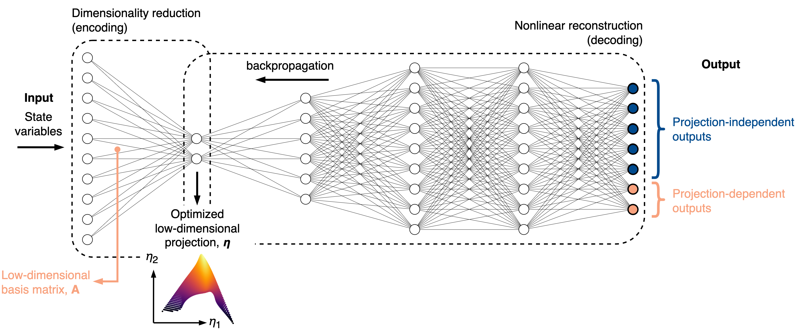
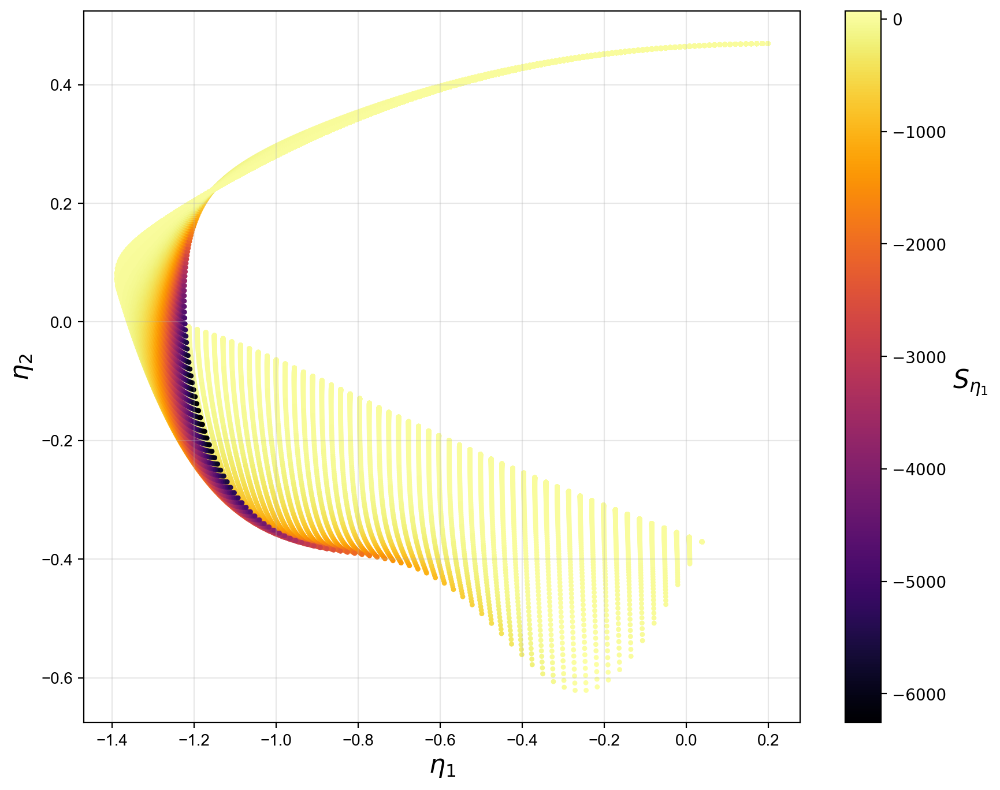
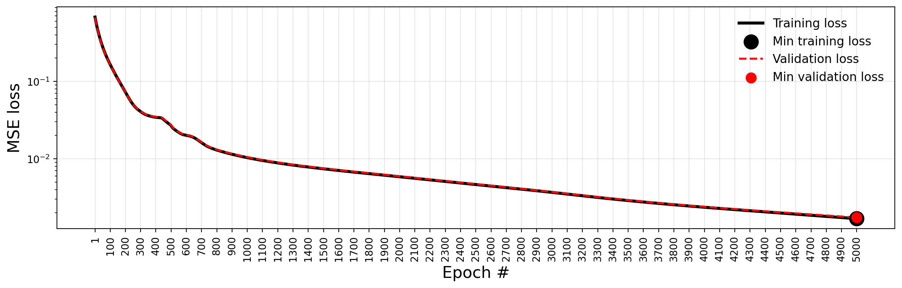
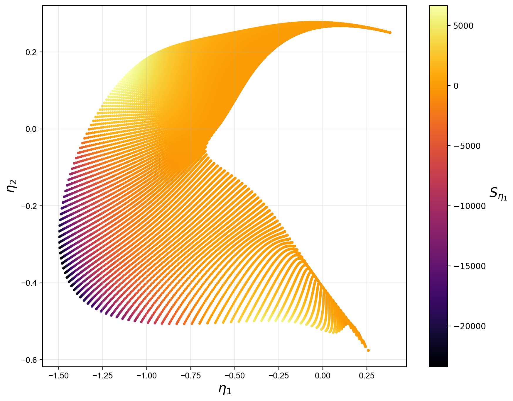

.. note:: This tutorial was generated from a Jupyter notebook that can be
          accessed `here <https://mybinder.org/v2/git/https%3A%2F%2Fgitlab.multiscale.utah.edu%2Fcommon%2FPCAfold/master?filepath=docs%2Ftutorials%2Fdemo-qoi-aware-encoder-decoder.ipynb>`_.

QoI-aware encoder-decoder
=========================

In this tutorial, we present the QoI-aware encoder-decoder dimensionality reduction strategy from the ``utilities`` module.

The QoI-aware encoder-decoder is an autoencoder-like neural network that
reconstructs important quantities of interest (QoIs) at the output of a decoder.
The QoIs can be set to projection-independent variables (such as the original state variables)
or projection-dependent variables, whose definition changes during neural network training.

We introduce an intrusive modification to the neural network training process
such that at each epoch, a low-dimensional basis matrix is computed from the current weights in the encoder.
Any projection-dependent variables at the output get re-projected onto that basis.

The rationale for performing dimensionality reduction with the QoI-aware strategy is
that any poor topological behaviors on a low-dimensional projection will immediately increase the loss during training.
These behaviors could be non-uniqueness in representing QoIs due to overlaps on a projection,
or large gradients in QoIs caused by data compression in certain regions of a projection.
Thus, the QoI-aware strategy naturally promotes improved projection topologies and can
be useful in reduced-order modeling.

An illustrative explanation of how the QoI-aware encoder-decoder works is presented in the figure below:

We import the necessary modules:

.. code:: python

  from PCAfold import preprocess
  from PCAfold import reduction
  from PCAfold import analysis
  from PCAfold import utilities
  import numpy as np
  from tensorflow import optimizers

and we set some initial parameters:

.. code:: python

    save_filename = None

************************************
Upload a combustion data set
************************************

A data set representing combustion of hydrogen in air generated from steady laminar flamelet model using *Spitfire* is used as a demo data set.

We begin by importing the data set composed of the original state space variables,
:math:`\mathbf{X}`, and the corresponding source terms, :math:`\mathbf{S_X}`:

.. code:: python

  X = np.genfromtxt('H2-air-state-space.csv', delimiter=',')[:,0:-2]
  S_X = np.genfromtxt('H2-air-state-space-sources.csv', delimiter=',')[:,0:-2]
  X_names = np.genfromtxt('H2-air-state-space-names.csv', delimiter='\n', dtype=str)[0:-2]

  (n_observations, n_variables) = np.shape(X)

************************************
Train the QoI-aware encoder-decoder
************************************

We are going to generate 2D projections of the state-space:

.. code:: python

  n_components = 2

First, we are going to scale the state-space variables to a :math:`\langle 0, 1 \rangle` range. This is done to help the neural network training process.

We are also going to apply an adequate scaling to the source terms. This is done for consistency in reduced-order modeling (see: `Handling source terms <https://pcafold.readthedocs.io/en/latest/tutorials/demo-handling-source-terms.html>`_). The scaled source terms will serve as projection-dependent variables.

.. code:: python

  (input_data, centers, scales) = preprocess.center_scale(X, scaling='0to1')
  projection_dependent_outputs = S_X / scales

We create a PCA-initialization of the encoder:

.. code:: python

  pca = reduction.PCA(X, n_components=n_components, scaling='auto')
  encoder_weights_init = pca.A[:,0:n_components]

We visualize the initial projection:

.. code:: python

  X_projected = np.dot(input_data, encoder_weights_init)
  S_X_projected = np.dot(projection_dependent_outputs, encoder_weights_init)

We select a couple of important state variables to be used as the projection-independent variables:

.. code:: python

  selected_state_variables = [0, 2, 4, 5, 6]

First, we fix the random seed for results reproducibility:

.. code:: python

  random_seed = 100

We set several important hyper-parameters:

.. code:: python

  activation_decoder = 'tanh'
  decoder_interior_architecture = (6,9)
  optimizer = optimizers.legacy.Adam(learning_rate=0.001)
  learning_rate = 0.001
  loss = 'MSE'
  batch_size = n_observations
  validation_perc = 10

We are not going to hold initial weights constant, and we are going to allow the encoder to update weights at each epoch:

.. code:: python

  hold_initialization = None
  hold_weights = None

We are going to train the model for 5000 epochs:

.. code:: python

  n_epochs = 5000

We instantiate an object of the ``QoIAwareProjection`` class with various parameters:

.. code:: python

    projection = utilities.QoIAwareProjection(input_data, 
                                              n_components=n_components, 
                                              optimizer=optimizer,
                                              projection_independent_outputs=input_data[:,selected_state_variables],
                                              projection_dependent_outputs=projection_dependent_outputs,
                                              activation_decoder=activation_decoder,
                                              decoder_interior_architecture=decoder_interior_architecture,
                                              encoder_weights_init=encoder_weights_init,
                                              decoder_weights_init=None,
                                              hold_initialization=hold_initialization,
                                              hold_weights=hold_weights,
                                              transformed_projection_dependent_outputs='signed-square-root',
                                              transform_power=0.5,
                                              transform_shift=10**-4,
                                              transform_sign_shift=0,
                                              loss=loss,
                                              batch_size=batch_size,
                                              n_epochs=n_epochs,
                                              validation_perc=validation_perc,
                                              random_seed=random_seed,
                                              verbose=True)

Before we begin neural network training, we can print the summary of the current Keras model:

.. code:: python

  projection.summary()

.. code-block:: text

  QoI-aware encoder-decoder model summary...

  (Model has not been trained yet)

  - - - - - - - - - - - - - - - - - - - - - - - - - - - - - - - - - - - - - - - - - - - - - - - - - - - - - - - - - - - -
  Projection dimensionality:

  	- 2D projection

  - - - - - - - - - - - - - - - - - - - - - - - - - - - - - - - - - - - - - - - - - - - - - - - - - - - - - - - - - - - -
  Encoder-decoder architecture:

  	9-2-6-9-9

  - - - - - - - - - - - - - - - - - - - - - - - - - - - - - - - - - - - - - - - - - - - - - - - - - - - - - - - - - - - -
  Activation functions:

  	(9)--linear--(2)--tanh--(6)--tanh--(9)--tanh--(9)

  - - - - - - - - - - - - - - - - - - - - - - - - - - - - - - - - - - - - - - - - - - - - - - - - - - - - - - - - - - - -
  Variables at the decoder output:

  	- 5 projection independent variables
  	- 2 projection dependent variables
  	- 2 transformed projection dependent variables using signed-square-root

  - - - - - - - - - - - - - - - - - - - - - - - - - - - - - - - - - - - - - - - - - - - - - - - - - - - - - - - - - - - -
  Model validation:

  	- Using 10% of input data as validation data
  	- Model will be trained on 90% of input data

  - - - - - - - - - - - - - - - - - - - - - - - - - - - - - - - - - - - - - - - - - - - - - - - - - - - - - - - - - - - -
  Hyperparameters:

  	- Batch size:		58101
  	- # of epochs:		5000
  	- Optimizer:		<keras.src.optimizers.legacy.adam.Adam object at 0x7f9e0f29f310>
  	- Loss function:	MSE

  - - - - - - - - - - - - - - - - - - - - - - - - - - - - - - - - - - - - - - - - - - - - - - - - - - - - - - - - - - - -
  Weights initialization in the encoder:

  	- User-provided custom initialization of the encoder

  - - - - - - - - - - - - - - - - - - - - - - - - - - - - - - - - - - - - - - - - - - - - - - - - - - - - - - - - - - - -
  Weights initialization in the decoder:

  	- Glorot uniform

  - - - - - - - - - - - - - - - - - - - - - - - - - - - - - - - - - - - - - - - - - - - - - - - - - - - - - - - - - - - -
  Weights updates in the encoder:

  	- Initial weights in the encoder will change after first epoch
  	- Weights in the encoder will change at every epoch

  - - - - - - - - - - - - - - - - - - - - - - - - - - - - - - - - - - - - - - - - - - - - - - - - - - - - - - - - - - - -
  Results reproducibility:

  	- Reproducible neural network training will be assured using random seed: 100

  = = = = = = = = = = = = = = = = = = = = = = = = = = = = = = = = = = = = = = = = = = = = = = = = = = = = = = = = = = = =

We train the current Keras model:

.. code:: python

  projection.train()

We can visualize the MSE loss computed on training and validation data during training:

.. code:: python

  projection.plot_losses(markevery=100,
                         figure_size=(15, 4),
                         save_filename=save_filename)

After training, additional information is available in the model summary:

.. code:: python

  projection.summary()

.. code-block:: text

    = = = = = = = = = = = = = = = = = = = = = = = = = = = = = = = = = = = = = = = = = = = = = = = = = = = = = = = = = = = = 
    Training results:

    	- Minimum training loss:		0.0016817295690998435
    	- Minimum training loss at epoch:	5000
    
    	- Minimum validation loss:		0.0017386721447110176
    	- Minimum validation loss at epoch:	5000

    - - - - - - - - - - - - - - - - - - - - - - - - - - - - - - - - - - - - - - - - - - - - - - - - - - - - - - - - - - - - 

We extract the best lower-dimensional basis that corresponds to the epoch with the smallest training loss:

.. code:: python

  basis = projection.get_best_basis(method='min-training-loss')

We project the original dataset onto that basis:

.. code:: python

  X_projected = np.dot(input_data, basis)
  S_X_projected = np.dot(projection_dependent_outputs, basis)

We visualize the current manifold topology:

