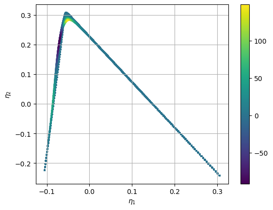

.. note:: This tutorial was generated from a Jupyter notebook that can be
          accessed `here <https://mybinder.org/v2/git/https%3A%2F%2Fgitlab.multiscale.utah.edu%2Fcommon%2FPCAfold/master?filepath=docs%2Ftutorials%2Fdemo-qoi-aware-encoder-pounet.ipynb>`_.

QoI-aware encoder-decoders employing Partition of Unity Networks (POUnets)
===================================================================================

This demo takes the general formulation of QoI-aware encoder-decoders
available in PCAfold and implements POUnets as the decoder.

.. code:: python

    from PCAfold import QoIAwareProjectionPOUnet, init_uniform_partitions, PCA, center_scale, PartitionOfUnityNetwork
    import numpy as np
    import matplotlib.pyplot as plt
    import tensorflow.compat.v1 as tf

We will load the combustion dataset and remove temperature from the
state variable list.

.. code:: python

    X = np.genfromtxt('H2-air-state-space.csv', delimiter=',')[:,1:-2]
    S_X = np.genfromtxt('H2-air-state-space-sources.csv', delimiter=',')[:,1:-2]
    X_names = np.genfromtxt('H2-air-state-space-names.csv', delimiter='\n', dtype=str)[1:-2]
    X_names

.. parsed-literal::

    array(['H', 'H2', 'O', 'OH', 'H2O', 'O2', 'HO2', 'H2O2'], dtype='<U4')

We then initialize the encoder weights using PCA. Notice how the 2D
manifold is squeezed tightly and has overlapping states in some regions.

.. code:: python

    n_components = 2
    
    pca = PCA(X, n_components=n_components, scaling='auto')
    encoder_weights_init = pca.A[:,:n_components]
    
    X_projected = X.dot(encoder_weights_init)
    S_X_projected = S_X.dot(encoder_weights_init)
    
    plt.scatter(X_projected[:,0], X_projected[:,1],s=3, c=S_X_projected[:,0], cmap='viridis')
    plt.colorbar()
    plt.grid()
    plt.show()

Next, we finish initializing the encoder-decoder with the POUnet
parameters. The helper function ``init_uniform_partitions`` is used as
done in the POUnet demo, but note the independent variable space for the
POUnet is the projected state variables ``X_projected``. We have chosen
a linear basis below.

When building the graph for the encoder-decoder, a function is required
for computing the dependent training variables (QoIs). This allows for
flexibility in using the projection parameters, which get updated
themselves during training, for the dependent variable definitions.
Therefore, the projection training can be informed by how well the
projected source terms are represented, for example. The function must
take in the encoder weights as an argument, but these do not have to be
used. We also perform a nonlinear transformation on the source terms,
which can help penalize projections introducing overlap in values.
Below, we build a function that computes the projected source terms and
concatenates these values with those of the OH and water mass fractions.
These four variables provide the QoIs for which the loss function is
computed during training. Note the QoI function must be written using
tensorflow operations.

The graph is then built. Below we have turned on the optional
``constrain_positivity`` flag. As mass fractions are naturally positive,
this only penalizes projections that create negative projected source
terms. This can have advantages in simplifying regression and reducing
the impact of regression errors with the wrong sign during simulation.

Finally, we train the ``QoIAwareProjectionPOUnet`` for 1000 iterations,
archiving every 100th iteration, and save the parameters with the lowest
overall errors. This is for demonstration, but more iterations are
generally needed to converge to an optimal solution.

.. code:: python

    ednet = QoIAwareProjectionPOUnet(encoder_weights_init, 
                                     **init_uniform_partitions([8,8], X_projected), 
                                     basis_type='linear'
                                    )
    
    # define the function to produce the dependent variables for training
    def define_dvar(proj_weights):
        dvar_y = tf.Variable(X[:,3:5], name='non_transform', dtype=tf.float64) # mass fractions for OH and H2O
        
        dvar_s = tf.Variable(np.expand_dims(S_X, axis=2), name='non_transform', dtype=tf.float64)
        dvar_s = ednet.tf_projection(dvar_s, nobias=True) # projected source terms
        dvar_st = tf.math.sqrt(tf.cast(tf.abs(dvar_s+1.e-4), dtype=tf.float64)) * tf.math.sign(dvar_s+1.e-4)+1.e-2 * tf.math.sign(dvar_s+1.e-4) # power transform source terms
        dvar_st_norm = dvar_st/tf.reduce_max(tf.cast(tf.abs(dvar_st), dtype=tf.float64), axis=0, keepdims=True) # normalize
    
        dvar = tf.concat([dvar_y, dvar_st_norm], axis=1) # train on combination
        return dvar
    
    ednet.build_training_graph(X, define_dvar, error_type='abs', constrain_positivity=True)
    
    ednet.train(1000, archive_rate=100, verbose=True)

.. parsed-literal::

    ------------------------------------------------------------
       iteration |   mean sqr |      % max  |    sum sqr
    ------------------------------------------------------------
             100 |   7.85e-04 |      79.79% |   4.56e+01
    resetting best error
             200 |   6.72e-04 |      79.53% |   3.91e+01
    resetting best error
             300 |   6.04e-04 |      78.90% |   3.51e+01
    resetting best error
             400 |   5.29e-04 |      78.87% |   3.07e+01
    resetting best error
             500 |   4.49e-04 |      76.84% |   2.61e+01
    resetting best error
             600 |   3.53e-04 |      73.46% |   2.05e+01
    resetting best error
             700 |   2.20e-04 |      67.99% |   1.28e+01
    resetting best error
             800 |   1.18e-04 |      59.24% |   6.86e+00
    resetting best error
             900 |   9.86e-05 |      59.00% |   5.73e+00
    resetting best error
            1000 |   9.25e-05 |      59.07% |   5.37e+00
    resetting best error

The learning rate (default 1e-3) and least squares l2 regularization
(default 1e-10) can also be updated at any time.

.. code:: python

    ednet.update_lr(1.e-4)
    ednet.update_l2reg(1.e-11)
    
    ednet.train(200, archive_rate=100, verbose=True)

.. parsed-literal::

    updating lr: 0.0001
    updating l2reg: 1e-11
    ------------------------------------------------------------
       iteration |   mean sqr |      % max  |    sum sqr
    ------------------------------------------------------------
             100 |   9.03e-05 |      59.40% |   5.25e+00
    resetting best error
             200 |   8.96e-05 |      59.41% |   5.21e+00
    resetting best error

We can look at the trained projection weights:

.. code:: python

    print(ednet.projection_weights)

.. parsed-literal::

    [[-0.35640105  0.05729153]
     [ 0.42022997  0.05765012]
     [-0.48311619 -0.24169431]
     [-0.24244533 -0.20839019]
     [-0.11743472  0.78807212]
     [-0.24317541 -0.00543714]
     [-1.16916608 -0.3213446 ]
     [-1.52308699  0.10786119]]

We can look at the projection after the progress in training. We see how
the projected source term values are closer to being positive than
before and the overlap has been removed. We would expect further
training to create more separation between observations. Other QoIs for
training may also lead to better separation faster.

.. code:: python

    X_projected = ednet.projection(X)
    S_X_projected = ednet.projection(X, nobias=True)
    
    plt.scatter(X_projected[:,0], X_projected[:,1],s=3, c=S_X_projected[:,0], cmap='viridis')
    plt.colorbar()
    plt.grid()
    plt.show()

Below we grab the archived states during training and visualize the
errors.

.. code:: python

    err_dict = ednet.training_archive
    
    for k in ['mse', 'sse', 'inf']:
        plt.loglog(ednet.iterations,err_dict[k],'-', label=k)
    plt.grid()
    plt.xlabel('iterations')
    plt.ylabel('error')
    plt.legend()
    plt.show()

We may also save and load a ``QoIAwareProjectionPOUnet`` to/from file.
Rebuilding the graph is not necessary to grab the projection off a
loaded ``QoIAwareProjectionPOUnet``.

.. code:: python

    # Save the data to a file
    ednet.write_data_to_file('filename.pkl')
    
    # reload projection data from file
    ednet2 = QoIAwareProjectionPOUnet.load_from_file('filename.pkl')
    
    #compute projection without needing to rebuild graph:
    X_projected = ednet2.projection(X)

It can then be useful to create multiple POUnets for separate variables
using the same trained projection and partitions from the
``QoIAwareProjectionPOUnet``. Below we demonstrate this for the water
mass fraction.

.. code:: python

    net = PartitionOfUnityNetwork(
                                 partition_centers=ednet.partition_centers,
                                 partition_shapes=ednet.partition_shapes,
                                 basis_type=ednet.basis_type,
                                 ivar_center=ednet.proj_ivar_center,
                                 ivar_scale=ednet.proj_ivar_scale
                                )
    i_dvar = 4
    dvar1 = X[:,i_dvar]
    net.build_training_graph(ednet.projection(X), dvar1)
    net.lstsq()
    
    pred = net(ednet.projection(X))
    plt.plot(dvar1, dvar1, 'k-')
    plt.plot(dvar1, pred.ravel(), 'r.')
    plt.title(X_names[i_dvar])
    plt.grid()
    plt.show()

.. parsed-literal::

    performing least-squares solve

There is also an option when building the ``QoIAwareProjectionPOUnet``
graph of separating trainable from nontrainable projection weights. This
can be useful if certain dimensions of the projection are predefined,
such as mixture fraction commonly used in combustion. In order to set
certain columns of the projection weight matrix constant, specify the
first index for which the weights are trainable
(``first_trainable_idx``).

Below is an example of holding the first weights constant. We see how
the second weights change after training, but the first do not.

.. code:: python

    ednet2 = QoIAwareProjectionPOUnet.load_from_file('filename.pkl')
    ednet2.build_training_graph(X, define_dvar, first_trainable_idx=1)
    old_weights = ednet2.projection_weights
    ednet2.train(10, archive_rate=1)
    print('difference in weigths before and after training:\n', old_weights-ednet2.projection_weights)

.. parsed-literal::

    difference in weigths before and after training:
     [[ 0.        -0.001    ]
     [ 0.        -0.001    ]
     [ 0.        -0.001    ]
     [ 0.        -0.001    ]
     [ 0.         0.001    ]
     [ 0.         0.001    ]
     [ 0.         0.001    ]
     [ 0.         0.0009999]]

