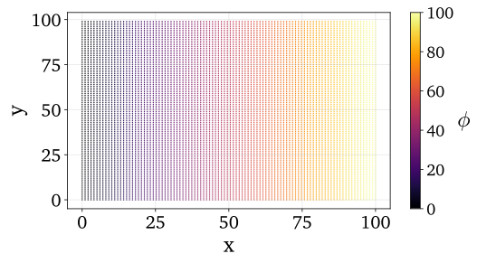
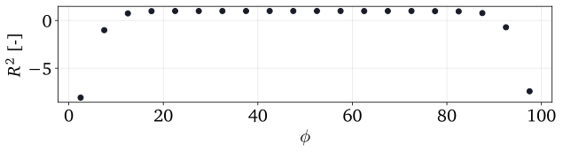

.. note:: This tutorial was generated from a Jupyter notebook that can be
          accessed `here <https://mybinder.org/v2/git/https%3A%2F%2Fgitlab.multiscale.utah.edu%2Fcommon%2FPCAfold/master?filepath=docs%2Ftutorials%2Fdemo-regression.ipynb>`_.

########################################
Nonlinear regression
########################################

In this tutorial, we present the nonlinear regression utilities from the ``analysis`` module.

We import the necessary modules:

.. code:: python

  from PCAfold import preprocess
  from PCAfold import reduction
  from PCAfold import analysis
  import numpy as np

and we set some initial parameters:

.. code:: python

    save_filename = None

************************************
Generating a synthetic data set
************************************

We begin by generating a synthetic data set with two independent variables,
:math:`x` and :math:`y`, and one dependent variable, :math:`\phi`, that we will
nonlinearly regress using kernel regression.

Generate independent variables :math:`x` and :math:`y` from a uniform grid:

.. code:: python

    n_points = 100
    grid = np.linspace(0,100,n_points)
    x, y = np.meshgrid(grid, grid)
    x = x.flatten()
    y = y.flatten()
    xy = np.hstack((x[:,None],y[:,None]))
    (n_observations, _) = np.shape(xy)

Generate a dependent variable :math:`\phi` as a linear function of :math:`x`:

.. code:: python

    phi = xy[:,0:1]**2

Visualize the generated data set:

.. code:: python

  plt = reduction.plot_2d_manifold(x, y, color=phi, x_label='x', y_label='y', colorbar_label='$\phi$', color_map='inferno', figure_size=(8,4), save_filename=None)

************************************
Kernel regression
************************************

We first generate train and test samples using the ``DataSampler`` class:

.. code::

  train_perc = 80
  random_seed = 100

  idx = np.zeros((n_observations,)).astype(int)
  sample_random = preprocess.DataSampler(idx, random_seed=random_seed, verbose=False)
  (idx_train, idx_test) = sample_random.random(train_perc, test_selection_option=1)

  xy_train = xy[idx_train,:]
  xy_test = xy[idx_test,:]

  phi_train = phi[idx_train]
  phi_test = phi[idx_test]

Specify the bandwidth for the Nadaraya-Watson kernel:

.. code::

  bandwidth = 10

Fit the kernel regression model with train data:

.. code::

  model = analysis.KReg(xy_train, phi_train)

Predict the test data:

.. code::

  phi_test_predicted = model.predict(xy_test, bandwidth=bandwidth)

Predict all data:

.. code::

  phi_predicted = model.predict(xy, bandwidth=bandwidth)

************************************
Nonlinear regression assessment
************************************

In this section we will perform few assessments of the quality of the nonlinear regression.

We begin by visualizing the regressed (predicted) dependent variable :math:`\phi`. This can be done either in 2D:

.. code:: 

    plt = analysis.plot_2d_regression(x, phi, phi_predicted, x_label='$x$', y_label='$\phi$', figure_size=(10,4), save_filename=save_filename)

.. image:: ../images/tutorial-regression-result-2d.svg
    :width: 500
    :align: center

or in 3D:
    
.. code::

  plt = analysis.plot_3d_regression(x, y, phi, phi_predicted, elev=20, azim=-100, x_label='$x$', y_label='$y$', z_label='$\phi$', figure_size=(10,7), save_filename=None)

.. image:: ../images/tutorial-regression-result.svg
    :width: 500
    :align: center

We can then compute the coefficient of determination, :math:`R^2`, values for the test data and entire data:

.. code::

  r2_test = analysis.coefficient_of_determination(phi_test, phi_test_predicted)
  r2_all = analysis.coefficient_of_determination(phi, phi_predicted)

  print('All R2:\t\t' + str(round(r2_all, 6)) + '\nTest R2:\t' + str(round(r2_test, 6)))

The code above will print:

.. code-block:: text

  All R2:	0.997378
  Test R2:	0.997366

In addition to a single value of :math:`R^2` for the entire data set, we can also
compute stratified :math:`R^2` values. This allows us to observe how kernel
regression performed in each strata of the dependent variable :math:`\phi`.
We will compute the stratified :math:`R^2` in 20 bins of :math:`\phi`:

.. code:: python

  n_bins = 20
  use_global_mean = False
  verbose = True

  (r2_in_bins, bins_borders) = analysis.stratified_coefficient_of_determination(phi, phi_predicted, n_bins=n_bins, use_global_mean=use_global_mean, verbose=verbose)

The code above will print:

.. code-block:: text

  Bin	1	| size	 500	| R2	-8.083554
  Bin	2	| size	 500	| R2	-1.012664
  Bin	3	| size	 500	| R2	0.74316
  Bin	4	| size	 500	| R2	0.979256
  Bin	5	| size	 500	| R2	0.995444
  Bin	6	| size	 500	| R2	0.992669
  Bin	7	| size	 500	| R2	0.993084
  Bin	8	| size	 500	| R2	0.995499
  Bin	9	| size	 500	| R2	0.994835
  Bin	10	| size	 500	| R2	0.994202
  Bin	11	| size	 500	| R2	0.997531
  Bin	12	| size	 500	| R2	0.995191
  Bin	13	| size	 500	| R2	0.988946
  Bin	14	| size	 500	| R2	0.993118
  Bin	15	| size	 500	| R2	0.995184
  Bin	16	| size	 500	| R2	0.980076
  Bin	17	| size	 500	| R2	0.955785
  Bin	18	| size	 500	| R2	0.776274
  Bin	19	| size	 500	| R2	-0.711611
  Bin	20	| size	 500	| R2	-7.413988

Finally, we can plot the stratified :math:`R^2` values across bins centers:

.. code:: python

  plt = analysis.plot_stratified_coefficient_of_determination(r2_in_bins, bins_borders, variable_name='$\phi$', figure_size=(10,2), save_filename=None)

This last plot lets us see that kernel regression performed very well in the
middle range of the dependent variable values but very poorly at both edges of that range.
This is consistent with what we have seen in a 3D plot
that visualized the regression result.
