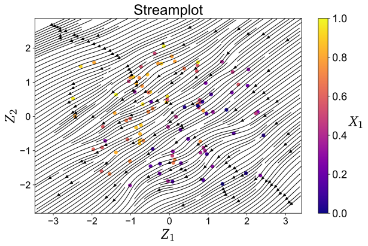
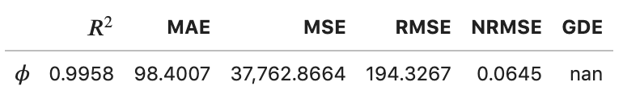
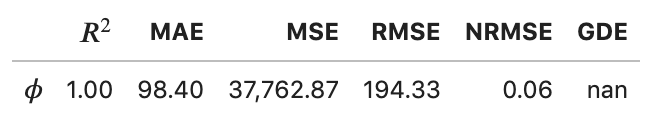

.. note:: This tutorial was generated from a Jupyter notebook that can be
          accessed `here <https://mybinder.org/v2/git/https%3A%2F%2Fgitlab.multiscale.utah.edu%2Fcommon%2FPCAfold/master?filepath=docs%2Ftutorials%2Fdemo-regression.ipynb>`_.

########################################
Nonlinear regression
########################################

In this tutorial, we present the nonlinear regression utilities from the ``analysis`` module.

We import the necessary modules:

.. code:: python

  from PCAfold import preprocess
  from PCAfold import reduction
  from PCAfold import analysis
  import numpy as np

and we set some initial parameters:

.. code:: python

    save_filename = None

************************************
Generating a synthetic data set
************************************

We begin by generating a synthetic data set with two independent variables,
:math:`x` and :math:`y`, and one dependent variable, :math:`\phi`, that we will
nonlinearly regress using kernel regression.

Generate independent variables :math:`x` and :math:`y` from a uniform grid:

.. code:: python

    n_points = 100
    grid = np.linspace(0,100,n_points)
    x, y = np.meshgrid(grid, grid)
    x = x.flatten()
    y = y.flatten()
    xy = np.hstack((x[:,None],y[:,None]))
    (n_observations, _) = np.shape(xy)

Generate a dependent variable :math:`\phi` as a linear function of :math:`x`:

.. code:: python

    phi = xy[:,0:1]**2

Visualize the generated data set:

.. code:: python

  plt = reduction.plot_2d_manifold(x, y, color=phi, x_label='x', y_label='y', colorbar_label='$\phi$', color_map='inferno', figure_size=(8,4), save_filename=None)

.. image:: ../images/tutorial-regression-data-set.svg
    :width: 500
    :align: center

************************************
Kernel regression
************************************

We first generate train and test samples using the ``DataSampler`` class:

.. code::

  train_perc = 80
  random_seed = 100

  idx = np.zeros((n_observations,)).astype(int)
  sample_random = preprocess.DataSampler(idx, random_seed=random_seed, verbose=False)
  (idx_train, idx_test) = sample_random.random(train_perc, test_selection_option=1)

  xy_train = xy[idx_train,:]
  xy_test = xy[idx_test,:]

  phi_train = phi[idx_train]
  phi_test = phi[idx_test]

Specify the bandwidth for the Nadaraya-Watson kernel:

.. code::

  bandwidth = 10

Fit the kernel regression model with train data:

.. code::

  model = analysis.KReg(xy_train, phi_train)

Predict the test data:

.. code::

  phi_test_predicted = model.predict(xy_test, bandwidth=bandwidth)

Predict all data:

.. code::

  phi_predicted = model.predict(xy, bandwidth=bandwidth)

************************************
Nonlinear regression assessment
************************************

In this section we will perform few assessments of the quality of the nonlinear regression.

Visual assessment
=================

We begin by visualizing the regressed (predicted) dependent variable :math:`\phi`. This can be done either in 2D:

.. code:: 

    plt = analysis.plot_2d_regression(x, phi, phi_predicted, x_label='$x$', y_label='$\phi$', figure_size=(10,4), save_filename=save_filename)

.. image:: ../images/tutorial-regression-result-2d.svg
    :width: 500
    :align: center

or in 3D:
    
.. code::

  plt = analysis.plot_3d_regression(x, y, phi, phi_predicted, elev=20, azim=-100, x_label='$x$', y_label='$y$', z_label='$\phi$', figure_size=(10,7), save_filename=None)

.. image:: ../images/tutorial-regression-result.svg
    :width: 500
    :align: center

We can then compute the coefficient of determination, :math:`R^2`, values for the test data and entire data:

.. code::

  r2_test = analysis.coefficient_of_determination(phi_test, phi_test_predicted)
  r2_all = analysis.coefficient_of_determination(phi, phi_predicted)

  print('All R2:\t\t' + str(round(r2_all, 6)) + '\nTest R2:\t' + str(round(r2_test, 6)))

The code above will print:

.. code-block:: text

  All R2:	0.997378
  Test R2:	0.997366

In addition to a single value of :math:`R^2` for the entire data set, we can also
compute stratified :math:`R^2` values. This allows us to observe how kernel
regression performed in each strata of the dependent variable :math:`\phi`.
We will compute the stratified :math:`R^2` in 20 bins of :math:`\phi`:

.. code:: python

    n_bins = 20
    use_global_mean = False
    verbose = True

    (idx, bins_borders) = preprocess.variable_bins(phi, k=n_bins, verbose=False)

    r2_in_bins = analysis.stratified_coefficient_of_determination(phi, phi_predicted, idx=idx, use_global_mean=use_global_mean, verbose=verbose)

The code above will print:

.. code-block:: text

    Bin	1	| size	 2300	| R2	0.868336
    Bin	2	| size	 900	| R2	0.870357
    Bin	3	| size	 700	| R2	0.863821
    Bin	4	| size	 600	| R2	0.880655
    Bin	5	| size	 500	| R2	0.875764
    Bin	6	| size	 500	| R2	0.889148
    Bin	7	| size	 400	| R2	0.797888
    Bin	8	| size	 400	| R2	0.773907
    Bin	9	| size	 400	| R2	0.79479
    Bin	10	| size	 400	| R2	0.862069
    Bin	11	| size	 300	| R2	0.864022
    Bin	12	| size	 300	| R2	0.93599
    Bin	13	| size	 300	| R2	0.972185
    Bin	14	| size	 300	| R2	0.988894
    Bin	15	| size	 300	| R2	0.979975
    Bin	16	| size	 300	| R2	0.766598
    Bin	17	| size	 300	| R2	-0.46525
    Bin	18	| size	 200	| R2	-11.158072
    Bin	19	| size	 300	| R2	-10.94865
    Bin	20	| size	 300	| R2	-28.00655

Finally, we can plot the stratified :math:`R^2` values across bins centers:

.. code:: python

  plt = analysis.plot_stratified_coefficient_of_determination(r2_in_bins, bins_borders, variable_name='$\phi$', figure_size=(10,2), save_filename=None)

.. image:: ../images/tutorial-regression-stratified-r2.svg
    :width: 500
    :align: center

This last plot lets us see that kernel regression performed very well in the
middle range of the dependent variable values but very poorly at both edges of that range.
This is consistent with what we have seen in a 3D plot
that visualized the regression result.

Streamplots for predicted vector quantities
===========================================

In a special case, when the predicted variable is a two-dimensional vector, a streamplot of the regressed vector field can be plotted using the function ``plot_2d_regression_streamplot``.

Below, we show an example on a synthetic data set:

.. code:: python

    X = np.random.rand(100,5)
    S_X = np.random.rand(100,5)

    pca_X = reduction.PCA(X, n_components=2)
    PCs = pca_X.transform(X)
    S_Z = pca_X.transform(S_X, nocenter=True)

    vector_model = analysis.KReg(PCs, S_Z)
    
We define the regression model function:

.. code:: python

    def regression_model(query):

        predicted = vector_model.predict(query, 'nearest_neighbors_isotropic', n_neighbors=1)

        return predicted

Define the bounds for the streamplot:

.. code:: python

    grid_bounds = ([np.min(PCs[:,0]),np.max(PCs[:,0])],[np.min(PCs[:,1]),np.max(PCs[:,1])])

Plot the regression streamplot:

.. code:: python

    plt = analysis.plot_2d_regression_streamplot(grid_bounds,
                                        regression_model,
                                        x=PCs[:,0],
                                        y=PCs[:,1],
                                        resolution=(15,15),
                                        extension=(20,20),
                                        color='k',
                                        x_label='$Z_1$',
                                        y_label='$Z_2$',
                                        manifold_color=X[:,0],
                                        colorbar_label='$X_1$',
                                        color_map='plasma',
                                        colorbar_range=(0,1),
                                        manifold_alpha=1,
                                        grid_on=False,
                                        figure_size=(10,6),
                                        title='Streamplot',
                                        save_filename=None)
    

Error metrics
=============

Finally, several error metrics are available that will measure how well the dependent variable(s) were predicted. Metrics can be accessed individually, those include:

- Mean absolute error
- Mean squared error
- Root mean squared error
- Normalized root mean squared error
- Turning points
- Good estimate
- Good direction estimate

An example of computing mean absolute error is shown below:

.. code:: python

    MAE = analysis.mean_absolute_error(phi, phi_predicted)

By instantiating an object of the ``RegressionAssessment`` class, one can compute all available metrics at once:

.. code:: python

    regression_metrics = analysis.RegressionAssessment(phi, phi_predicted, variable_names=['$\phi$'], norm='std')
    
As an example, mean absolute error can be accessed by:
    
.. code:: python
    
    regression_metrics.mean_absolute_error
    
All computed metrics can be printed with the use of the ``RegressionAssessment.print_metrics`` function. Few output formats are available.

Raw text format:
    
.. code:: python

    regression_metrics.print_metrics(table_format=['raw'], float_format='.4f')
    
The code above will print:

.. code-block:: text
    
    --------------------
    $\phi$
    R2:	0.9958
    MAE:	98.4007
    MSE:	37762.8664
    RMSE:	194.3267
    NRMSE:	0.0645
    GDE:	nan

``tex`` format:
    
.. code:: python
    
    regression_metrics.print_metrics(table_format=['tex'], float_format='.4f')
    
The code above will print:

.. code-block:: text
    
    \begin{table}[h!]
    \begin{center}
    \begin{tabular}{ll} \toprule
     & \textit{$\phi$} \\ \midrule
    $R^2$ & 0.9958 \\
    MAE & 98.4007 \\
    MSE & 37762.8664 \\
    RMSE & 194.3267 \\
    NRMSE & 0.0645 \\
    GDE & nan \\
    \end{tabular}
    \caption{}\label{}
    \end{center}
    \end{table}
    
``pandas.DataFrame`` format (most recommended for Jupyter notebooks):

.. code:: python

    regression_metrics.print_metrics(table_format=['pandas'], float_format='.4f')
    

    
Note that with the ``float_format`` parameter you can change the number of digits displayed:
    
.. code:: python
    
    regression_metrics.print_metrics(table_format=['pandas'], float_format='.2f')
    
