.. note:: This tutorial was generated from a Jupyter notebook that can be
          accessed `here <https://gitlab.multiscale.utah.edu/common/PCAfold/-/blob/master/docs/tutorials/demo-sampling.ipynb>`_.

Data sampling
================

In this tutorial, we present how train and test samples can be selected using the
sampling functionalities of the ``preprocess`` module. In general, train and test
samples will always be some subset of the entire data set ``X``:

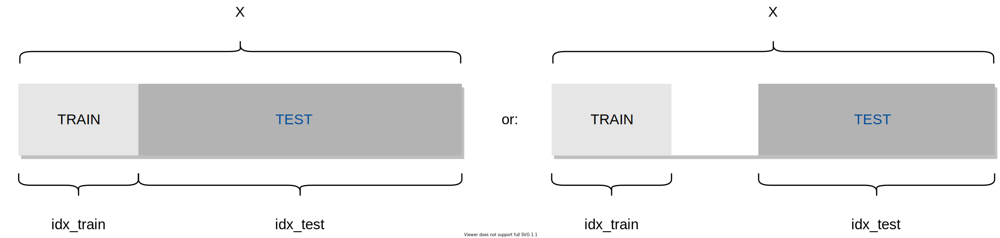

We import the necessary modules:

.. code:: python

    from PCAfold import DataSampler
    from PCAfold import preprocess
    import matplotlib.pyplot as plt
    from matplotlib.colors import ListedColormap
    import numpy as np

and we set some initial parameters:

.. code:: python

    save_filename = None
    color_map = ListedColormap(['#0e7da7', '#ceca70', '#b45050', '#2d2d54'])
    first_cluster = False
    figure_size = (5,5)
    random_seed = 200
    np.random.seed(seed=random_seed)

We generate a synthetic data set that is composed of four distinct
clusters that have an imbalanced number of observations (100, 250, 400 and 500
- 1250 total number of observations):

.. code:: python

    N_1, N_2, N_3, N_4 = 100, 250, 400, 500
    n_observations = N_1 + N_2 + N_3 + N_4
    mean_k1, mean_k2, mean_k3, mean_k4 = [-3, 3], [3, 3], [-3, -3], [3, -3] 
    covariance = [[1, 0.2], [0.2, 1]]
    x_k1, y_k1 = np.random.multivariate_normal(mean_k1, covariance, N_1).T
    x_k2, y_k2 = np.random.multivariate_normal(mean_k2, covariance, N_2).T
    x_k3, y_k3 = np.random.multivariate_normal(mean_k3, covariance, N_3).T
    x_k4, y_k4 = np.random.multivariate_normal(mean_k4, covariance, N_4).T
    x = np.vstack((x_k1[:,np.newaxis], x_k2[:,np.newaxis], x_k3[:,np.newaxis], x_k4[:,np.newaxis]))
    y = np.vstack((y_k1[:,np.newaxis], y_k2[:,np.newaxis], y_k3[:,np.newaxis], y_k4[:,np.newaxis]))
    idx = np.vstack((np.zeros((N_1, 1)), np.ones((N_2, 1)), 2*np.ones((N_3, 1)), 3*np.ones((N_4, 1)))).astype(int).ravel()
    populations = preprocess.get_populations(idx)

We visualize the original data set:

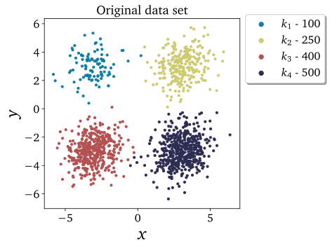

The only information about the original data set that will be needed is
the vector ``idx`` of cluster classifications.

.. note::

  Note that
  ``idx_train`` and ``idx_test``, that are the outputs of the sampling functions in this
  module, have a different interpretation than ``idx``. They are vectors containing
  observation indices, *not* cluster classifications.
  For instance, if train samples are composed of the first, second and tenth
  observation then ``idx_train=[0,1,9]``.

  You can find which cluster each observation in ``idx_train`` (or ``idx_test``)
  belongs to, for instance through:

  .. code::

    idx[idx_train,]
    idx[idx_test,]

  You can also extract a subset of ``idx_train`` that are only the indices belonging to a
  particular cluster.
  For instance, for the first cluster you can extract them by:

  .. code::

    train_indices_in_cluster_1 = [i for i in idx_train if idx[i,]==0]

  for the second cluster:

  .. code::

    train_indices_in_cluster_2 = [i for i in idx_train if idx[i,]==1]

  and so on.

We start by initalizing an object of the ``DataSampler`` class. For the moment,
we will set the parameter ``idx_test`` to an empty list, but we will demonstrate
an example for setting that parameter to something else later. Note that we can
set a fixed random seed if we want the sampling results to be reproducible. With
``verbose=True``, we will additionally see some detailed information about the current
sampling.

.. code:: python

  sample = DataSampler(idx, idx_test=[], random_seed=random_seed, verbose=True)

--------------------------------------------------------------------------------

Sample a fixed number
----------------------

We first select a fixed number of samples using the ``DataSampler.number``
function. Let's request 15% of the total data to be the train data. The function
calculates that it needs to select 46 samples from each cluster, which
amounts to 14.7% of the total number of samples in the data set. Whenever the exact percentage
requested by the user cannot be achieved, the function always under-samples.

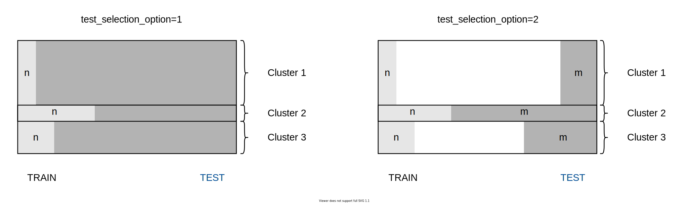

Select test data with ``test_selection_option=1``
^^^^^^^^^^^^^^^^^^^^^^^^^^^^^^^^^^^^^^^^^^^^^^^^^

There are always two ways in which the complementary test data can be selected.
They can be selected using the ``test_selection_option`` parameter.
We start with ``test_selection_option=1``, which selects all remaining
observations as the test data:

.. code:: python

  (idx_train, idx_test) = sample.number(15, test_selection_option=1)

Setting ``verbose=True`` lets us see some detailed information on sampling:

.. code-block:: text

  Cluster 0: taking 46 train samples out of 100 observations (46.0%).
  Cluster 1: taking 46 train samples out of 250 observations (18.4%).
  Cluster 2: taking 46 train samples out of 400 observations (11.5%).
  Cluster 3: taking 46 train samples out of 500 observations (9.2%).

  Cluster 0: taking 54 test samples out of 54 remaining observations (100.0%).
  Cluster 1: taking 204 test samples out of 204 remaining observations (100.0%).
  Cluster 2: taking 354 test samples out of 354 remaining observations (100.0%).
  Cluster 3: taking 454 test samples out of 454 remaining observations (100.0%).

  Selected 184 train samples (14.7%) and 1066 test samples (85.3%).

A dedicated plotting function from the ``preprocess`` module can be used to visualize
the train and test samples. This function takes as inputs the obtained ``idx_train``
and ``idx_test`` vectors. Note that a custom colormap can be specified by the user.

.. code:: python

  plt = preprocess.plot_2d_train_test_samples(x, y, idx, idx_train, idx_test, color_map=color_map, first_cluster_index_zero=False, figure_size=(10,5), save_filename=None)

The visual result of this sampling can be seen below:

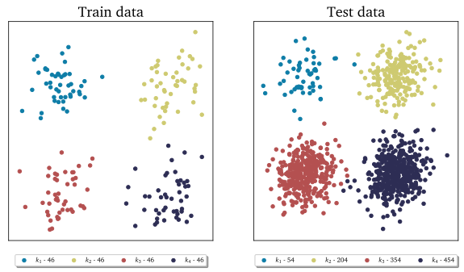

Select test data with ``test_selection_option=2``
^^^^^^^^^^^^^^^^^^^^^^^^^^^^^^^^^^^^^^^^^^^^^^^^^

We then set ``test_selection_option=2`` which selects a fixed number of
test samples from each cluster, calculated based on the smallest cluster. This
amounts to 54 test samples from each cluster.

.. code:: python

  (idx_train, idx_test) = sample.number(15, test_selection_option=2)

With ``verbose=True`` we will see some detailed information on sampling:

.. code-block:: text

  Cluster 0: taking 46 train samples out of 100 observations (46.0%).
  Cluster 1: taking 46 train samples out of 250 observations (18.4%).
  Cluster 2: taking 46 train samples out of 400 observations (11.5%).
  Cluster 3: taking 46 train samples out of 500 observations (9.2%).

  Cluster 0: taking 54 test samples out of 54 remaining observations (100.0%).
  Cluster 1: taking 54 test samples out of 204 remaining observations (26.5%).
  Cluster 2: taking 54 test samples out of 354 remaining observations (15.3%).
  Cluster 3: taking 54 test samples out of 454 remaining observations (11.9%).

  Selected 184 train samples (14.7%) and 216 test samples (17.3%).

The visual result of this sampling can be seen below:

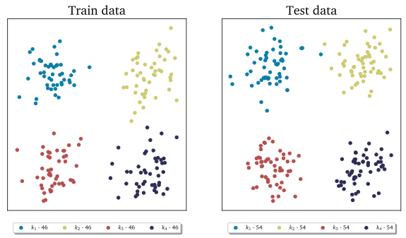

--------------------------------------------------------------------------------

Sample a fixed percentage
--------------------------

Next, we select a percentage of samples from each cluster using the
``DataSampler.percentage`` function. Let's request 10% of the total data to be the train
data - the function selects 10% of samples from each cluster.

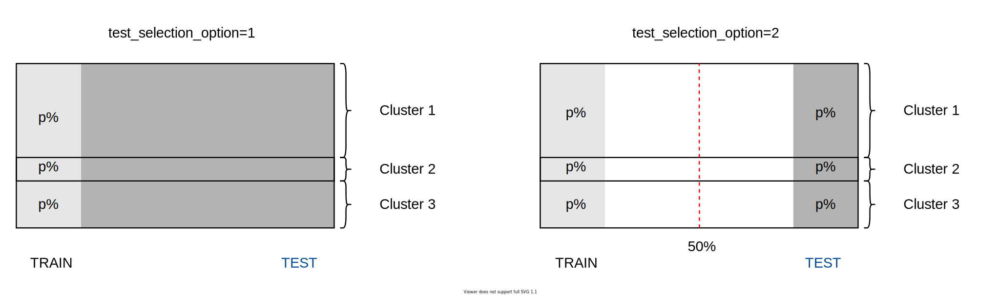
  
Select test data with ``test_selection_option=1``
^^^^^^^^^^^^^^^^^^^^^^^^^^^^^^^^^^^^^^^^^^^^^^^^^

We start with ``test_selection_option=1``, which selects all remaining
observations as the test data:

.. code:: python

  (idx_train, idx_test) = sample.percentage(10, test_selection_option=1)

With ``verbose=True`` we will see some detailed information on sampling:

.. code-block:: text

  Cluster 0: taking 10 train samples out of 100 observations (10.0%).
  Cluster 1: taking 25 train samples out of 250 observations (10.0%).
  Cluster 2: taking 40 train samples out of 400 observations (10.0%).
  Cluster 3: taking 50 train samples out of 500 observations (10.0%).

  Cluster 0: taking 90 test samples out of 90 remaining observations (100.0%).
  Cluster 1: taking 225 test samples out of 225 remaining observations (100.0%).
  Cluster 2: taking 360 test samples out of 360 remaining observations (100.0%).
  Cluster 3: taking 450 test samples out of 450 remaining observations (100.0%).

  Selected 125 train samples (10.0%) and 1125 test samples (90.0%).

The visual result of this sampling can be seen below:

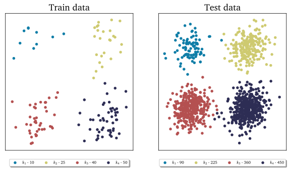

Select test data with ``test_selection_option=2``
^^^^^^^^^^^^^^^^^^^^^^^^^^^^^^^^^^^^^^^^^^^^^^^^^

We then set ``test_selection_option=2`` which uses the same procedure
to select the test data as was used to select the train data. In this case,
it also selects 10% of samples from each cluster as the test samples.

.. code:: python

  (idx_train, idx_test) = sample.percentage(10, test_selection_option=2)

With ``verbose=True`` we will see some detailed information on sampling:

.. code-block:: text

  Cluster 0: taking 10 train samples out of 100 observations (10.0%).
  Cluster 1: taking 25 train samples out of 250 observations (10.0%).
  Cluster 2: taking 40 train samples out of 400 observations (10.0%).
  Cluster 3: taking 50 train samples out of 500 observations (10.0%).

  Cluster 0: taking 10 test samples out of 90 remaining observations (11.1%).
  Cluster 1: taking 25 test samples out of 225 remaining observations (11.1%).
  Cluster 2: taking 40 test samples out of 360 remaining observations (11.1%).
  Cluster 3: taking 50 test samples out of 450 remaining observations (11.1%).

  Selected 125 train samples (10.0%) and 125 test samples (10.0%).

The visual result of this sampling can be seen below:

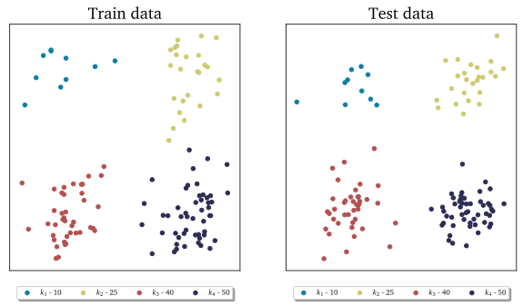

--------------------------------------------------------------------------------

Sample manually
---------------

We select samples manually from each cluster using the ``DataSampler.manual``
function.

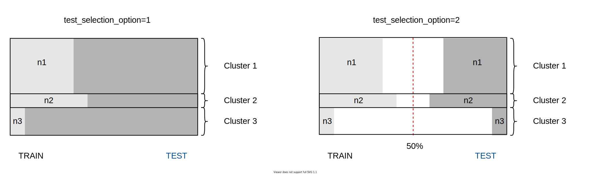

Select test data with ``test_selection_option=1``
^^^^^^^^^^^^^^^^^^^^^^^^^^^^^^^^^^^^^^^^^^^^^^^^^

We start with ``test_selection_option=1`` which selects all remaining
observations as the test data.
Let's request 4, 5, 10 and 2 samples from the first, second, third and fourth cluster respectively.
The sampling dictionary will thus have to be:
``sampling_dictionary={0:4, 1:5, 2:10, 3:2}``. Note that the function
still selects those samples randomly from each cluster.
We should also change ``sampling_type`` to ``'number'`` so that samples are
selected on a number and not a percentage basis:

.. code:: python

  (idx_train, idx_test) = sample.manual({0:4, 1:5, 2:10, 3:2}, sampling_type='number', test_selection_option=1)

With ``verbose=True`` we will see some detailed information on sampling:

.. code-block:: text

  Cluster 0: taking 4 train samples out of 100 observations (4.0%).
  Cluster 1: taking 5 train samples out of 250 observations (2.0%).
  Cluster 2: taking 10 train samples out of 400 observations (2.5%).
  Cluster 3: taking 2 train samples out of 500 observations (0.4%).

  Cluster 0: taking 96 test samples out of 96 remaining observations (100.0%).
  Cluster 1: taking 245 test samples out of 245 remaining observations (100.0%).
  Cluster 2: taking 390 test samples out of 390 remaining observations (100.0%).
  Cluster 3: taking 498 test samples out of 498 remaining observations (100.0%).

  Selected 21 train samples (1.7%) and 1229 test samples (98.3%).

The visual result of this sampling can be seen below:

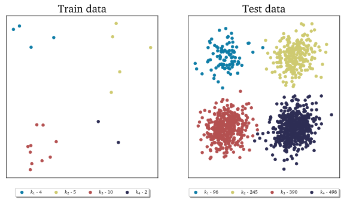

Select test data with ``test_selection_option=2``
^^^^^^^^^^^^^^^^^^^^^^^^^^^^^^^^^^^^^^^^^^^^^^^^^

We then set ``test_selection_option=2`` which uses the same procedure
to select the test data as was used to select the train data. This time, let's request
50%, 10%, 10% and 20% from the first, second, third and fourth cluster respectively.
The sampling dictionary will thus have to be:
``sampling_dictionary={0:50, 1:10, 2:10, 3:20}`` and we should change the
``sampling_type`` to ``'percentage'``:

.. code:: python

  (idx_train, idx_test) = sample.manual({0:50, 1:10, 2:10, 3:20}, sampling_type='percentage', test_selection_option=2)

With ``verbose=True`` we will see some detailed information on sampling:

.. code-block:: text

  Cluster 0: taking 50 train samples out of 100 observations (50.0%).
  Cluster 1: taking 25 train samples out of 250 observations (10.0%).
  Cluster 2: taking 40 train samples out of 400 observations (10.0%).
  Cluster 3: taking 100 train samples out of 500 observations (20.0%).

  Cluster 0: taking 50 test samples out of 50 remaining observations (100.0%).
  Cluster 1: taking 25 test samples out of 225 remaining observations (11.1%).
  Cluster 2: taking 40 test samples out of 360 remaining observations (11.1%).
  Cluster 3: taking 100 test samples out of 400 remaining observations (25.0%).

  Selected 215 train samples (17.2%) and 215 test samples (17.2%).

The visual result of this sampling can be seen below:

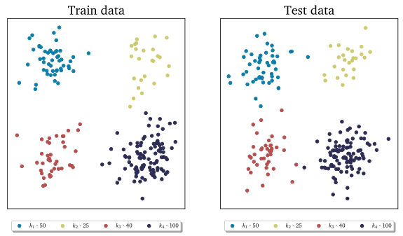

--------------------------------------------------------------------------------

Sample at random
----------------

Finally, we select random samples using the ``DataSampler.random`` function.
Let's request 10% of the total data to be the train data.

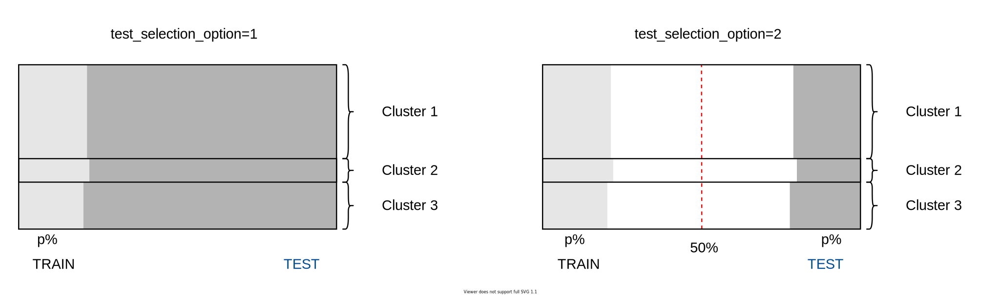

.. note::

  Random sampling will typically give a very similar sample distribution as
  percentage sampling. The only difference is that percentage sampling will
  maintain the percentage ``perc`` exact within each cluster while random sampling
  will typically result in some small variations from ``perc`` in each cluster
  since it is sampling independently of cluster definitions.

Select test data with ``test_selection_option=1``
^^^^^^^^^^^^^^^^^^^^^^^^^^^^^^^^^^^^^^^^^^^^^^^^^

We start with ``test_selection_option=1`` which selects all remaining
observations as test data.

.. code:: python

  (idx_train, idx_test) = sample.random(10, test_selection_option=1)

With ``verbose=True`` we will see some detailed information on sampling:

.. code-block:: text

  Cluster 0: taking 14 train samples out of 100 observations (14.0%).
  Cluster 1: taking 28 train samples out of 250 observations (11.2%).
  Cluster 2: taking 42 train samples out of 400 observations (10.5%).
  Cluster 3: taking 41 train samples out of 500 observations (8.2%).

  Cluster 0: taking 86 test samples out of 86 remaining observations (100.0%).
  Cluster 1: taking 222 test samples out of 222 remaining observations (100.0%).
  Cluster 2: taking 358 test samples out of 358 remaining observations (100.0%).
  Cluster 3: taking 459 test samples out of 459 remaining observations (100.0%).

  Selected 125 train samples (10.0%) and 1125 test samples (90.0%).

The visual result of this sampling can be seen below:

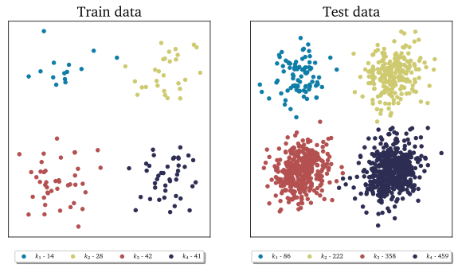

Select test data with ``test_selection_option=2``
^^^^^^^^^^^^^^^^^^^^^^^^^^^^^^^^^^^^^^^^^^^^^^^^^

We then set ``test_selection_option=2`` which uses the same procedure
to select the test data as was used to select the train data. In this case, it will also sample
10% of the total data set as the test data.

.. code:: python

  (idx_train, idx_test) = sample.random(10, test_selection_option=2)

With ``verbose=True`` we will see some detailed information on sampling:

.. code-block:: text

  Cluster 0: taking 14 train samples out of 100 observations (14.0%).
  Cluster 1: taking 28 train samples out of 250 observations (11.2%).
  Cluster 2: taking 42 train samples out of 400 observations (10.5%).
  Cluster 3: taking 41 train samples out of 500 observations (8.2%).

  Cluster 0: taking 8 test samples out of 86 remaining observations (9.3%).
  Cluster 1: taking 25 test samples out of 222 remaining observations (11.3%).
  Cluster 2: taking 29 test samples out of 358 remaining observations (8.1%).
  Cluster 3: taking 63 test samples out of 459 remaining observations (13.7%).

  Selected 125 train samples (10.0%) and 125 test samples (10.0%).

The visual result of this sampling can be seen below:

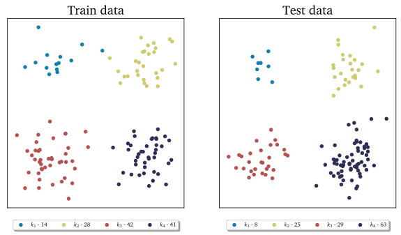

--------------------------------------------------------------------------------

Maintaining a fixed test data set
---------------------------------

In this example, we further illustrate how maintaining a fixed test data set
functionality can be utilized.
Suppose that in every cluster you have a very distinct set of observations on
which you always want to test your model.
You can point out those observations when initializing a ``DataSampler``
object through the use of the ``idx_test`` parameter.

We simulate this situation by appending additional samples to the previously
defined data set. We add 20 samples in each cluster - those sammples can be seen in the
figure below as smaller clouds next to each cluster:

.. image:: ../images/tutorial-train-test-select-original-data-set-appended-doc.svg
  :width: 500
  :align: center

Assuming that we know the indices of points that represent the appended clouds, stored in
``idx_test``, we can use that array of indices as an input parameter:

.. code:: python

  sample = DataSampler(idx, idx_test=idx_test, random_seed=random_seed, verbose=True)

Any sampling function now called will maintain those samples as the test data and the
train data will be sampled ignoring the indices in ``idx_test``.
Note also that if ``idx_test`` is specified, the ``test_selection_option`` parameter is ignored.

We will demonstrate this sampling using the ``DataSampler.random`` function, but
any other sampling function that we demonstrated earlier can be used as well.

.. code:: python

  (idx_train, idx_test) = sample.random(80, test_selection_option=2)

With ``verbose=True`` we will see some detailed information on sampling:

.. code-block:: text

  Cluster 0: taking 86 train samples out of 120 observations (71.7%).
  Cluster 1: taking 211 train samples out of 270 observations (78.1%).
  Cluster 2: taking 347 train samples out of 420 observations (82.6%).
  Cluster 3: taking 420 train samples out of 520 observations (80.8%).

  Cluster 0: taking 20 test samples out of 34 remaining observations (58.8%).
  Cluster 1: taking 20 test samples out of 59 remaining observations (33.9%).
  Cluster 2: taking 20 test samples out of 73 remaining observations (27.4%).
  Cluster 3: taking 20 test samples out of 100 remaining observations (20.0%).

  Selected 1064 train samples (80.0%) and 80 test samples (6.0%).

The visual result of this sampling can be seen below:

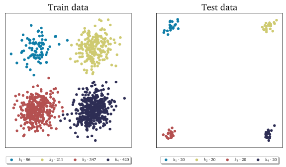

--------------------------------------------------------------------------------

Chaining sampling functions
---------------------------

Finally, we discuss an interesting use-case for chaining two sampling
functions, where train samples obtained from one sampling can become a fixed test
data for another sampling.

Suppose that our target is to have a fixed test data set composed of:

- 10 samples from the first cluster
- 20 samples from the second cluster
- 10 samples from the third cluster
- 50 samples from the fourth cluster

and, at the same time, select a fixed number of train samples from each cluster.

We can start with generating the desired test samples using the
``DataSampler.manual`` function. We can output the train data as the test data:

.. code:: python

  sample = DataSampler(idx, random_seed=random_seed, verbose=True)
  (idx_test, _) = sample.manual({0:10, 1:20, 2:10, 3:50}, sampling_type='number', test_selection_option=1)

Now we feed the obtained test set as a fixed test set for the target sampling:

.. code:: python

  sample.idx_test = idx_test
  (idx_train, idx_test) = sample.number(19.5, test_selection_option=1)

With ``verbose=True`` we will see some detailed information on sampling:

.. code-block:: text

  Cluster 0: taking 60 train samples out of 100 observations (60.0%).
  Cluster 1: taking 60 train samples out of 250 observations (24.0%).
  Cluster 2: taking 60 train samples out of 400 observations (15.0%).
  Cluster 3: taking 60 train samples out of 500 observations (12.0%).

  Cluster 0: taking 10 test samples out of 40 remaining observations (25.0%).
  Cluster 1: taking 20 test samples out of 190 remaining observations (10.5%).
  Cluster 2: taking 10 test samples out of 340 remaining observations (2.9%).
  Cluster 3: taking 50 test samples out of 440 remaining observations (11.4%).

  Selected 240 train samples (19.2%) and 90 test samples (7.2%).

The visual result of this sampling can be seen below:

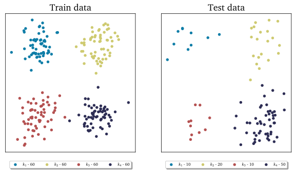

Notice that we have achieved what we wanted to: we generated a desired test
data set with 10, 20, 10 and 50 samples, and we also have an equal number of
train samples selected from each cluster - in this case 60 samples.
