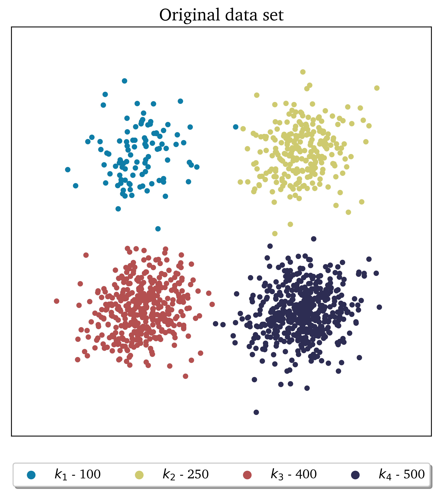
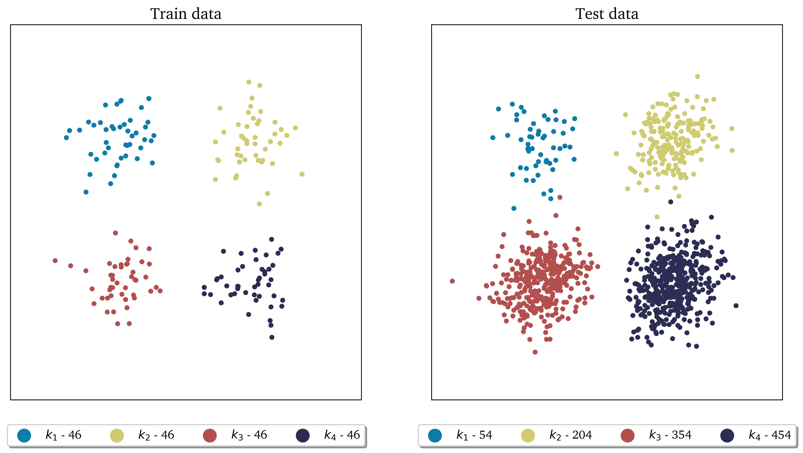
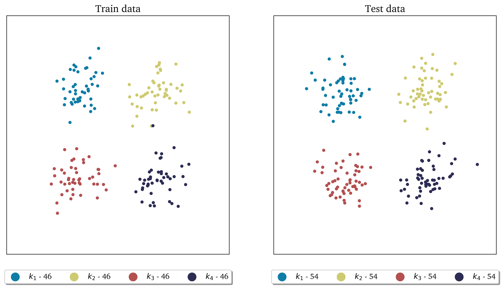
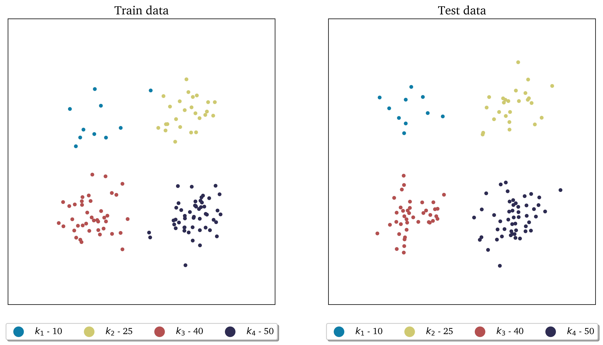
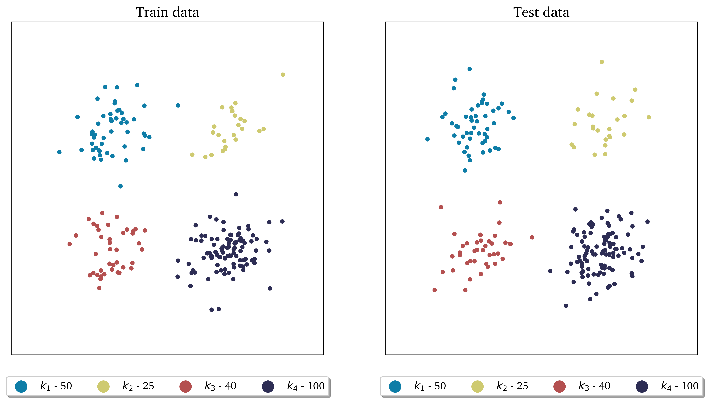
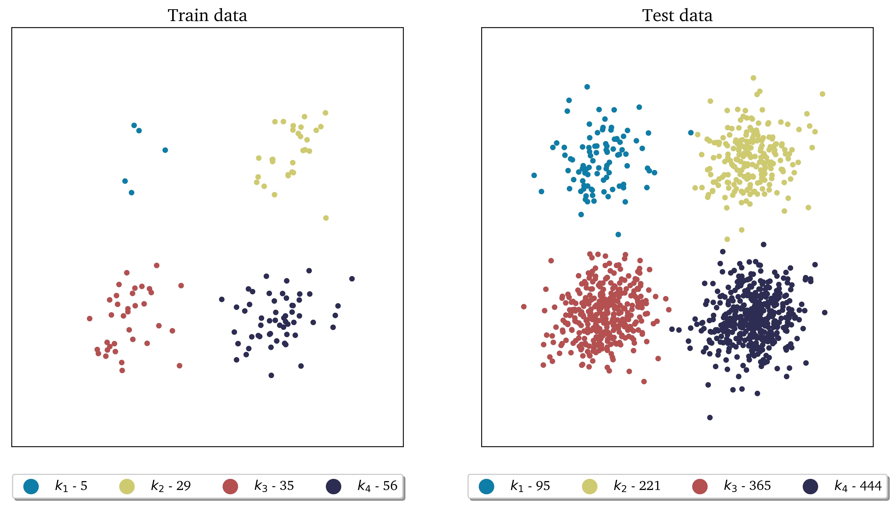
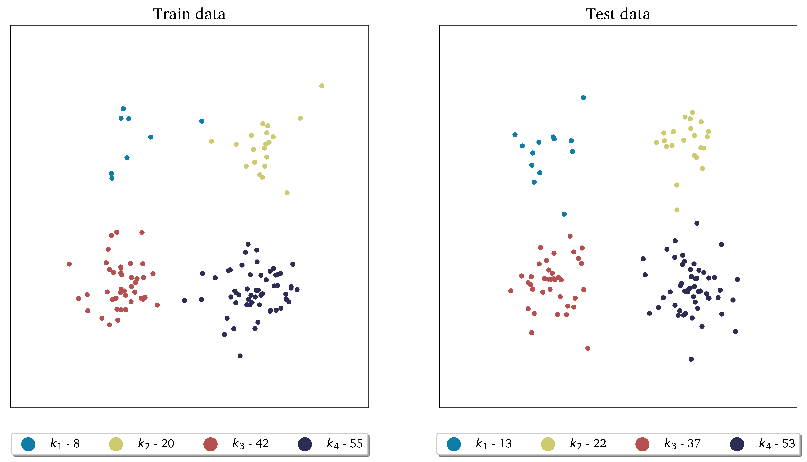
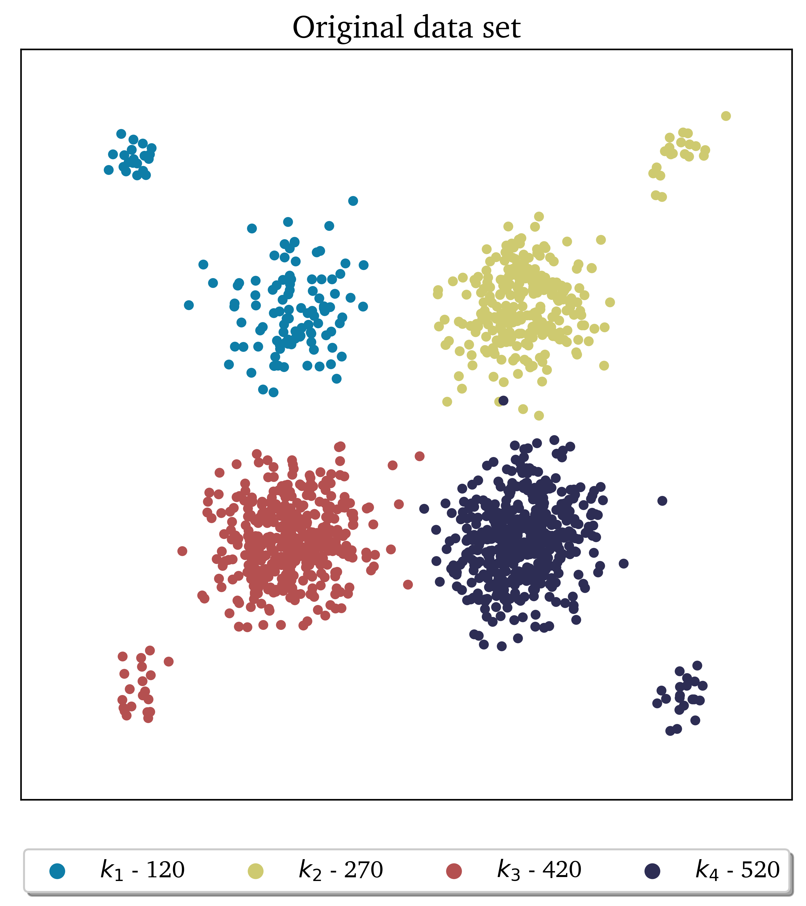
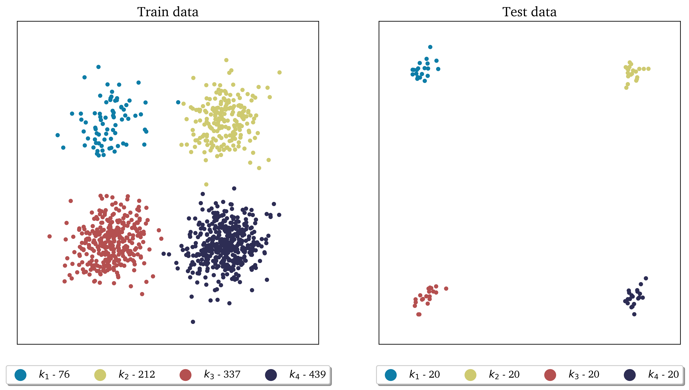
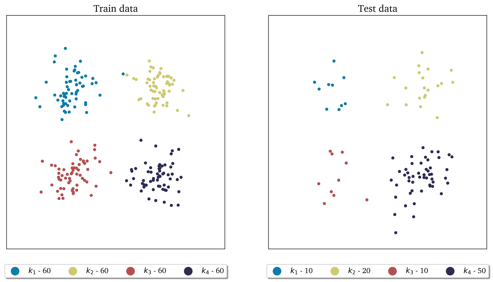

.. note:: This tutorial was generated from a Jupyter notebook that can be
          accessed `here <https://gitlab.multiscale.utah.edu/common/PCAfold/-/blob/regression/docs/tutorials/demo-sampling.ipynb>`_.

Sampling
========

In this tutorial we present how train and test samples can be selected using the
sampling functionalities of the ``preprocess`` module.
We need to import the ``DataSampler`` class:

.. code:: python

  from PCAfold import DataSampler

First, we generate a synthetic data set that is composed of four distinct
clusters that have imbalanced number of observations (100, 250, 400 and 500
which amounts to 1250 total number of observations):

The only information about the original data set that will be needed is
``idx`` - vector of cluster classifications.

.. note::

  ``idx_train`` and ``idx_test`` that are outputs of sampling functions in this
  module have different interpretation than ``idx``. They are vectors containing
  observation index, *not* cluster classifications.
  For instance, if train samples are composed of the first, second and tenth
  observation then ``idx_train=[0,1,9]``.

  You can find which cluster each observation in ``idx_train`` (or ``idx_test``)
  belongs to, for instance through:

  .. code::

    idx[idx_train,]
    idx[idx_test,]

  You can also extract a subset of ``idx_train`` that are indices belonging to a
  particular cluster.
  For instance, for the first cluster you can extract them by:

  .. code::

    train_indices_in_cluster_1 = [i for i in idx_train if idx[i,]==0]

  for the second cluster:

  .. code::

    train_indices_in_cluster_2 = [i for i in idx_train if idx[i,]==1]

  and so on.

--------------------------------------------------------------------------------

Select fixed number
-------------------

We first select fixed number of samples using ``DataSampler.number``
function . Let's request 15% of the total data to be train data. The function
calculates that it needs to select 46 samples from each cluster, which will
amount to 14.7% of total samples in the data set - when the exact percentage
specified by the user cannot be achieved, the function will always undersample.

Select test data with ``test_selection_option=1``
^^^^^^^^^^^^^^^^^^^^^^^^^^^^^^^^^^^^^^^^^^^^^^^^^

Since there are two ways in which test data can be selected, we start with
``test_selection_option=1`` which will select all remaining observations as test
data.

.. code:: python

  sample = DataSampler(idx, idx_test=[], random_seed=None, verbose=True)
  (idx_train, idx_test) = sample.number(15, test_selection_option=1)

With ``verbose=True`` we will see some detailed information on sampling:

.. code-block:: text

  Cluster 0: taking 46 train samples out of 100 observations (46.0%).
  Cluster 1: taking 46 train samples out of 250 observations (18.4%).
  Cluster 2: taking 46 train samples out of 400 observations (11.5%).
  Cluster 3: taking 46 train samples out of 500 observations (9.2%).

  Cluster 0: taking 54 test samples out of 54 remaining observations (100.0%).
  Cluster 1: taking 204 test samples out of 204 remaining observations (100.0%).
  Cluster 2: taking 354 test samples out of 354 remaining observations (100.0%).
  Cluster 3: taking 454 test samples out of 454 remaining observations (100.0%).

  Selected 184 train samples (14.7%) and 1066 test samples (85.3%).

The visual result of this sampling can be seen below:

Select test data with ``test_selection_option=2``
^^^^^^^^^^^^^^^^^^^^^^^^^^^^^^^^^^^^^^^^^^^^^^^^^

We then request ``test_selection_option=2`` which will select fixed number of
test samples from each cluster, calculated based on the smallest cluster. This
amounts to 54 test samples from each cluster.

.. code:: python

  sample = DataSampler(idx, idx_test=[], random_seed=None, verbose=True)
  (idx_train, idx_test) = sample.number(15, test_selection_option=2)

With ``verbose=True`` we will see some detailed information on sampling:

.. code-block:: text

  Cluster 0: taking 46 train samples out of 100 observations (46.0%).
  Cluster 1: taking 46 train samples out of 250 observations (18.4%).
  Cluster 2: taking 46 train samples out of 400 observations (11.5%).
  Cluster 3: taking 46 train samples out of 500 observations (9.2%).

  Cluster 0: taking 54 test samples out of 54 remaining observations (100.0%).
  Cluster 1: taking 54 test samples out of 204 remaining observations (26.5%).
  Cluster 2: taking 54 test samples out of 354 remaining observations (15.3%).
  Cluster 3: taking 54 test samples out of 454 remaining observations (11.9%).

  Selected 184 train samples (14.7%) and 216 test samples (17.3%).

The visual result of this sampling can be seen below:

--------------------------------------------------------------------------------

Select fixed percentage
-----------------------

Next, we select a percentage of samples from each cluster using
``DataSampler.percentage`` function. Let's request 10% of the total data to be train
data. The function will select 10% of samples from each cluster.

Select test data with ``test_selection_option=1``
^^^^^^^^^^^^^^^^^^^^^^^^^^^^^^^^^^^^^^^^^^^^^^^^^

We start with ``test_selection_option=1`` which will select all remaining
observations as test data.

.. code:: python

  sample = DataSampler(idx, idx_test=[], random_seed=None, verbose=True)
  (idx_train, idx_test) = sample.percentage(10, test_selection_option=1)

With ``verbose=True`` we will see some detailed information on sampling:

.. code-block:: text

  Cluster 0: taking 10 train samples out of 100 observations (10.0%).
  Cluster 1: taking 25 train samples out of 250 observations (10.0%).
  Cluster 2: taking 40 train samples out of 400 observations (10.0%).
  Cluster 3: taking 50 train samples out of 500 observations (10.0%).

  Cluster 0: taking 90 test samples out of 90 remaining observations (100.0%).
  Cluster 1: taking 225 test samples out of 225 remaining observations (100.0%).
  Cluster 2: taking 360 test samples out of 360 remaining observations (100.0%).
  Cluster 3: taking 450 test samples out of 450 remaining observations (100.0%).

  Selected 125 train samples (10.0%) and 1125 test samples (90.0%).

The visual result of this sampling can be seen below:

Select test data with ``test_selection_option=2``
^^^^^^^^^^^^^^^^^^^^^^^^^^^^^^^^^^^^^^^^^^^^^^^^^

We then request ``test_selection_option=2`` which will use the same procedure
to select test data as was used to select train data. It thus also selects 10%
of samples in each cluster as test samples.

.. code:: python

  sample = DataSampler(idx, idx_test=[], random_seed=None, verbose=True)
  (idx_train, idx_test) = sample.percentage(10, test_selection_option=2)

With ``verbose=True`` we will see some detailed information on sampling:

.. code-block:: text

  Cluster 0: taking 10 train samples out of 100 observations (10.0%).
  Cluster 1: taking 25 train samples out of 250 observations (10.0%).
  Cluster 2: taking 40 train samples out of 400 observations (10.0%).
  Cluster 3: taking 50 train samples out of 500 observations (10.0%).

  Cluster 0: taking 10 test samples out of 90 remaining observations (11.1%).
  Cluster 1: taking 25 test samples out of 225 remaining observations (11.1%).
  Cluster 2: taking 40 test samples out of 360 remaining observations (11.1%).
  Cluster 3: taking 50 test samples out of 450 remaining observations (11.1%).

  Selected 125 train samples (10.0%) and 125 test samples (10.0%).

The visual result of this sampling can be seen below:

--------------------------------------------------------------------------------

Select manually
---------------

We select samples manually from each cluster using ``DataSampler.manual``
function.

Select test data with ``test_selection_option=1``
^^^^^^^^^^^^^^^^^^^^^^^^^^^^^^^^^^^^^^^^^^^^^^^^^

We start with ``test_selection_option=1`` which will select all remaining
observations as test data.
Let's request 4, 5, 10 and 2 samples from clusters 1, 2, 3 and 4 respectively.
The sampling dictionary will thus have to be:
``sampling_dictionary={0:4, 1:5, 2:10, 3:2}``. Note that the function will
still select those samples randomly from each cluster.
We should also change ``sampling_type`` to ``'number'`` so that samples are
selected on number and not percentage basis:

.. code:: python

  sample = DataSampler(idx, idx_test=[], random_seed=None, verbose=True)
  (idx_train, idx_test) = sample.manual({0:4, 1:5, 2:10, 3:2}, sampling_type='number', test_selection_option=1)

With ``verbose=True`` we will see some detailed information on sampling:

.. code-block:: text

  Cluster 0: taking 4 train samples out of 100 observations (4.0%).
  Cluster 1: taking 5 train samples out of 250 observations (2.0%).
  Cluster 2: taking 10 train samples out of 400 observations (2.5%).
  Cluster 3: taking 2 train samples out of 500 observations (0.4%).

  Cluster 0: taking 96 test samples out of 96 remaining observations (100.0%).
  Cluster 1: taking 245 test samples out of 245 remaining observations (100.0%).
  Cluster 2: taking 390 test samples out of 390 remaining observations (100.0%).
  Cluster 3: taking 498 test samples out of 498 remaining observations (100.0%).

  Selected 21 train samples (1.7%) and 1229 test samples (98.3%).

The visual result of this sampling can be seen below:

.. image:: ../images/tutorial-train-test-select-manually-1.png
  :width: 700
  :align: center

Select test data with ``test_selection_option=2``
^^^^^^^^^^^^^^^^^^^^^^^^^^^^^^^^^^^^^^^^^^^^^^^^^

We then request ``test_selection_option=2`` which will use the same procedure
to select test data as was used to select train data. This time let's request
50%, 10%, 10% and 20% from clusters 1, 2, 3 and 4 respectively.
The sampling dictionary will thus have to be:
``sampling_dictionary={0:50, 1:10, 2:10, 3:20}`` and we should change the
``sampling_type`` to ``'percentage'``:

.. code:: python

  sample = DataSampler(idx, idx_test=[], random_seed=None, verbose=True)
  (idx_train, idx_test) = sample.manual({0:50, 1:10, 2:10, 3:20}, sampling_type='percentage', test_selection_option=2)

With ``verbose=True`` we will see some detailed information on sampling:

.. code-block:: text

  Cluster 0: taking 50 train samples out of 100 observations (50.0%).
  Cluster 1: taking 25 train samples out of 250 observations (10.0%).
  Cluster 2: taking 40 train samples out of 400 observations (10.0%).
  Cluster 3: taking 100 train samples out of 500 observations (20.0%).

  Cluster 0: taking 50 test samples out of 50 remaining observations (100.0%).
  Cluster 1: taking 25 test samples out of 225 remaining observations (11.1%).
  Cluster 2: taking 40 test samples out of 360 remaining observations (11.1%).
  Cluster 3: taking 100 test samples out of 400 remaining observations (25.0%).

  Selected 215 train samples (17.2%) and 215 test samples (17.2%).

The visual result of this sampling can be seen below:

--------------------------------------------------------------------------------

Select at random
----------------

Finally, we select random samples using ``DataSampler.random`` function.
Let's request 10% of the total data to be train data.

.. note::

  Random sampling will typically give a very similar sample distribution as
  percentage sampling. The only difference is that percentage sampling will
  maintain the percentage ``perc`` exact within each cluster while this function
  will typically result in some small variations from ``perc`` in each cluster
  since it is sampling independently of cluster classifications.

Select test data with ``test_selection_option=1``
^^^^^^^^^^^^^^^^^^^^^^^^^^^^^^^^^^^^^^^^^^^^^^^^^

We start with ``test_selection_option=1`` which will select all remaining
observations as test data.

.. code:: python

  sample = DataSampler(idx, idx_test=[], random_seed=None, verbose=True)
  (idx_train, idx_test) = sample.random(10, test_selection_option=1)

With ``verbose=True`` we will see some detailed information on sampling:

.. code-block:: text

  Cluster 0: taking 5 train samples out of 100 observations (5.0%).
  Cluster 1: taking 29 train samples out of 250 observations (11.6%).
  Cluster 2: taking 35 train samples out of 400 observations (8.8%).
  Cluster 3: taking 56 train samples out of 500 observations (11.2%).

  Cluster 0: taking 95 test samples out of 95 remaining observations (100.0%).
  Cluster 1: taking 221 test samples out of 221 remaining observations (100.0%).
  Cluster 2: taking 365 test samples out of 365 remaining observations (100.0%).
  Cluster 3: taking 444 test samples out of 444 remaining observations (100.0%).

  Selected 125 train samples (10.0%) and 1125 test samples (90.0%).

The visual result of this sampling can be seen below:

Select test data with ``test_selection_option=2``
^^^^^^^^^^^^^^^^^^^^^^^^^^^^^^^^^^^^^^^^^^^^^^^^^

We then request ``test_selection_option=2`` which will use the same procedure
to select test data as was used to select train data. It will thus also sample
10% of the total data set as test data.

.. code:: python

  sample = DataSampler(idx, idx_test=[], random_seed=None, verbose=True)
  (idx_train, idx_test) = sample.random(10, test_selection_option=2)

With ``verbose=True`` we will see some detailed information on sampling:

.. code-block:: text

  Cluster 0: taking 8 train samples out of 100 observations (8.0%).
  Cluster 1: taking 20 train samples out of 250 observations (8.0%).
  Cluster 2: taking 42 train samples out of 400 observations (10.5%).
  Cluster 3: taking 55 train samples out of 500 observations (11.0%).

  Cluster 0: taking 13 test samples out of 92 remaining observations (14.1%).
  Cluster 1: taking 22 test samples out of 230 remaining observations (9.6%).
  Cluster 2: taking 37 test samples out of 358 remaining observations (10.3%).
  Cluster 3: taking 53 test samples out of 445 remaining observations (11.9%).

  Selected 125 train samples (10.0%) and 125 test samples (10.0%).

The visual result of this sampling can be seen below:

--------------------------------------------------------------------------------

Maintaining fixed test data
---------------------------

In this example we further illustrate how maintaining fixed test data
functionality can be utilized.
Suppose that in every cluster you have a very distinct set of observations on
which you would always like to test your model.
You can point out those observations when initializing ``DataSampler``
object through the use of ``idx_test`` vector.

We simulate this situation by appending additional samples to the previously
defined data set. We add 20 samples in each cluster - those can be seen in the
figure below as smaller clouds next to each cluster:

If we know the indices of points that represent the appended clouds, stored in
``idx_test``, then we can use that array of indices as an input parameter:

.. code:: python

  sample = DataSampler(idx, idx_test=idx_test, random_seed=None, verbose=True)

Any sampling function now called will maintain those samples as test data and
train data will be sampled ignoring the indices in ``idx_test``.
Note also that if ``idx_test`` is passed the ``test_selection_option`` parameter is ignored.

We will demonstrate this sampling using ``DataSampler.random`` function, but
any other sampling function can be used as well.

.. code:: python

  (idx_train, idx_test) = sample.random(80, test_selection_option=2)

With ``verbose=True`` we will see some detailed information on sampling:

.. code-block:: text

  Cluster 0: taking 76 train samples out of 120 observations (63.3%).
  Cluster 1: taking 212 train samples out of 270 observations (78.5%).
  Cluster 2: taking 337 train samples out of 420 observations (80.2%).
  Cluster 3: taking 439 train samples out of 520 observations (84.4%).

  Cluster 0: taking 20 test samples out of 44 remaining observations (45.5%).
  Cluster 1: taking 20 test samples out of 58 remaining observations (34.5%).
  Cluster 2: taking 20 test samples out of 83 remaining observations (24.1%).
  Cluster 3: taking 20 test samples out of 81 remaining observations (24.7%).

  Selected 1064 train samples (80.0%) and 80 test samples (6.0%).

The visual result of this sampling can be seen below:

--------------------------------------------------------------------------------

Chaining sampling functions
---------------------------

Finally, we discuss an interesting use-case for chaining two sampling
functions where train samples obtained from one sampling can become fixed test
data for another sampling.

Suppose that our target is to have a fixed test data set that will be composed
of:

- 10 samples from the first cluster
- 20 samples from the second cluster
- 10 samples from the third cluster
- 50 samples from the fourth cluster

and at the same time generate fixed number of train samples in each cluster.

We can start with generating desired test samples using
``DataSampler.manual`` function. We can output train data as test data:

.. code:: python

  sample = DataSampler(idx, random_seed=None, verbose=True)
  (idx_test, _) = sample.manual({0:10, 1:20, 2:10, 3:50}, sampling_type='number', test_selection_option=1)

Now we feed the obtained test set as a fixed test set for the target sampling:

.. code:: python

  sample.idx_test = idx_test
  (idx_train, idx_test) = sample.number(19.5, test_selection_option=1)

With ``verbose=True`` we will see some detailed information on sampling:

.. code-block:: text

  Cluster 0: taking 60 train samples out of 100 observations (60.0%).
  Cluster 1: taking 60 train samples out of 250 observations (24.0%).
  Cluster 2: taking 60 train samples out of 400 observations (15.0%).
  Cluster 3: taking 60 train samples out of 500 observations (12.0%).

  Cluster 0: taking 10 test samples out of 40 remaining observations (25.0%).
  Cluster 1: taking 20 test samples out of 190 remaining observations (10.5%).
  Cluster 2: taking 10 test samples out of 340 remaining observations (2.9%).
  Cluster 3: taking 50 test samples out of 440 remaining observations (11.4%).

  Selected 240 train samples (19.2%) and 90 test samples (7.2%).

The visual result of this sampling can be seen below:

Notice that we have achieved what we wanted to: we generated a desired test
data set and we also have fixed number of train samples.
