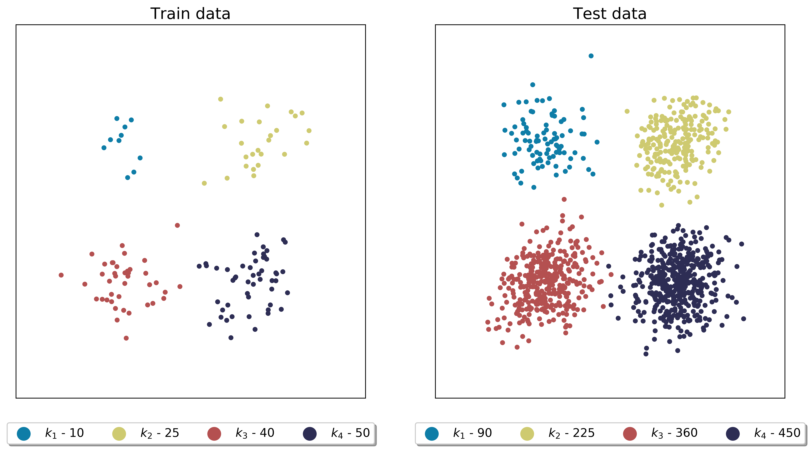
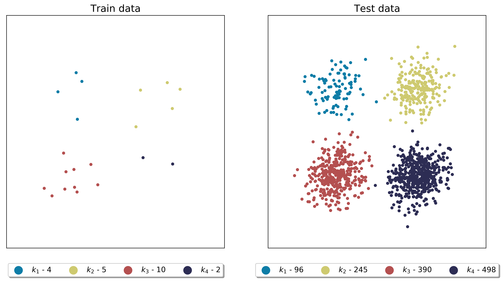

.. module:: pca

.. note:: This tutorial was generated from a Jupyter notebook that can be
          downloaded `here <https://gitlab.multiscale.utah.edu/common/PCA-python/-/blob/regression/docs/tutorials/train-test-selection.ipynb>`_.

Selecting train and test data
=============================

In this tutorial we present how train and test samples can be selected using the ``train_test_select`` module. To import the module:

.. code::

  import PCA.train_test_select as tts

First, we generate a synthetic data set that is composed of four distinct clusters that have imbalanced number of observations (100, 250, 400 and 500 - 1250 total number of observations):

.. image:: ../images/tutorial-train-test-select-original-data-set.png
  :width: 350
  :align: center

The only inputs that we are going to need are ``idx`` (vector of cluster classifications) and ``n_observations`` (the total number of observations in the data set).

.. note::

  ``idx_train`` and ``idx_test`` that are outputs of sampling functions in this module have different interpretation than ``idx``. They are vectors containing observation index, *not* cluster classifications.
  For instance, if train samples are composed of the first, second and tenth observation: ``idx_train=[0,1,9]``.

  You can find which cluster each observation in ``idx_train`` (or ``idx_test``) belongs to, for instance through:

  .. code::

    idx[idx_train,]
    idx[idx_test,]

  You can also extract a subset of ``idx_train`` that are indices belonging to a particular cluster. For instance for a first cluster you can extract them by:

  .. code::

    k = 0
    train_indices_k = [t_id for t_id in idx_train if idx[t_id,]==k]

Select fixed number
^^^^^^^^^^^^^^^^^^^

We first select fixed number of samples using function ``train_test_split_fixed_number_from_idx``. Let's request 15% of the total data to be train data. The function calculates that it needs to select 46 samples from each cluster, which will amount to 14.7% of total samples in the data set.

Select test data with ``test_selection_option=1``
"""""""""""""""""""""""""""""""""""""""""""""""""

Since there are two ways in which test data can be selected, we start with ``test_selection_option=1`` which will select all remaining observations as test data.

.. code:: python

  (idx_train, idx_test) = tts.train_test_split_fixed_number_from_idx(idx, 15, test_selection_option=1, bar50=True, verbose=True)

With ``verbose=True`` we will see some detailed information on sampling:

.. code-block:: text

  Cluster 1: taking 46 train samples out of 100 observations (46.0%).
  Cluster 2: taking 46 train samples out of 250 observations (18.4%).
  Cluster 3: taking 46 train samples out of 400 observations (11.5%).
  Cluster 4: taking 46 train samples out of 500 observations (9.2%).

  Cluster 1: taking 54 test samples out of 54 remaining observations (100.0%).
  Cluster 2: taking 204 test samples out of 204 remaining observations (100.0%).
  Cluster 3: taking 354 test samples out of 354 remaining observations (100.0%).
  Cluster 4: taking 454 test samples out of 454 remaining observations (100.0%).

  Selected 184 train samples (14.7%) and 1066 test samples (85.3%).

The visual result of this sampling can be seen below:

.. image:: ../images/tutorial-train-test-select-fixed-number-1.png
  :width: 700
  :align: center

Select test data with ``test_selection_option=2``
"""""""""""""""""""""""""""""""""""""""""""""""""

We then request ``test_selection_option=2`` which will select fixed number of test samples from each cluster, calculated based on the smallest cluster. This amounts to 54 test samples from each cluster.

.. code:: python

  (idx_train, idx_test) = tts.train_test_split_fixed_number_from_idx(idx, 15, test_selection_option=2, bar50=True, verbose=True)

With ``verbose=True`` we will see some detailed information on sampling:

.. code-block:: text

  Cluster 1: taking 46 train samples out of 100 observations (46.0%).
  Cluster 2: taking 46 train samples out of 250 observations (18.4%).
  Cluster 3: taking 46 train samples out of 400 observations (11.5%).
  Cluster 4: taking 46 train samples out of 500 observations (9.2%).

  Cluster 1: taking 54 test samples out of 54 remaining observations (100.0%).
  Cluster 2: taking 54 test samples out of 204 remaining observations (26.5%).
  Cluster 3: taking 54 test samples out of 354 remaining observations (15.3%).
  Cluster 4: taking 54 test samples out of 454 remaining observations (11.9%).

  Selected 184 train samples (14.7%) and 216 test samples (17.3%).

The visual result of this sampling can be seen below:

.. image:: ../images/tutorial-train-test-select-fixed-number-2.png
  :width: 700
  :align: center

Select fixed percentage
^^^^^^^^^^^^^^^^^^^^^^^

Next, we select a percentage of samples from each cluster using function ``train_test_split_percentage_from_idx``. Let's request 10% of the total data to be train data. The function will select 10% of samples from each cluster. All remaining data samples will become test data.

.. code:: python

  (idx_train, idx_test) = tts.train_test_split_percentage_from_idx(idx, 10, verbose=True)

With ``verbose=True`` we will see some detailed information on sampling:

.. code-block:: text

  Cluster 1: taking 10 train samples out of 100 observations (10.0%).
  Cluster 2: taking 25 train samples out of 250 observations (10.0%).
  Cluster 3: taking 40 train samples out of 400 observations (10.0%).
  Cluster 4: taking 50 train samples out of 500 observations (10.0%).

  Cluster 1: taking 90 test samples out of 90 remaining observations (100.0%).
  Cluster 2: taking 225 test samples out of 225 remaining observations (100.0%).
  Cluster 3: taking 360 test samples out of 360 remaining observations (100.0%).
  Cluster 4: taking 450 test samples out of 450 remaining observations (100.0%).

  Selected 125 train samples (10.0%) and 1125 test samples (90.0%).

The visual result of this sampling can be seen below:

Select manually
^^^^^^^^^^^^^^^

We select samples manually from each cluster using function ``train_test_split_manual_from_idx``. Let's request 4, 5, 10 and 2 samples from clusters 1, 2, 3 and 4 respectively. The sampling dictionary will thus have to be: ``sampling_dictionary={0:4, 1:5, 2:10, 3:2}``. Note that the function will still select those samples randomly from each cluster.
We should also change ``sampling_type`` to ``'number'`` so that samples are selected on number and not percentage basis.

.. code:: python

  (idx_train, idx_test) = tts.train_test_split_manual_from_idx(idx, {0:4, 1:5, 2:10, 3:2}, sampling_type='number', bar50=True, verbose=True)

With ``verbose=True`` we will see some detailed information on sampling:

.. code-block:: text

  Cluster 1: taking 4 train samples out of 100 observations (4.0%).
  Cluster 2: taking 5 train samples out of 250 observations (2.0%).
  Cluster 3: taking 10 train samples out of 400 observations (2.5%).
  Cluster 4: taking 2 train samples out of 500 observations (0.4%).

  Cluster 1: taking 96 test samples out of 96 remaining observations (100.0%).
  Cluster 2: taking 245 test samples out of 245 remaining observations (100.0%).
  Cluster 3: taking 390 test samples out of 390 remaining observations (100.0%).
  Cluster 4: taking 498 test samples out of 498 remaining observations (100.0%).

  Selected 21 train samples (1.7%) and 1229 test samples (98.3%).

The visual result of this sampling can be seen below:

Select at random
^^^^^^^^^^^^^^^^

Finally, we select random samples using function ``train_test_split_random``. Let's request 10% of the total data to be train data.

.. code:: python

  (idx_train, idx_test) = tts.train_test_split_random(idx, 10, idx_test=[], verbose=True)

With ``verbose=True`` we will see some detailed information on sampling:

.. code-block:: text

  Cluster 1: taking 9 train samples out of 100 observations (9.0%).
  Cluster 2: taking 26 train samples out of 250 observations (10.4%).
  Cluster 3: taking 42 train samples out of 400 observations (10.5%).
  Cluster 4: taking 48 train samples out of 500 observations (9.6%).

  Cluster 1: taking 91 test samples out of 91 remaining observations (100.0%).
  Cluster 2: taking 224 test samples out of 224 remaining observations (100.0%).
  Cluster 3: taking 358 test samples out of 358 remaining observations (100.0%).
  Cluster 4: taking 452 test samples out of 452 remaining observations (100.0%).

  Selected 125 train samples (10.0%) and 1125 test samples (90.0%).

The visual result of this sampling can be seen below:

.. image:: ../images/tutorial-train-test-select-random-doc.png
  :width: 700
  :align: center

.. note::

  Random sampling will typically give a very similar sample distribution as percentage sampling, unless there is/are cluster/s that are significantly smaller than other clusters.

Maintaining fixed test data
"""""""""""""""""""""""""""

In this example we further illustrate how ``idx_test`` input parameter can be used.
