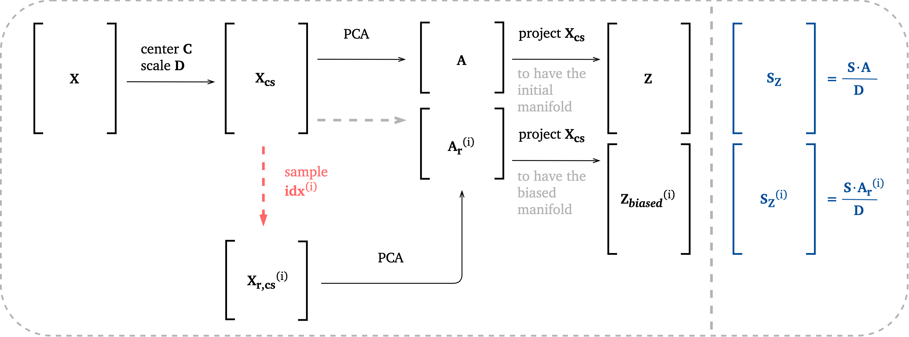
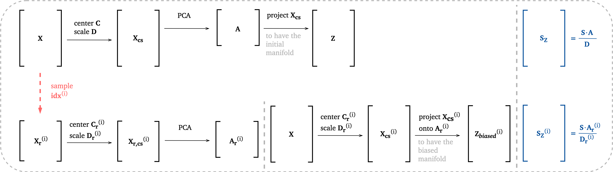

.. module:: PCA.cluster_biased_pca

Cluster-biased PCA
==================

``cluster_biased_pca.py`` module contains functions for performing analysis of data sets using cluster-biased PCA.

The general methodology for cluster-biased PCA is presented in the scheme below:

Biasing option 1
----------------

.. image:: ../images/cb-PCA-scheme-option-1.png
    :width: 700
    :align: center

Biasing option 2
----------------

Biasing option 3
----------------

Biasing option 4
----------------

.. image:: ../images/cb-PCA-scheme-option-4.png
    :width: 700
    :align: center

Biasing option 5
----------------

.. image:: ../images/cb-PCA-scheme-option-5.png
    :width: 700
    :align: center
