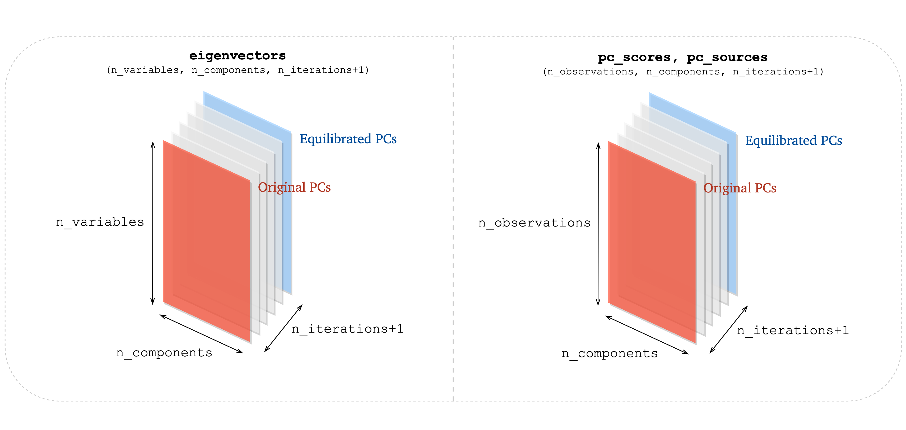

.. module:: cluster_biased_pca

Cluster-biased PCA
==================

``cluster_biased_pca.py`` module contains functions for performing analysis of data sets using cluster-biased PCA. Cluster-biased PCA is a link between local PCA and global PCA - it is using local features to inform (bias) the global PCs through changing sample densities.

The general methodology for cluster-biased PCA is presented in the scheme below:

.. image:: ../images/cluster-biased-PCA-scheme-sampling-highlighted.png
  :width: 700

Biasing options
----------------

This section explains the choice for ``biasing_option`` input parameter in some of the functions in this module.

Schemes below present how centering and scaling of data sets can be handled and how PCA transformations are done using the original eigenvectors :math:`\mathbf{A}` vs. the biased eigenvectors :math:`\mathbf{A_r}`. The superscript :math:`(i)` represents the :math:`i^{th}` version of the idx vector.

.. note:: Given the same ``idx``, the eigenvectors matrix :math:`\mathbf{A_r}` will be the same in option 1, 3 and 4 (the reduced data set is pre-processed in the same way in these three options). It will only be different in option 2 where the reduced data set is not pre-processed after being sampled from :math:`\mathbf{X_{cs}}`.

.. note:: The biased PC-scores :math:`\mathbf{Z_{biased}}` resulting from option 4 are included within the biased PC-scores :math:`\mathbf{Z_{biased}}` resulting from option 3. Note that the only difference going with option 3 instead of option 4 is that there will be more observations in the PC-scores matrix, but the data set that is transformed by PCA in both cases was pre-processed using the same centers and scales.

Biasing option 1
^^^^^^^^^^^^^^^^

In this option, the projection is always done using the centered and scaled original data set :math:`\mathbf{X_{cs}}` (centered with :math:`\mathbf{C}` and scaled with :math:`\mathbf{D}`). When sources of the PCs are computed, they are scaled by the scaling coming from the original data matrix :math:`\mathbf{X}`. The centers and scales of the reduced data set (:math:`\mathbf{C_r}` and :math:`\mathbf{D_r}`) are not used anywhere beyond the pre-processing step.

.. image:: ../images/cb-PCA-scheme-option-1.png
    :width: 700
    :align: center

Biasing option 2
^^^^^^^^^^^^^^^^

This option is the same as option 1, except we sample directly from :math:`\mathbf{X_{cs}}` and then without additionally pre-processing :math:`\mathbf{X_r}`, we perform PCA on a reduced data set.

.. image:: ../images/cb-PCA-scheme-option-2.png
    :width: 700
    :align: center

Biasing option 3
^^^^^^^^^^^^^^^^

In this option, the projection is always done using the original data set :math:`\mathbf{X}` centered and scaled with the centers and scales found on the reduced data set :math:`\mathbf{X_r}` (centered by :math:`\mathbf{C_r}` and scaled by :math:`\mathbf{D_r}`). The sources :math:`\mathbf{S}` are scaled with :math:`\mathbf{D_r}` as well to match the data set scaling.

.. image:: ../images/cb-PCA-scheme-option-3.png
    :width: 700
    :align: center

Biasing option 4
^^^^^^^^^^^^^^^^

In this option, the projection is done on the reduced data set :math:`\mathbf{X_r}` centered with :math:`\mathbf{C_r}` and scaled with :math:`\mathbf{D_r}`.
Source terms :math:`\mathbf{S}` have to be sampled as well, using the same ``idx`` vector. The sampled sources :math:`\mathbf{S}` are scaled with :math:`\mathbf{D_r}` as well to match the data set scaling.

.. note:: The major difference from the other three options is that this time, the number of transported observations is different from the original number of observations in the original data set.

.. image:: ../images/cb-PCA-scheme-option-4.png
    :width: 700
    :align: center

Biasing option 5
^^^^^^^^^^^^^^^^

In this option, the reduced data set is only found in order to compute its centers and scales. Once we have that, we go back to the original data set and pre-process it using :math:`\mathbf{C_r}` and :math:`\mathbf{D_r}`. PCA transformation is done on the entire data set :math:`\mathbf{X_{cs}^{(i)}}` and the same data set is projected onto the found eigenvectors.

.. image:: ../images/cb-PCA-scheme-option-5.png
    :width: 700
    :align: center

Functions
---------

Analyze centers movement
^^^^^^^^^^^^^^^^^^^^^^^^

.. autofunction:: PCAfold.cluster_biased_pca.analyze_centers_movement

Analyze eigenvector weights movement
^^^^^^^^^^^^^^^^^^^^^^^^^^^^^^^^^^^^

.. autofunction:: PCAfold.cluster_biased_pca.analyze_eigenvector_weights_movement

Analyze eigenvalue distribution
^^^^^^^^^^^^^^^^^^^^^^^^^^^^^^^

.. autofunction:: PCAfold.cluster_biased_pca.analyze_eigenvalue_distribution

Equilibrate cluster populations
^^^^^^^^^^^^^^^^^^^^^^^^^^^^^^^

.. autofunction:: PCAfold.cluster_biased_pca.equilibrate_cluster_populations

Equilibration
"""""""""""""

For the moment, there is only one way implemented for the equilibration. The smallest cluster is found and any larger ``j-th`` cluster's observations are diminished at each iteration by

.. math::

    \frac{\verb|N_j| - \verb|N_smallest_cluster|}{\verb|n_iterations|}

``N_j`` is the number of observations in the ``j-th`` cluster and ``N_smallest_cluster`` is the number of observations in the smallest cluster. ``n_iterations`` is an input parameter in the function.
This is presented in the scheme below:

.. image:: ../images/cluster-equilibration-scheme.png
    :width: 700
    :align: center

Future implementation might include equilibration that slows down close to equilibrium. This might be helpful for sensitivity analysis.

Interpretation for the outputs
""""""""""""""""""""""""""""""

This function returns 3D arrays ``eigenvectors``, ``pc_scores`` and ``pc_sources`` that have the following structure:

Re-sample at equilibration using K-Means clustering
^^^^^^^^^^^^^^^^^^^^^^^^^^^^^^^^^^^^^^^^^^^^^^^^^^^

.. autofunction:: PCAfold.cluster_biased_pca.resample_at_equilibration_with_kmeans_on_pc_sources

.. autofunction:: PCAfold.cluster_biased_pca.resample_at_equilibration_with_kmeans_on_pc_scores
