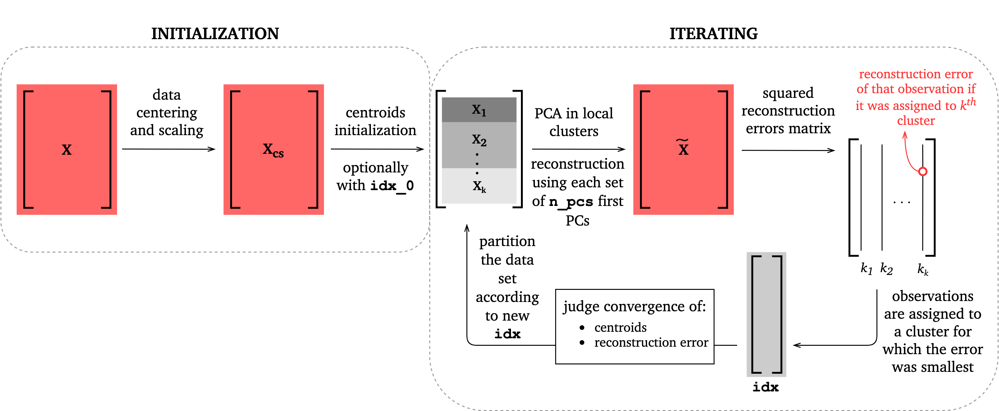

.. module:: clustering_data

Clustering
==========

``clustering_data.py`` module contains functions for classifying data sets into local clusters and performing some basic operations on clusters :cite:`Everitt2009`, :cite:`Kaufman2009`.

Clustering functions
--------------------

Each function that clusters the data set returns a vector of integers ``idx`` of type ``numpy.ndarray`` of size ``(n_observations,)`` that specifies classification of each observation from the original data set ``X`` to a local cluster.

.. image:: ../images/clustering-idx.png
  :width: 400
  :align: center

.. note:: The first cluster has index ``0`` within all ``idx`` vectors returned. When verbose information is printed with ``verbose=True`` during function execution or on the plots the cluster numeration starts with ``1``.

.. autofunction:: PCAfold.clustering_data.variable_bins

An example of how a vector can be partitioned with this function is presented below:

.. autofunction:: PCAfold.clustering_data.predefined_variable_bins

An example of how a vector can be partitioned with this function is presented below:

.. autofunction:: PCAfold.clustering_data.mixture_fraction_bins

An example of how a vector can be partitioned with this function is presented below:

.. autofunction:: PCAfold.clustering_data.pc_source_bins

Two examples of how a vector can be partitioned with this function are presented below.

With ``split_at_zero=False``:

With ``split_at_zero=True``:

.. autofunction:: PCAfold.clustering_data.vqpca

VQPCA algorithm was first proposed in :cite:`Kambhatla1997` and later its
modified version, that we present here, was developed in :cite:`Parente2009`.
The general scheme for the iterative procedure is presented below:

Auxiliary functions
-------------------

.. autofunction:: PCAfold.clustering_data.degrade_clusters

.. autofunction:: PCAfold.clustering_data.flip_clusters

.. autofunction:: PCAfold.clustering_data.get_centroids

.. autofunction:: PCAfold.clustering_data.get_partition

.. autofunction:: PCAfold.clustering_data.get_populations

Bibliography
------------

.. bibliography:: clustering.bib
