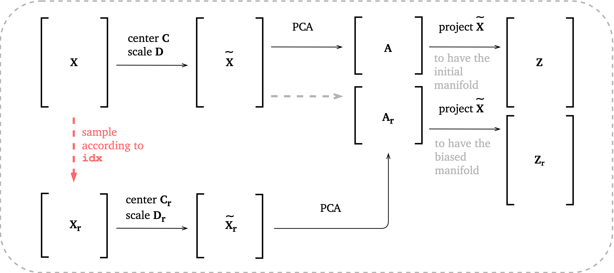
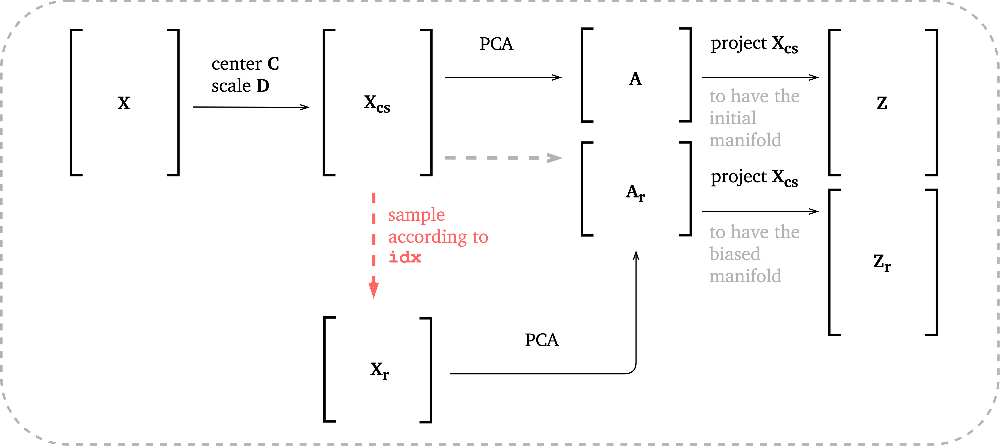
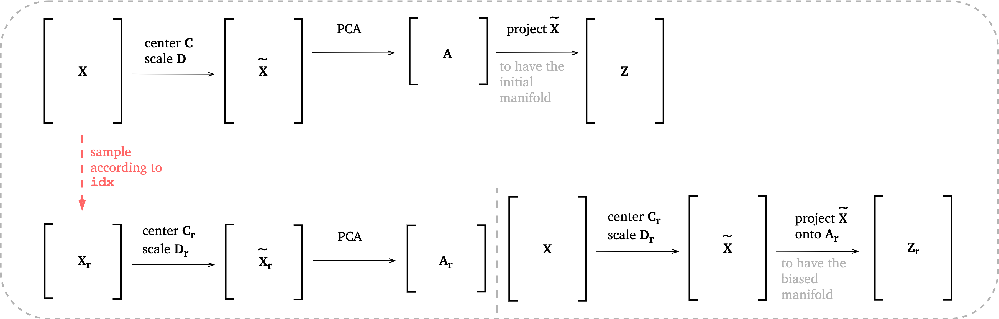
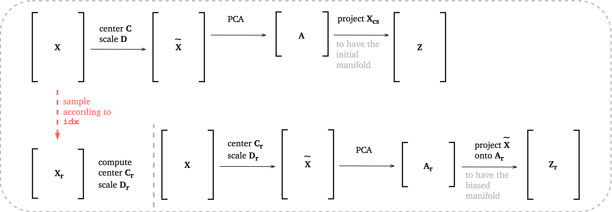

.. module:: reduction

##############
Data reduction
##############

``reduction`` module contains functions for performing Principal Component
Analysis :cite:`Jolliffe2002`.

--------------------------------------------------------------------------------

****************************
Principal Component Analysis
****************************

.. note:: It is assumed that the rows of the data set :math:`\mathbf{X}` on which PCA is
  performed correspond to observations and columns correspond to variables.
  It has dimensions ``(n_observations, n_variables)``.

Class ``PCA``
=============

.. autoclass:: PCAfold.reduction.PCA

``PCA.transform``
=================

.. autofunction:: PCAfold.reduction.PCA.transform

``PCA.reconstruct``
===================

.. autofunction:: PCAfold.reduction.PCA.reconstruct

``PCA.u_scores``
================

.. autofunction:: PCAfold.reduction.PCA.u_scores

``PCA.w_scores``
================

.. autofunction:: PCAfold.reduction.PCA.w_scores

``PCA.calculate_r2``
====================

.. autofunction:: PCAfold.reduction.PCA.calculate_r2

``PCA.r2_convergence``
======================

.. autofunction:: PCAfold.reduction.PCA.r2_convergence

``PCA.set_retained_eigenvalues``
================================

.. autofunction:: PCAfold.reduction.PCA.set_retained_eigenvalues

``PCA.principal_variables``
===========================

.. autofunction:: PCAfold.reduction.PCA.principal_variables

``PCA.data_consistency_check``
==============================

.. autofunction:: PCAfold.reduction.PCA.data_consistency_check

``PCA.save_to_txt``
==========================

.. autofunction:: PCAfold.reduction.PCA.save_to_txt

--------------------------------------------------------------------------------

********************************************************
PCA on sampled data sets
********************************************************

``pca_on_sampled_data_set``
===========================

.. autofunction:: PCAfold.reduction.pca_on_sampled_data_set

``analyze_eigenvector_weights_change``
======================================

.. autofunction:: PCAfold.reduction.analyze_eigenvector_weights_change

``analyze_eigenvalue_distribution``
===================================

.. autofunction:: PCAfold.reduction.analyze_eigenvalue_distribution

``equilibrate_cluster_populations``
===================================

.. autofunction:: PCAfold.reduction.equilibrate_cluster_populations

--------------------------------------------------------------------------------

***************
Biasing options
***************

This section explains the choice for ``biasing_option`` input parameter in some
of the functions in this module. This parameter will control how PCA is performed
on :math:`\mathbf{X_r}` data set sampled from :math:`\mathbf{X}`.

The general goal for PCA on sampled data sets is to bias PCA with some
information about the sampled data set :math:`\mathbf{X_r}`.

It is assumed that centers and scales computed on
:math:`\mathbf{X_r}` are denoted :math:`\mathbf{C_r}` and :math:`\mathbf{D_r}`
and centers and scales computed on :math:`\mathbf{X}` are denoted
:math:`\mathbf{C}` and :math:`\mathbf{D}`. Here :math:`N` is the number of
observations in :math:`\mathbf{X}`.

Biasing option 1
================

The steps of PCA in this option:

+-------------------------------+----------------------------------------------------------------------------------------------------------------------------+
| *Step*                        | *Option 1*                                                                                                                 |
+===============================+============================================================================================================================+
| *S1*: Sampling                | :math:`\mathbf{X} \xrightarrow{\text{sampling}} \mathbf{X_r}`                                                              |
+-------------------------------+----------------------------------------------------------------------------------------------------------------------------+
| | *S2*: Centering and scaling | | :math:`\mathbf{\tilde{X}_r} = (\mathbf{X_r} - \mathbf{C_r}) \cdot \mathbf{D_r}^{-1}`                                     |
| |                             | | :math:`\mathbf{\tilde{X}} = (\mathbf{X} - \mathbf{C}) \cdot \mathbf{D}^{-1}`                                             |
+-------------------------------+----------------------------------------------------------------------------------------------------------------------------+
| *S3*: PCA: Eigenvectors       | :math:`\frac{1}{N-1} {\mathbf{\tilde{X}_r}}^{\mathbf{T}} \mathbf{\tilde{X}_r} \xrightarrow{\text{eigendec.}} \mathbf{A_r}` |
+-------------------------------+----------------------------------------------------------------------------------------------------------------------------+
| *S4*: PCA: Transformation     | :math:`\mathbf{Z_r} = \mathbf{\tilde{X}} \mathbf{A_r}`                                                                     |
+-------------------------------+----------------------------------------------------------------------------------------------------------------------------+

These steps are presented graphically below:

Biasing option 2
================

The steps of PCA in this option:

+-------------------------------+--------------------------------------------------------------------------------------------------------------+
| *Step*                        | *Option 2*                                                                                                   |
+===============================+==============================================================================================================+
| *S1*: Sampling                | :math:`\mathbf{\tilde{X}} \xrightarrow{\text{sampling}} \mathbf{X_r}`                                        |
+-------------------------------+--------------------------------------------------------------------------------------------------------------+
| | *S2*: Centering and scaling | | :math:`\mathbf{X_r}` is not further pre-processed                                                          |
| |                             | | :math:`\mathbf{\tilde{X}} = (\mathbf{X} - \mathbf{C}) \cdot \mathbf{D}^{-1}`                               |
+-------------------------------+--------------------------------------------------------------------------------------------------------------+
| *S3*: PCA: Eigenvectors       | :math:`\frac{1}{N-1} {\mathbf{X_r}}^{\mathbf{T}} \mathbf{X_r} \xrightarrow{\text{eigendec.}} \mathbf{A_r}`   |
+-------------------------------+--------------------------------------------------------------------------------------------------------------+
| *S4*: PCA: Transformation     | :math:`\mathbf{Z_r} = \mathbf{\tilde{X}} \mathbf{A_r}`                                                       |
+-------------------------------+--------------------------------------------------------------------------------------------------------------+

These steps are presented graphically below:

Biasing option 3
================

The steps of PCA in this option:

+-------------------------------+----------------------------------------------------------------------------------------------------------------------------+
| *Step*                        | *Option 3*                                                                                                                 |
+===============================+============================================================================================================================+
| *S1*: Sampling                | :math:`\mathbf{X} \xrightarrow{\text{sampling}} \mathbf{X_r}`                                                              |
+-------------------------------+----------------------------------------------------------------------------------------------------------------------------+
| | *S2*: Centering and scaling | | :math:`\mathbf{\tilde{X}_r} = (\mathbf{X_r} - \mathbf{C_r}) \cdot \mathbf{D_r}^{-1}`                                     |
| |                             | | :math:`\mathbf{\tilde{X}} = (\mathbf{X} - \mathbf{C_r}) \cdot \mathbf{D_r}^{-1}`                                         |
+-------------------------------+----------------------------------------------------------------------------------------------------------------------------+
| *S3*: PCA: Eigenvectors       | :math:`\frac{1}{N-1} {\mathbf{\tilde{X}_r}}^{\mathbf{T}} \mathbf{\tilde{X}_r} \xrightarrow{\text{eigendec.}} \mathbf{A_r}` |
+-------------------------------+----------------------------------------------------------------------------------------------------------------------------+
| *S4*: PCA: Transformation     | :math:`\mathbf{Z_r} = \mathbf{\tilde{X}} \mathbf{A_r}`                                                                     |
+-------------------------------+----------------------------------------------------------------------------------------------------------------------------+

These steps are presented graphically below:

Biasing option 4
================

The steps of PCA in this option:

+-------------------------------+--------------------------------------------------------------------------------------------------------------------------+
| *Step*                        | *Option 4*                                                                                                               |
+===============================+==========================================================================================================================+
| *S1*: Sampling                | :math:`\mathbf{X} \xrightarrow{\text{sampling}} \mathbf{X_r}`                                                            |
+-------------------------------+--------------------------------------------------------------------------------------------------------------------------+
| *S2*: Centering and scaling   | :math:`\mathbf{\tilde{X}} = (\mathbf{X} - \mathbf{C_r}) \cdot \mathbf{D_r}^{-1}`                                         |
+-------------------------------+--------------------------------------------------------------------------------------------------------------------------+
| *S3*: PCA: Eigenvectors       | :math:`\frac{1}{N-1} {\mathbf{\tilde{X}}}^{\mathbf{T}} \mathbf{\tilde{X}} \xrightarrow{\text{eigendec.}} \mathbf{A_r}`   |
+-------------------------------+--------------------------------------------------------------------------------------------------------------------------+
| *S4*: PCA: Transformation     | :math:`\mathbf{Z_r} = \mathbf{\tilde{X}} \mathbf{A_r}`                                                                   |
+-------------------------------+--------------------------------------------------------------------------------------------------------------------------+

These steps are presented graphically below:

--------------------------------------------------------------------------------

******************
Plotting functions
******************

``plot_2d_manifold``
====================

.. autofunction:: PCAfold.reduction.plot_2d_manifold

``plot_eigenvectors``
=====================

.. autofunction:: PCAfold.reduction.plot_eigenvectors

``plot_eigenvectors_comparison``
================================

.. autofunction:: PCAfold.reduction.plot_eigenvectors_comparison

``plot_eigenvalue_distribution``
================================

.. autofunction:: PCAfold.reduction.plot_eigenvalue_distribution

``plot_eigenvalue_distribution_comparison``
===========================================

.. autofunction:: PCAfold.reduction.plot_eigenvalue_distribution_comparison

``plot_cumulative_variance``
============================

.. autofunction:: PCAfold.reduction.plot_cumulative_variance

--------------------------------------------------------------------------------

************
Bibliography
************

.. bibliography:: data-reduction.bib
