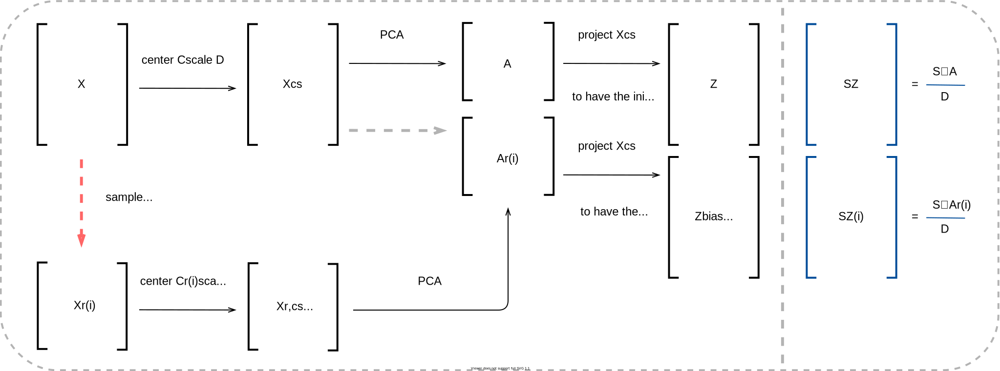
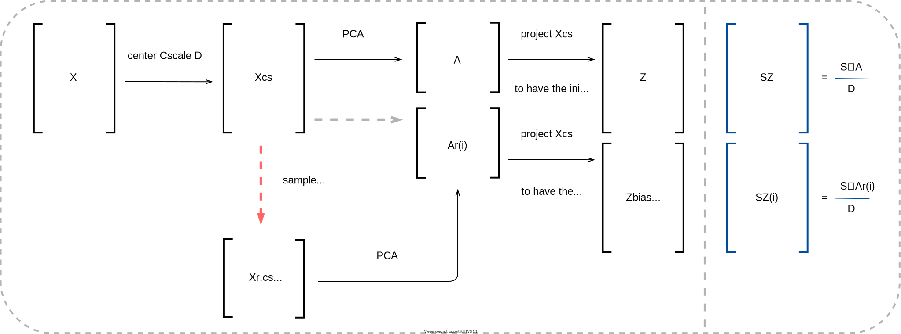
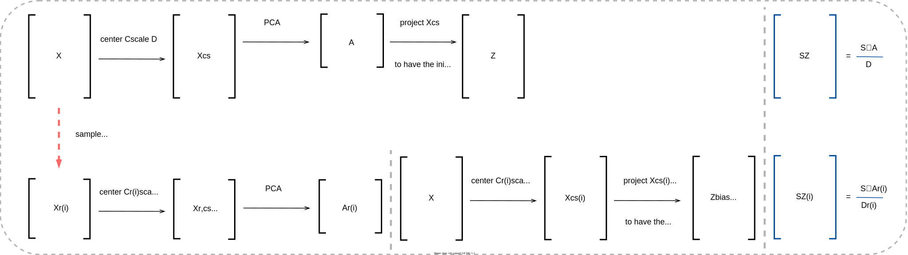
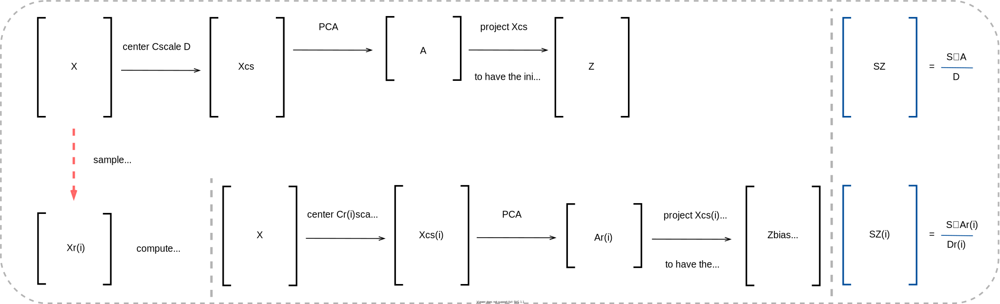

.. module:: reduction

##############
Data reduction
##############

The ``reduction`` module contains functions for performing Principal Component
Analysis (PCA).

.. note:: The format for the user-supplied input data matrix
  :math:`\mathbf{X} \in \mathbb{R}^{N \times Q}`, common to all modules, is that
  :math:`N` observations are stored in rows and :math:`Q` variables are stored
  in columns. Since typically :math:`N \gg Q`, the initial dimensionality of the
  data set is determined by the number of variables, :math:`Q`.

  .. math::

    \mathbf{X} =
    \begin{bmatrix}
    \vdots & \vdots & & \vdots \\
    X_1 & X_2 & \dots & X_{Q} \\
    \vdots & \vdots & & \vdots \\
    \end{bmatrix}

  The general agreement throughout this documentation is that :math:`i` will
  index observations and :math:`j` will index variables.

  The representation of the user-supplied data matrix in **PCAfold**
  is the input parameter ``X``, which should be of type ``numpy.ndarray``
  and of size ``(n_observations,n_variables)``.

--------------------------------------------------------------------------------

****************************
Principal Component Analysis
****************************

Class ``PCA``
=============

.. autoclass:: PCAfold.reduction.PCA

``PCA.transform``
=================

.. autofunction:: PCAfold.reduction.PCA.transform

``PCA.reconstruct``
===================

.. autofunction:: PCAfold.reduction.PCA.reconstruct

``PCA.get_weights_dictionary``
==============================

.. autofunction:: PCAfold.reduction.PCA.get_weights_dictionary

``PCA.u_scores``
================

.. autofunction:: PCAfold.reduction.PCA.u_scores

``PCA.w_scores``
================

.. autofunction:: PCAfold.reduction.PCA.w_scores

``PCA.calculate_r2``
====================

.. autofunction:: PCAfold.reduction.PCA.calculate_r2

``PCA.r2_convergence``
======================

.. autofunction:: PCAfold.reduction.PCA.r2_convergence

``PCA.set_retained_eigenvalues``
================================

.. autofunction:: PCAfold.reduction.PCA.set_retained_eigenvalues

``PCA.principal_variables``
===========================

.. autofunction:: PCAfold.reduction.PCA.principal_variables

``PCA.data_consistency_check``
==============================

.. autofunction:: PCAfold.reduction.PCA.data_consistency_check

``PCA.save_to_txt``
==========================

.. autofunction:: PCAfold.reduction.PCA.save_to_txt

--------------------------------------------------------------------------------

**********************************
Local Principal Component Analysis
**********************************

Class ``LPCA``
==============

.. autoclass:: PCAfold.reduction.LPCA

``LPCA.local_correlation``
============================

.. autofunction:: PCAfold.reduction.LPCA.local_correlation

--------------------------------------------------------------------------------

************************************
Subset Principal Component Analysis
************************************

Class ``SubsetPCA``
===================

.. autoclass:: PCAfold.reduction.SubsetPCA

--------------------------------------------------------------------------------

********************************************************
PCA on sampled data sets
********************************************************

``pca_on_sampled_data_set``
===========================

.. autofunction:: PCAfold.reduction.pca_on_sampled_data_set

``analyze_centers_change``
==========================

.. autofunction:: PCAfold.reduction.analyze_centers_change

``analyze_eigenvector_weights_change``
======================================

.. autofunction:: PCAfold.reduction.analyze_eigenvector_weights_change

``analyze_eigenvalue_distribution``
===================================

.. autofunction:: PCAfold.reduction.analyze_eigenvalue_distribution

``equilibrate_cluster_populations``
===================================

.. autofunction:: PCAfold.reduction.equilibrate_cluster_populations

--------------------------------------------------------------------------------

***************
Biasing options
***************

This section explains the choice for ``biasing_option`` input parameter in some
of the functions in this module.
The general goal for PCA on sampled data sets is to bias PCA with some
information about the sampled data set :math:`\mathbf{X_r}`.
Biasing option parameter will control how PCA is performed on or informed by
:math:`\mathbf{X_r}` data set sampled from :math:`\mathbf{X}`.

It is assumed that centers and scales computed on
:math:`\mathbf{X_r}` are denoted :math:`\mathbf{C_r}` and :math:`\mathbf{D_r}`
and centers and scales computed on :math:`\mathbf{X}` are denoted
:math:`\mathbf{C}` and :math:`\mathbf{D}`. :math:`N` is the number of
observations in :math:`\mathbf{X}`.

Biasing option 1
================

The steps of PCA in this option:

+-------------------------------+----------------------------------------------------------------------------------------------------------------------------+
| *Step*                        | *Option 1*                                                                                                                 |
+===============================+============================================================================================================================+
| *S1*: Sampling                | :math:`\mathbf{X} \xrightarrow{\text{sampling}} \mathbf{X_r}`                                                              |
+-------------------------------+----------------------------------------------------------------------------------------------------------------------------+
| | *S2*: Centering and scaling | | :math:`\mathbf{X_{cs, r}} = (\mathbf{X_r} - \mathbf{C_r}) \cdot \mathbf{D_r}^{-1}`                                       |
| |                             | | :math:`\mathbf{X_{cs}} = (\mathbf{X} - \mathbf{C}) \cdot \mathbf{D}^{-1}`                                                |
+-------------------------------+----------------------------------------------------------------------------------------------------------------------------+
| *S3*: PCA: Eigenvectors       | :math:`\frac{1}{N-1} \mathbf{X_{cs, r}}^{\mathbf{T}} \mathbf{X_{cs, r}} \xrightarrow{\text{eigendec.}} \mathbf{A_r}`       |
+-------------------------------+----------------------------------------------------------------------------------------------------------------------------+
| *S4*: PCA: Transformation     | :math:`\mathbf{Z_r} = \mathbf{X_{cs}} \mathbf{A_r}`                                                                        |
+-------------------------------+----------------------------------------------------------------------------------------------------------------------------+

These steps are presented graphically below:

Biasing option 2
================

The steps of PCA in this option:

+-------------------------------+--------------------------------------------------------------------------------------------------------------+
| *Step*                        | *Option 2*                                                                                                   |
+===============================+==============================================================================================================+
| *S1*: Sampling                | :math:`\mathbf{X_{cs}} \xrightarrow{\text{sampling}} \mathbf{X_r}`                                           |
+-------------------------------+--------------------------------------------------------------------------------------------------------------+
| | *S2*: Centering and scaling | | :math:`\mathbf{X_r}` is not further pre-processed                                                          |
| |                             | | :math:`\mathbf{X_{cs}} = (\mathbf{X} - \mathbf{C}) \cdot \mathbf{D}^{-1}`                                  |
+-------------------------------+--------------------------------------------------------------------------------------------------------------+
| *S3*: PCA: Eigenvectors       | :math:`\frac{1}{N-1} \mathbf{X_r}^{\mathbf{T}} \mathbf{X_r} \xrightarrow{\text{eigendec.}} \mathbf{A_r}`     |
+-------------------------------+--------------------------------------------------------------------------------------------------------------+
| *S4*: PCA: Transformation     | :math:`\mathbf{Z_r} = \mathbf{X_{cs}} \mathbf{A_r}`                                                          |
+-------------------------------+--------------------------------------------------------------------------------------------------------------+

These steps are presented graphically below:

Biasing option 3
================

The steps of PCA in this option:

+-------------------------------+----------------------------------------------------------------------------------------------------------------------------+
| *Step*                        | *Option 3*                                                                                                                 |
+===============================+============================================================================================================================+
| *S1*: Sampling                | :math:`\mathbf{X} \xrightarrow{\text{sampling}} \mathbf{X_r}`                                                              |
+-------------------------------+----------------------------------------------------------------------------------------------------------------------------+
| | *S2*: Centering and scaling | | :math:`\mathbf{X_{cs, r}} = (\mathbf{X_r} - \mathbf{C_r}) \cdot \mathbf{D_r}^{-1}`                                       |
| |                             | | :math:`\mathbf{X_{cs}} = (\mathbf{X} - \mathbf{C_r}) \cdot \mathbf{D_r}^{-1}`                                            |
+-------------------------------+----------------------------------------------------------------------------------------------------------------------------+
| *S3*: PCA: Eigenvectors       | :math:`\frac{1}{N-1} \mathbf{X_{cs, r}}^{\mathbf{T}} \mathbf{X_{cs, r}} \xrightarrow{\text{eigendec.}} \mathbf{A_r}`       |
+-------------------------------+----------------------------------------------------------------------------------------------------------------------------+
| *S4*: PCA: Transformation     | :math:`\mathbf{Z_r} = \mathbf{X_{cs}} \mathbf{A_r}`                                                                        |
+-------------------------------+----------------------------------------------------------------------------------------------------------------------------+

These steps are presented graphically below:

Biasing option 4
================

The steps of PCA in this option:

+-------------------------------+--------------------------------------------------------------------------------------------------------------------------+
| *Step*                        | *Option 4*                                                                                                               |
+===============================+==========================================================================================================================+
| *S1*: Sampling                | :math:`\mathbf{X} \xrightarrow{\text{sampling}} \mathbf{X_r}`                                                            |
+-------------------------------+--------------------------------------------------------------------------------------------------------------------------+
| *S2*: Centering and scaling   | :math:`\mathbf{X_{cs}} = (\mathbf{X} - \mathbf{C_r}) \cdot \mathbf{D_r}^{-1}`                                            |
+-------------------------------+--------------------------------------------------------------------------------------------------------------------------+
| *S3*: PCA: Eigenvectors       | :math:`\frac{1}{N-1} \mathbf{X_{cs}}^{\mathbf{T}} \mathbf{X_{cs}} \xrightarrow{\text{eigendec.}} \mathbf{A_r}`           |
+-------------------------------+--------------------------------------------------------------------------------------------------------------------------+
| *S4*: PCA: Transformation     | :math:`\mathbf{Z_r} = \mathbf{X_{cs}} \mathbf{A_r}`                                                                      |
+-------------------------------+--------------------------------------------------------------------------------------------------------------------------+

These steps are presented graphically below:

--------------------------------------------------------------------------------

******************
Plotting functions
******************

``plot_2d_manifold``
====================

.. autofunction:: PCAfold.reduction.plot_2d_manifold

``plot_3d_manifold``
====================

.. autofunction:: PCAfold.reduction.plot_3d_manifold

``plot_2d_manifold_sequence``
========================================

.. autofunction:: PCAfold.reduction.plot_2d_manifold_sequence

``plot_parity``
===============

.. autofunction:: PCAfold.reduction.plot_parity

``plot_mode``
=====================

.. autofunction:: PCAfold.reduction.plot_mode

``plot_eigenvectors``
=====================

.. autofunction:: PCAfold.reduction.plot_eigenvectors

``plot_eigenvectors_comparison``
================================

.. autofunction:: PCAfold.reduction.plot_eigenvectors_comparison

``plot_eigenvalue_distribution``
================================

.. autofunction:: PCAfold.reduction.plot_eigenvalue_distribution

``plot_eigenvalue_distribution_comparison``
===========================================

.. autofunction:: PCAfold.reduction.plot_eigenvalue_distribution_comparison

``plot_cumulative_variance``
============================

.. autofunction:: PCAfold.reduction.plot_cumulative_variance

``plot_heatmap``
============================

.. autofunction:: PCAfold.reduction.plot_heatmap

``plot_heatmap_sequence``
============================

.. autofunction:: PCAfold.reduction.plot_heatmap_sequence

--------------------------------------------------------------------------------

************
Bibliography
************

.. bibliography:: data-reduction.bib
  :labelprefix: R
