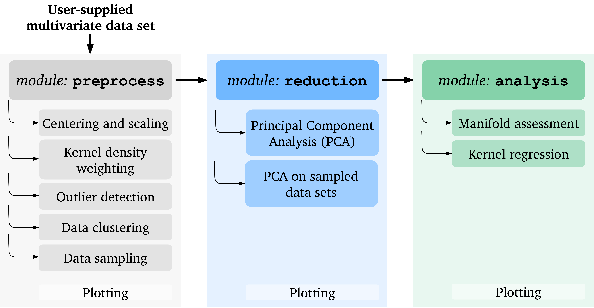

Getting started
===============

Installation
------------

Dependencies
^^^^^^^^^^^^

**PCAfold** requires ``python3.7`` and the following packages:

- ``Cython``
- ``matplotlib``
- ``numpy``
- ``scipy``

Build from source
^^^^^^^^^^^^^^^^^

Clone the **PCAfold** repository and move into the ``PCAfold`` directory created:

.. code-block:: text

  git clone http://gitlab.multiscale.utah.edu/common/PCAfold.git
  cd PCAfold

Run the ``setup.py`` script as below to complete the installation:

.. code-block:: text

  python3.7 setup.py build_ext --inplace
  python3.7 setup.py install

You are ready to ``import PCAfold``!

Local documentation build
^^^^^^^^^^^^^^^^^^^^^^^^^

To build the documentation locally, you need ``sphinx`` installed on your machine,
along with the following extensions:

.. code-block:: text

  sphinx.ext.todo
  sphinx.ext.githubpages
  sphinx.ext.autodoc
  sphinx.ext.napoleon
  sphinx.ext.mathjax
  sphinx.ext.autosummary
  sphinxcontrib.bibtex

Then, navigate to ``docs/`` directory and build the documentation:

.. code-block:: text

  sphinx-build -b html . builddir

  make html

Documentation main page ``_build/html/index.html`` can be opened in a web browser.

In MacOS you can open it directly from the terminal:

.. code-block:: text

  open _build/html/index.html

Testing
^^^^^^^

To run regression tests from the base repo directory run:

.. code-block:: text

  python3.7 -m unittest discover

To switch verbose on, use the ``-v`` flag.

All tests should be passing. If any of the tests is failing and you can’t sort
out why, please open an issue on `GitLab <https://gitlab.multiscale.utah.edu/common/PCAfold>`_.

Plotting
--------

Some functions within **PCAfold** result in plot outputs. Global styles for the
plots are set using the ``styles.py`` file. This file can be updated with new
settings that will be seen globally by **PCAfold** modules. Re-build the project
after changing ``styles.py`` file:

.. code-block:: text

  python3.7 setup.py install

All plotting functions return handles to generated plots.

Workflows
---------

In this section we present several popular workflows that can be achieved using
functionalities of **PCAfold**. An overview for combining **PCAfold** modules
into a complete workflow is presented in the diagram below:

Each module’s functionalities can also be used as a standalone tool for
performing a specific task and can easily combine with techniques from outside of
this software, such as K-Means algorithm or Artificial Neural Networks.

The format for the user-supplied input data matrix
:math:`\mathbf{X} \in \mathbb{R}^{N \times Q}` common to all modules is that
:math:`N` observations are stored in rows and :math:`Q` variables are stored
in columns. The initial dimensionality of the data set is determined by the
number of variables :math:`Q`. Typically, :math:`N \gg Q`.

Below are brief descriptions of several workflows that utilize functionalities of **PCAfold**:

Data manipulation
^^^^^^^^^^^^^^^^^

Basic data manipulation such as centering, scaling, outlier detection and removal
or kernel density weighting of data sets can be achieved using the ``preprocess``
module only.

Data clustering
^^^^^^^^^^^^^^^

Data clustering can be achieved using the ``preprocess`` module. This functionality can be
useful for data analysis or feature detection and can also be the first
step for applying data reduction techniques locally (on local portions of the data).

Data sampling
^^^^^^^^^^^^^

Data sampling can be achieved using the ``preprocess`` module. Possible
use-case for sampling data sets could be to split data sets into train and test
samples for other Machine Learning algorithms. Another use-case can be sampling
imbalanced data sets.

Global PCA
^^^^^^^^^^

Global PCA can be performed using ``PCA`` class available in the ``reduction`` module.

Local PCA
^^^^^^^^^

Local PCA can be performed by combining clustering techniques, for instance
the ones available in the ``preprocess`` module, with ``PCA`` class
available in the ``reduction`` module.
In particular, local eigenvectors and Principal Components can be obtained by passing an
extracted cluster instead of a full data set as an input for ``PCA`` class.
It is also worth pointing out that clustering algorithms from outside of
**PCAfold** software can be brought into the workflow.

PCA on sampled data sets
^^^^^^^^^^^^^^^^^^^^^^^^

PCA on sampled data sets can be performed by combining sampling techniques from
the ``preprocess`` module, with ``PCA`` class
available in the ``reduction`` module. The ``reduction`` module additionally
contains a few more functions specifically designed to help analyze the results of
performing PCA on sampled data sets.

Assessing manifold quality
^^^^^^^^^^^^^^^^^^^^^^^^^^

Once a low-dimensional manifold is obtained, the quality of the manifold can be
assessed using functionalities available in the ``analysis`` module.
It is worth noting that the manifold assessment metrics available can be
equally applied to manifolds derived by means of techniques other than PCA.
