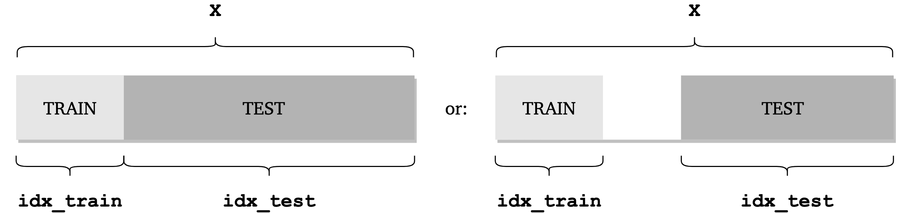

.. module:: sampling

#############################
Train and test data selection
#############################

``sampling.py`` module contains functions for splitting data sets into train and test data for use in machine learning algorithms.
Apart from random splitting that can be achieved with the commonly used `sklearn.model_selection.train_test_split <https://scikit-learn.org/stable/modules/generated/sklearn.model_selection.train_test_split.html>`_, new methods are implemented here that allow for purposive sampling, such as drawing samples at certain amount from local clusters :cite:`May2010`, :cite:`Gill2004`.

The general idea is to divide the entire data set ``X`` (or its portion) into train and test samples as presented below:

**Train data** is always sampled in the same way for a given sampling function.
Depending on the option selected, **test data** will be sampled differently, either as all
remaining samples that were not included in train data or as a subset of those.
You can select the option by setting the ``test_selection_option`` parameter for each sampling function.
Reach out to the documentation for a specific sampling function to see what options are available.

All splitting functions in this module return a tuple of two variables: ``(idx_train, idx_test)``.
Both ``idx_train`` and ``idx_test`` are vectors of integers of type ``numpy.ndarray`` and of size ``(_,)``.
These variables contain indices of observations that went into train data and test data respectively.

In your model learning algorithm you can then get the train and test observations, for instance in the following way:

.. code:: python

  X_train = X[idx_train,:]
  X_test = X[idx_test,:]

All functions are equipped with ``verbose=False`` parameter. If it is set to ``True`` some additional information on train and test selection is printed.

.. note:: It is assumed that the first cluster has index ``0`` within all input ``idx`` vectors. When verbose information is printed with ``verbose=True`` during function execution or on the plots the cluster numeration starts with ``1``.

*************************
Class ``TrainTestSelect``
*************************

.. autoclass:: PCAfold.sampling.TrainTestSelect

Functions within ``TrainTestSelect`` class
==========================================

Select fixed number
-------------------

.. autofunction:: PCAfold.sampling.TrainTestSelect.number

Select fixed percentage
-----------------------

.. autofunction:: PCAfold.sampling.TrainTestSelect.percentage

Select manually
---------------

.. autofunction:: PCAfold.sampling.TrainTestSelect.manual

Select at random
----------------

.. autofunction:: PCAfold.sampling.TrainTestSelect.random

--------------------------------------------------------------------------------

*************************
Bibliography
*************************

.. bibliography:: train-test-select.bib
