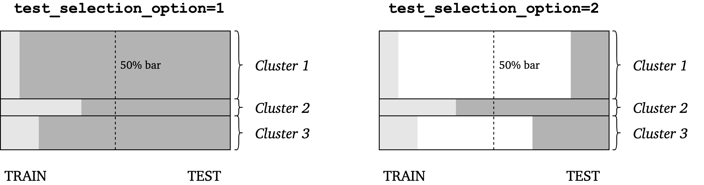

.. module:: sampling

#############################
Train and test data selection
#############################

``sampling.py`` module contains functions for splitting data sets into train and test data for use in machine learning algorithms.
Apart from random splitting that can be achieved with the commonly used `sklearn.model_selection.train_test_split <https://scikit-learn.org/stable/modules/generated/sklearn.model_selection.train_test_split.html>`_, new methods are implemented here that allow for purposive sampling, such as drawing samples at certain amount from local clusters :cite:`May2010`, :cite:`Gill2004`.

The general idea is to divide the entire data set ``X`` (or its portion) into train and test samples as presented below:

.. image:: ../images/tts-train-test-select.png
  :width: 350
  :align: center

All splitting functions in this module return a tuple of two variables: ``(idx_train, idx_test)``.
Both ``idx_train`` and ``idx_test`` are vectors of integers of type ``numpy.ndarray`` and of size ``(_,)``.
These variables contain indices of observations that went into train data and test data respectively.

In your model learning algorithm you can then get the train and test observations, for instance in the following way:

.. code:: python

  X_train = X[idx_train,:]
  X_test = X[idx_test,:]

All functions are equipped with ``verbose=False`` parameter. If it is set to ``True`` some additional information on train and test selection is printed.

.. note:: It is assumed that the first cluster has index ``0`` within all input ``idx`` vectors. When verbose information is printed with ``verbose=True`` during function execution or on the plots the cluster numeration starts with ``1``.

*************************
Class ``TrainTestSelect``
*************************

.. autoclass:: PCAfold.sampling.TrainTestSelect

**Example:**

.. code::

  from PCAfold import TrainTestSelect
  import numpy as np

  idx = np.array([0,0,0,0,0,0,1,1,1,1,1,1,1,1,1,1,2,2,2,2,2])
  selection = TrainTestSelect(idx, idx_test=[5,6,20], bar_50=True, random_seed=100, verbose=True)

Functions within ``TrainTestSelect`` class
==========================================

Select fixed number
-------------------

.. autofunction:: PCAfold.sampling.TrainTestSelect.number

**Example:**

.. code::

  (idx_train, idx_test) = selection.number(20, test_selection_option=1)

Train data
^^^^^^^^^^

Train data is always selected as an equal number of samples from local clusters.
By default (``bar_50=True``) no more than 50% of the cluster's samples will be
selected. This is to avoid oversampling small clusters which might in turn
result in too little test data.
The number of samples ``n_of_samples`` that should be taken from each cluster
is calculated based on a percentage ``perc`` provided:

.. math::

    \verb|n_of_samples| = \verb|int| \Big( \frac{\verb|perc| \cdot \verb|n_observations|}{k \cdot 100} \Big)

where ``n_observations`` is the total number of samples in a data set and :math:`k` is the number of clusters.

Test data
^^^^^^^^^

Depending on the option selected, test data will be created differently, either as all
remaining samples that were not included in train data or as a subset of those.
You can select the option by setting the ``test_selection_option`` parameter which is 1 by default.
The scheme below presents graphically how train and test data can be selected using ``test_selection_option`` parameter:

Select fixed percentage
-----------------------

.. autofunction:: PCAfold.sampling.TrainTestSelect.percentage

**Example:**

.. code::

  (idx_train, idx_test) = selection.percentage(20, test_selection_option=1)

Train data
^^^^^^^^^^

Train data is always selected as an equal number of samples from local clusters.
By default (``bar_50=True``) no more than 50% of the cluster's samples will be
selected. This is to avoid oversampling small clusters which might in turn
result in too little test data.

Test data
^^^^^^^^^

Depending on the option selected, test data will be created differently, either as all
remaining samples that were not included in train data or as a subset of those.

Select manually
---------------

.. autofunction:: PCAfold.sampling.TrainTestSelect.manual

**Example:**

.. code::

  (idx_train, idx_test) = selection.manual({0:1, 1:1, 2:1}, sampling_type='number', test_selection_option=1)

Train data
^^^^^^^^^^

Train data is always selected as an equal number of samples from local clusters.
By default (``bar_50=True``) no more than 50% of the cluster's samples will be
selected. This is to avoid oversampling small clusters which might in turn
result in too little test data.

Test data
^^^^^^^^^

Depending on the option selected, test data will be created differently, either as all
remaining samples that were not included in train data or as a subset of those.

Select at random
----------------

.. autofunction:: PCAfold.sampling.TrainTestSelect.random

**Example:**

.. code::

  (idx_train, idx_test) = selection.random(20, test_selection_option=1)

Train data
^^^^^^^^^^

Train data is always selected as an equal number of samples from local clusters.
By default (``bar_50=True``) no more than 50% of the cluster's samples will be
selected. This is to avoid oversampling small clusters which might in turn
result in too little test data.

Test data
^^^^^^^^^

Depending on the option selected, test data will be created differently, either as all
remaining samples that were not included in train data or as a subset of those.

--------------------------------------------------------------------------------

*************************
Bibliography
*************************

.. bibliography:: train-test-select.bib
